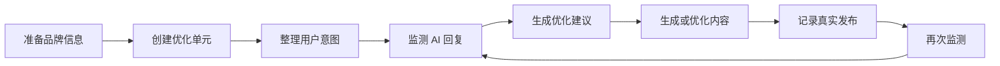
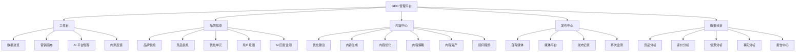
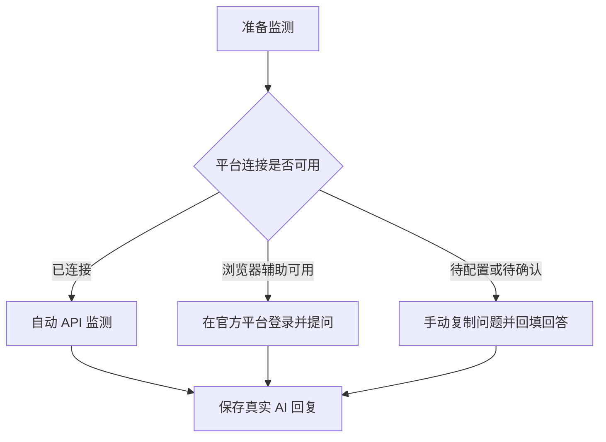
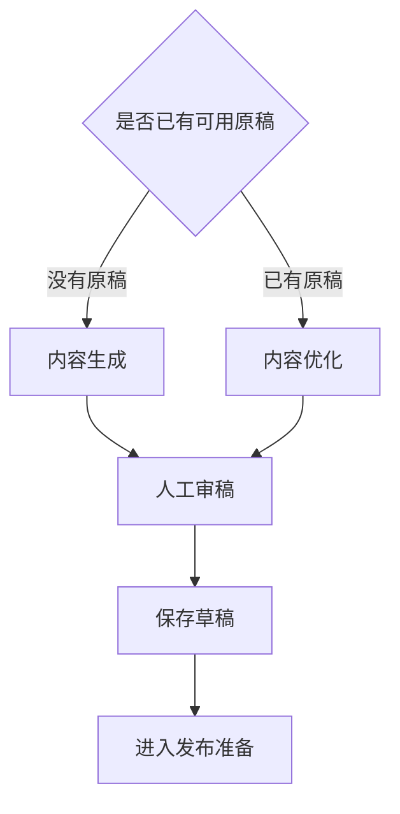
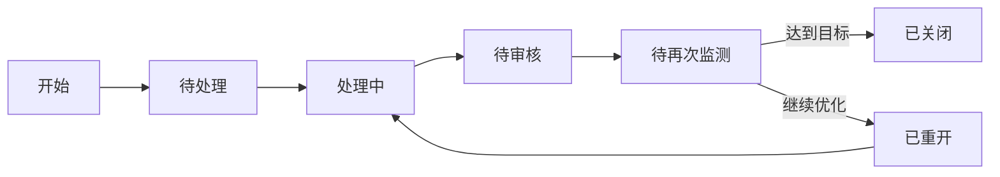

# GEO 管理平台可视化使用教程

## 1. 这套平台解决什么问题

GEO 管理平台用于观察和改善品牌在豆包、Kimi、DeepSeek、通义千问、阶跃星辰等 AI 平台中的表现。

你可以用它回答四个核心问题：

1. 用户向 AI 提问时，AI 会不会提到或推荐我的品牌？
2. AI 对品牌、产品、服务范围和优势的描述是否准确？
3. 哪些品牌资料和公开内容需要补充？
4. 内容发布后，AI 的回答是否真的改善？

平台把这些工作组织成一条持续循环的运营链路。



## 2. 进入平台后先看哪里

当前开发版打开后直接进入数据总览。页面没有单独的登录步骤，系统会使用当前演示用户身份。

开发预览链接具有会话时效。页面显示“开发环境已离线”时，需要重新启动开发服务并重新获取预览地址。

### 2.1 页面布局示意

```text
+----------------------+------------------------------------------------------+
| 左侧一级导航         | 顶部：当前页面名称              当前品牌 [切换 v]   |
|                      +------------------------------------------------------+
| 工作台               |                                                      |
| 品牌信息             | 页面说明                                             |
| 内容中心             | 关键指标 / 阶段提示 / 推荐下一步                    |
| 发布中心             |                                                      |
| 数据分析             | 主要操作区                                           |
|                      | 表单、列表、图表、状态和操作按钮                     |
|                      |                                                      |
+----------------------+------------------------------------------------------+
```

### 2.2 每次操作前的三个检查

| 检查位置 | 需要确认的内容 | 为什么重要 |
|---|---|---|
| 页面右上角 | “当前品牌”是否正确 | 所有监测、内容、发布和报告都属于当前品牌 |
| 页面顶部 | 当前页面名称和说明 | 确认自己正在执行哪个阶段 |
| 页面中的状态提示 | 是否有缺资料、缺回复或待确认提醒 | 前置数据缺失会影响后续分析质量 |

### 2.3 品牌切换规则

除“数据总览”外，大多数页面都依赖当前品牌。右上角品牌选择框显示“品牌名称（当前角色）”。切换品牌后，页面数据会同步切换。

看到以下提示时，先回到“工作台 > 数据总览”：

- “暂无可访问品牌，请先在多品牌总览中创建品牌”
- “当前页面需要品牌上下文，请先选择品牌”

## 3. 五大业务区地图



| 业务区 | 什么时候使用 | 主要产出 |
|---|---|---|
| 工作台 | 刚进入平台、需要看整体进度时 | 当前状态、下一步、全局关系图 |
| 品牌信息 | 开始新品牌或准备新一轮监测时 | 品牌资料、优化单元、用户问题、真实回复 |
| 内容中心 | 已经发现 AI 回答问题时 | 优化计划、内容草稿、内容资产 |
| 发布中心 | 内容准备完成后 | 媒体账号、真实发布记录、复测任务 |
| 数据分析 | 已积累监测和发布数据后 | 竞品、评价、引用、事实和报告结论 |

## 4. 30 分钟跑通第一次小闭环

第一次使用建议只选一个品牌、一个优化单元、一个用户意图、一个 AI 平台和一个监测问题。先跑通链路，再逐步扩大范围。

### 第 1 步：创建或选择品牌

菜单位置：`工作台 > 数据总览`

1. 查看右上角“当前品牌”。
2. 已有品牌时，直接选择该品牌。
3. 需要新品牌时，点击“新建品牌”。
4. 填写品牌名称、行业、官网、目标城市、业务范围和目标用户。
5. 将品牌状态设置为“启用”并保存。

最少建议填写：

| 字段 | 示例 | 用途 |
|---|---|---|
| 品牌名称 | 追光小牛 | 判断 AI 是否提到品牌 |
| 行业 | 儿童运动教育 | 帮助系统理解业务语境 |
| 目标城市 | 贵阳 | 生成带地域特征的问题 |
| 业务范围 | 儿童体能课程 | 限定监测范围 |
| 目标用户 | 3 至 8 岁儿童家长 | 形成真实用户问法 |

完成标准：右上角显示正确品牌，数据总览出现该品牌的指标和起步任务。

### 第 2 步：补齐品牌信息

菜单位置：`品牌信息 > 品牌信息`

可以选择两种录入方式：

| 方式 | 适用情况 | 操作 |
|---|---|---|
| 上传资料 | 已有 Markdown、DOCX 或文本型 PDF | 点击“上传资料”，检查识别结果，再确认保存 |
| 分类编辑 | 资料较少或希望逐项维护 | 点击“手动填写品牌信息”或进入分类编辑 |

建议按以下顺序补充：

1. 基础信息：品牌介绍、核心卖点、权威背书。
2. 产品服务：产品名称、适用人群、服务特点、价格口径和服务范围。
3. 目标用户：用户画像、决策阶段、关注问题和常见表达。
4. 事实知识：FAQ、品牌标准答案、需要避免的错误说法。
5. 媒体素材：官网、文章、图片和其他可信资料。

点击“保存品牌资料”，查看资料完整度提示。

完成标准：核心品牌事实可用于判断 AI 回复是否准确。

### 第 3 步：创建优化单元

菜单位置：`品牌信息 > 优化单元`

优化单元是本轮希望 AI 理解或推荐的产品、服务或业务主题。

```text
品牌：追光小牛
└── 优化单元：3 至 5 岁儿童体能课程
    ├── 关键词：贵阳儿童体能、幼儿体适能
    ├── 优先级：高
    └── 状态：启用
```

操作步骤：

1. 点击“新增优化单元”。
2. 填写优化单元名称。
3. 选择类型和优先级。
4. 填写目标关键词。
5. 保持启用状态并点击“保存”。

完成标准：列表中出现该优化单元，状态为“启用”。

### 第 4 步：创建用户意图和监测问题

菜单位置：`品牌信息 > 用户意图`

用户意图是客户可能向 AI 提出的真实问题场景。

```text
优化单元：3 至 5 岁儿童体能课程
└── 用户意图：寻找适合低龄儿童的体能馆
    └── 监测问题：贵阳哪里有适合 3 至 5 岁孩子的体能训练机构？
```

操作步骤：

1. 点击“创建用户意图”。
2. 选择关联优化单元。
3. 填写用户意图。
4. 选择意图分类和监测频率。
5. 保存后点击“生成监测问题”。
6. 检查问法是否像真实用户会问的问题。
7. 需要批量扩充时使用“创建问题模板”和“批量生成监测问题”。

好的监测问题通常具备以下特征：

- 带有真实场景，例如城市、年龄、预算或使用目的。
- 保持自然问法，避免直接要求 AI 推荐自己的品牌。
- 一次只表达一个主要需求，便于比较不同平台回复。

完成标准：当前用户意图下至少有一个可用监测问题。

### 第 5 步：选择监测方式

菜单位置：`工作台 > AI 平台管理`



| 方式 | 适用情况 | 用户需要做什么 |
|---|---|---|
| 自动 API 监测 | 平台已连接并验证成功 | 选择问题后启动监测 |
| 浏览器辅助 | 官方平台需要用户登录 | 在官方页面完成登录、提问和回答回填 |
| 手动录入 | 连接尚未配置或平台临时受限 | 复制问题到 AI 平台，再粘贴完整回答 |

平台状态常见含义：

| 状态 | 含义 | 下一步 |
|---|---|---|
| 已连接 | 自动连接已经配置 | 点击“检查连接”确认可用 |
| 浏览器辅助可用 | 可通过用户登录完成监测 | 到 AI 回复监测执行辅助流程 |
| 手动录入可用 | 可回填真实回复 | 使用“手动录入” |
| 待配置 | 缺少连接配置 | 点击“连接平台”或采用手动录入 |
| 最近验证失败 | 当前连接异常 | 检查接口地址、模型、密钥和调用限制 |

### 第 6 步：完成首轮 AI 回复监测

菜单位置：`品牌信息 > AI 回复监测`

推荐操作顺序：

1. 点击“生成优化方向”。
2. 点击“生成监测问题”。
3. 选择本轮监测问题。
4. 点击“保存为监测计划”。
5. 点击“开始首轮监测”。
6. 自动监测完成后查看记录。
7. 待手动录入时点击“录入回答”或顶部“手动录入”。
8. 粘贴 AI 回答原文和引用来源。
9. 点击“解析分析”。
10. 核对结果后点击“确认回复解读”。

手动录入示例：

```text
平台：豆包
问题：贵阳哪里有适合 3 至 5 岁孩子的体能训练机构？
回答：粘贴 AI 平台返回的完整原文
引用来源：粘贴回答中出现的来源链接
```

查看结果时重点判断：

| 指标 | 需要回答的问题 |
|---|---|
| 有没有出现 | AI 是否提到了当前品牌 |
| 推荐排名 | 品牌在多个推荐对象中排第几 |
| 整体评价 | AI 对品牌持正向、中性还是负向态度 |
| 事实准确性 | 产品、城市、服务对象和优势是否说对 |
| 引用可信度 | 回答是否引用官网或可信第三方来源 |
| 竞品提及 | 哪些竞品出现得更频繁或排名更高 |

完成标准：至少一条真实回复处于“已完成”，并已确认回复解读。

### 第 7 步：把问题变成优化计划

菜单位置：`内容中心 > 优化建议`

1. 点击“从监测结果生成计划”。
2. 查看统一诊断结论、趋势、标准答案差异和内容缺口。
3. 选择最重要的一条优化计划。
4. 点击“确认计划”。
5. 填写负责人、截止时间、发布平台和再次监测时间。
6. 点击“确认并生成待办”。

优先级建议：

| 问题 | 建议优先级 | 常见动作 |
|---|---|---|
| 品牌完全没有出现 | 高 | 补品牌介绍、问答页和权威信源 |
| 品牌事实错误 | 高 | 更新标准答案并生成事实澄清内容 |
| 出现但排名较低 | 中高 | 补对比内容、场景内容和第三方引用 |
| 引用来源较弱 | 中高 | 建设官网内容和可信媒体内容 |
| 表述基本准确但不完整 | 中 | 补 FAQ、服务边界和用户案例 |

完成标准：计划状态从“待确认”进入“已确认”或“处理中”，并产生待办。

### 第 8 步：生成或优化内容

新内容入口：`内容中心 > 内容生成`

已有内容入口：`内容中心 > 内容优化`



内容生成步骤：

1. 选择内容策略、优化计划和用户意图。
2. 填写内容主题。
3. 选择内容模板和目标平台。
4. 补充目标关键词、引用资料和图片素材。
5. 选择语气风格并填写合规要求。
6. 点击“生成草稿”。
7. 人工检查标题、正文、事实、引用和风险表达。
8. 点击“保存草稿”。
9. 点击“进入发布准备”。

内容优化步骤：

1. 选择已有内容或粘贴原文。
2. 选择结构、事实、FAQ、引用或渠道适配等优化目标。
3. 点击“生成草稿”。
4. 对照原稿检查修改内容。
5. 人工审稿后保存。

发布前人工检查清单：

- 品牌名称、产品参数、价格和服务范围准确。
- 引用资料可访问且来源可信。
- 文案符合目标平台格式。
- 文案包含用户真正关心的问题和清晰答案。
- 文案包含合规表达和必要边界说明。
- 已设置再次监测时间。

### 第 9 步：记录真实发布

账号入口：`发布中心 > 自有媒体`

记录入口：`发布中心 > 发布记录`

1. 在“自有媒体”点击“接入账号”。
2. 选择发布平台、登录方式和发布模式。
3. 确认账号状态为“已授权”。
4. 到“发布记录”点击“新建发布记录”。
5. 选择发布账号并补齐标题、正文、目标平台和内容类型。
6. 采用人工发布时，把内容发布到真实平台。
7. 回到系统点击“记录发布结果”。
8. 填写真实发布链接并保存。

发布模式说明：

| 模式 | 工作方式 | 推荐场景 |
|---|---|---|
| 人工发布 | 用户复制内容并在平台完成发布 | 首次使用、重要账号、强审核场景 |
| 半自动发布 | 系统准备内容，用户确认后执行 | 流程稳定且保留人工确认的场景 |
| 自动发布 | 授权平台由系统直接执行 | 自有 CMS 或正式授权平台 |

完成标准：发布记录状态为“已发布”，并保存真实发布链接。

### 第 10 步：再次监测并判断是否改善

菜单位置：`发布中心 > 再次监测`

1. 点击“新建任务”或从发布记录点击“安排再次监测”。
2. 关联原监测记录、监测问题、AI 平台和优化单元。
3. 设置负责人、计划时间和目标分。
4. 到期后点击“执行再次监测”。
5. 使用相同问题和相同 AI 平台获取新回复。
6. 点击“查看同题监测”比较前后结果。
7. 录入实际分和监测结论。



判断规则：

| 复测结果 | 行动状态 | 下一步 |
|---|---|---|
| 品牌出现、排名和准确性达到目标 | 已改善 | 关闭本轮任务并保留监测 |
| 有改善但仍未达到目标 | 继续优化 | 安排下一轮内容补强 |
| 结果基本不变 | 继续优化 | 检查内容质量、渠道和信源 |
| 结果变差 | 待处理 | 检查错误事实、负面评价和竞品变化 |

完成标准：形成同题前后对比，并明确“已改善”或“继续优化”。

## 5. 如何使用营销画布

菜单位置：`工作台 > 营销画布`

营销画布适合从全局查看对象之间的关系。

```text
[优化单元]
    |
    +---- [用户意图] ---- [监测问题] ---- [真实 AI 回复]
    |                                          |
    +---- [内容策略] ---- [内容任务] ---------+
                                               |
                        [发布记录] ---- [再次监测]
```

常用操作：

| 操作 | 用途 |
|---|---|
| 查看使用说明 | 了解节点和连线含义 |
| 新建关联对象 | 创建用户意图、内容策略或优化任务 |
| 缩小、放大 | 调整画布视野 |
| 定位全部 | 查看所有关系节点 |
| 点击节点 | 查看详情和可执行动作 |

节点详情中可直接执行“补充用户意图”“补充内容策略”“创建优化任务”“查看真实回复”“生成内容”和“再次监测”。

## 6. 五大业务区逐页说明

### 6.1 工作台

| 页面 | 主要用途 | 关键操作 |
|---|---|---|
| 数据总览 | 查看品牌指标、起步任务和下一步 | 新建品牌、编辑品牌、上传资料、让 AI 跑一轮 |
| 营销画布 | 查看优化对象与运营链路关系 | 新建关联对象、查看节点、生成内容、再次监测 |
| AI 平台管理 | 管理 AI 平台连接 | 连接平台、管理接入、检查连接 |
| 内测反馈 | 记录产品使用问题 | 记录反馈、更新处理记录 |

### 6.2 品牌信息

| 页面 | 主要用途 | 关键操作 |
|---|---|---|
| 品牌信息 | 建立品牌事实基础 | 上传资料、分类编辑、保存品牌资料 |
| 竞品信息 | 维护直接竞品和标杆品牌 | 新增竞品、编辑资料、地图发现竞品 |
| 优化单元 | 定义本轮优化对象 | 新增、编辑、启停、创建用户意图 |
| 用户意图 | 维护真实用户问题场景 | 创建意图、创建模板、生成监测问题 |
| AI 回复监测 | 获取和分析真实 AI 回复 | 开始监测、手动录入、解析分析、确认解读 |

### 6.3 内容中心

| 页面 | 主要用途 | 关键操作 |
|---|---|---|
| 优化建议 | 把监测发现转成执行计划 | 生成计划、确认计划、生成内容任务、安排复测 |
| 内容生成 | 从品牌资料和缺口生成新稿 | 创建任务、生成草稿、保存、进入发布准备 |
| 内容优化 | 改造已有文章或文案 | 选择原稿、设置优化目标、生成优化稿 |
| 内容策略 | 管理选题、关键词和渠道方案 | 生成内容策略、查看覆盖情况 |
| 内容资产 | 管理文章、FAQ、问答和媒体稿 | 新建资产、继续编辑、发布准备、再次监测 |
| 顾问服务 | 管理诊断、复盘和交付事项 | 新增服务记录、查看详情、维护跟进 |

### 6.4 发布中心

| 页面 | 主要用途 | 关键操作 |
|---|---|---|
| 自有媒体 | 管理品牌可控账号 | 接入账号、连接平台、重新授权、切换发布模式 |
| 媒体平台 | 查看渠道规则 | 搜索平台、查看格式要求和发布建议 |
| 发布记录 | 管理发布台账和真实结果 | 新建记录、立即发布、记录结果、安排复测 |
| 再次监测 | 跟踪优化任务和复测结果 | 新建任务、处理任务、执行复测、安排下一轮 |

### 6.5 数据分析

| 页面 | 重点看什么 | 常见下一步 |
|---|---|---|
| 竞品分析 | 竞品提及率、排名、平台分布和压制风险 | 补竞品资料、生成对比内容 |
| 评价分析 | 正向、中性、负向评价和表达问题 | 修正内容策略、补品牌资料 |
| 信源分析 | AI 引用了哪些网站、媒体和内容资产 | 绑定资产、补可信信源 |
| 事实分析 | 参数、价格、范围和品牌事实是否准确 | 更新标准答案、生成事实补强内容 |
| 报告中心 | 周报、月报、多品牌对比和客户交付 | 生成报告、阅读报告、导出 Markdown |

## 7. 页面状态怎么看

### 7.1 AI 回复监测状态

| 状态 | 含义 | 建议操作 |
|---|---|---|
| 待开始 | 监测计划已经保存 | 点击开始监测 |
| 监测中 | 系统正在获取回复 | 等待任务完成后刷新 |
| 已完成 | 已获得真实回复 | 解析分析并确认解读 |
| 待手动录入 | 需要人工回填回复 | 点击录入回答 |
| 未成功 | 本次获取失败 | 查看原因并重试或手动录入 |

### 7.2 内容任务状态

| 状态 | 含义 | 建议操作 |
|---|---|---|
| 待生成 | 内容任务已经建立 | 点击生成草稿 |
| 生成中 | 系统正在生成 | 等待完成 |
| 已完成 | 草稿可编辑 | 人工审稿并保存 |
| 生成失败 | 本次生成异常 | 检查资料和平台配置后重新生成 |

### 7.3 发布记录状态

| 状态 | 含义 | 建议操作 |
|---|---|---|
| 草稿 | 发布内容仍在准备 | 完善标题、正文和账号 |
| 待人工发布 | 等待用户到真实平台发布 | 复制正文并完成发布 |
| 等待直连发布 | 已进入系统发布队列 | 确认账号授权和发布模式 |
| 发布中 | 平台正在处理 | 等待发布结果 |
| 已发布 | 已记录真实发布结果 | 填写链接并安排再次监测 |
| 发布失败 | 平台或账号返回异常 | 检查授权、内容规则和错误原因 |

## 8. 常见问题处理

### 8.1 页面提示开发环境已离线

原因：开发预览会话已经休眠或公开连接已经失效。

处理：重新启动开发服务，确认 Web 端口 `5173` 和 API 端口 `3001` 处于监听状态，再重新生成预览地址。

### 8.2 页面不知道先点哪里

回到“数据总览”，查看起步任务和推荐下一步。首次使用按本教程第 4 章的小闭环顺序操作。

### 8.3 没有可访问品牌

进入“数据总览”，点击“新建品牌”，保存后在右上角选择该品牌。

### 8.4 品牌资料仍有缺口

进入“品牌信息”，优先补基础介绍、产品服务、目标用户和 FAQ。资料完整度越高，监测解读和内容生成越可靠。

### 8.5 没有平台 API Key

使用浏览器辅助或手动录入。系统生成问题后，到目标 AI 平台提问，再把完整原文和引用来源粘贴回系统。

### 8.6 监测问题不像真实用户会问的

编辑用户意图或监测问题，补充城市、用户类型、使用场景和决策条件。保留自然问法，并控制每个问题只表达一个主要需求。

### 8.7 AI 回复需要人工判断

点击“需要确认”或“查看解读”，重点核对品牌事实、夸大承诺、风险表达、竞品比较和引用来源。

### 8.8 优化计划太多

先处理“品牌没有出现”“事实错误”“高风险负面表达”和“缺少可信引用”四类问题。每轮选择一至三个高优先级任务。

### 8.9 内容已经发布，数据仍没有变化

检查以下项目：

1. 再次监测是否使用了相同问题和相同 AI 平台。
2. 发布内容是否可以公开访问。
3. 内容是否包含清晰、可验证的品牌事实。
4. 发布渠道是否属于 AI 容易引用的可信来源。
5. 是否需要更长的内容收录和模型更新周期。

### 8.10 页面显示“当前区域加载失败”

点击“重新加载”。系统通常会保留已加载内容和当前输入。持续失败时记录页面、模块、错误现象和影响范围，并提交到“工作台 > 内测反馈”。

## 9. 新手最容易混淆的术语

| 术语 | 含义 |
|---|---|
| GEO | 优化品牌在生成式 AI 回答中的理解、提及、推荐和引用表现 |
| AI 可见性 | 品牌在真实 AI 回复中的出现、排名、评价和引用表现 |
| 优化单元 | 本轮希望 AI 推荐的产品、服务或业务主题 |
| 用户意图 | 客户可能向 AI 提出的真实需求场景 |
| 监测问题 | 从用户意图拆出的具体问法 |
| 真实 AI 回复 | 从自动监测、浏览器辅助或手动录入获得的平台原始回答 |
| 品牌标准答案 | 经品牌方确认的正确事实和表达口径 |
| 优化建议 | 从监测问题转化出的负责人、截止时间、内容和复测安排 |
| 内容策略 | 围绕选题、关键词、用户意图和发布渠道制定的方案 |
| 内容资产 | 可编辑、发布和复测的文章、FAQ、问答、对比页或媒体稿 |
| 信源 | AI 回答引用的网站、媒体、社交平台或第三方来源 |
| 再次监测 | 内容发布后用同一问题和平台重新测试 |
| Sprint | 一轮从资料准备、监测、优化、发布到复测的运营周期 |

## 10. 第一次使用验收清单

完成以下项目，代表已经跑通一次完整闭环：

- [ ] 已创建或选择正确品牌
- [ ] 已补充基础品牌资料、产品服务和目标用户
- [ ] 已创建一个启用的优化单元
- [ ] 已创建一个用户意图和一个自然监测问题
- [ ] 已获得至少一条真实 AI 回复
- [ ] 已解析并确认回复解读
- [ ] 已生成并确认一条优化计划
- [ ] 已生成或优化一篇内容草稿
- [ ] 已完成人工事实和合规检查
- [ ] 已创建发布记录并填写真实链接
- [ ] 已安排同题再次监测
- [ ] 已比较优化前后的结果

建议第一轮保持范围小而完整：一个品牌、一个优化单元、一个用户意图、一个问题、一个平台、一篇内容和一次复测。
