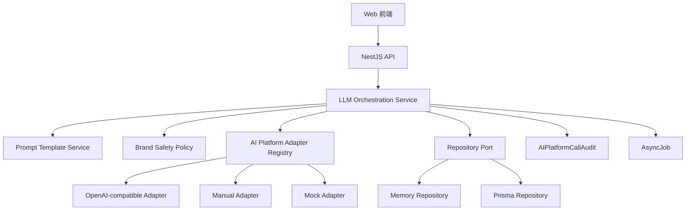

# 大模型 API 接入技术规划

## 目标

本规划用于把 AI 推荐管理平台从“规则模板 + 手动录入 + 示例闭环”升级为“真实大模型驱动的自动问题生成、自动监测、自动解读、自动内容生成和再次监测闭环”。

核心目标是解决内测时最明显的使用问题：品牌方打开系统后，可以先补品牌资料，再由系统自动生成监测问题、调用目标 AI 平台、解读回答、生成优化计划和内容草稿。

## 当前基础

当前工程位于 `当前工作区/`。

后端已经具备这些基础能力：

- API 统一前缀：`/api/v1`
- 品牌隔离：所有业务数据通过 `brandId` 隔离
- 前端品牌上下文：通过 `x-brand-id` 请求头传入
- 平台配置：`PlatformConfig` 已支持 endpoint、model、mode、rateLimit、hasCredential 和脱敏状态
- 平台适配器：已有 `AIPlatformAdapter`、`OpenAICompatibleAdapter`、`MockAdapter`、`ManualInputAdapter`
- 默认平台：豆包、Kimi、DeepSeek、通义千问、阶跃星辰
- 已烟测平台：SenseNova，endpoint 为 `https://token.sensenova.cn/v1/chat/completions`，模型为 `sensenova-6.7-flash-lite`，走 OpenAI-compatible fallback；密钥只保存在运行态配置或目标环境变量中，文档不记录真实值
- 监测计划：已有监测主题、监测问题、监测计划和执行编排
- 监测运行：已有 `MonitoringRun`、`AIResponse`、`AnalysisResult`
- 异步任务：已有 `AsyncJob`，当前支持 `monitoring` 和 `content_generation`
- 调用审计：已有 `AIPlatformCallAudit`
- 内容生成任务：已有 `ContentGenerationTask`、`ContentVersion`、`ContentExportRecord`

需要补强的关键点：

- 监测问题生成目前主要是规则模板，缺少真实大模型生成能力
- 回答解读目前主要是规则解析，缺少大模型结构化判断能力
- 内容生成 worker 当前使用默认草稿生成器，缺少真实大模型生成正文能力
- API 调用缺少统一的 LLM 任务层，监测调用、内容生成、问题生成和回答解读还没有复用同一套调用协议

## 总体架构



新增核心服务为 `LLM Orchestration Service`。它负责统一处理四类大模型任务：

- `question_generation`：自动生成监测主题和监测问题
- `answer_analysis`：自动解读 AI 回答
- `content_generation`：生成内容草稿
- `optimization_planning`：辅助生成优化计划和下一轮问题建议

## API 分层设计

### 1. 平台连接 API

平台连接 API 继续沿用现有 `platforms` 模块，新增对 LLM 调用任务的配置能力。

```http
GET /api/v1/platforms
POST /api/v1/platforms
PATCH /api/v1/platforms/:platformId
POST /api/v1/platforms/:platformId/validate
```

当前字段继续保留：

```ts
type PlatformConfig = {
  id: string;
  brandId: BrandId;
  platformCode: string;
  name: string;
  mode: PlatformMode;
  endpointUrl?: string;
  modelName?: string;
  rateLimitPerMinute: number;
  enabled: boolean;
  hasCredential: boolean;
  credentialRefMasked?: string;
  availableMethods: AIConnectionMethod[];
  connectionStatus: AIConnectionStatus;
  nextAction: string;
};
```

技术要求：

- 公开响应仅返回 `hasCredential` 和 `credentialRefMasked`
- 运行时配置通过 `getPlatformRuntimeConfig` 读取 `credentialRef`
- `OpenAICompatibleAdapter` 通过 credential resolver 从安全位置读取真实密钥
- 调用审计记录 platform、model、callType、status、duration、token、cost 和错误摘要

### 2. 大模型任务 API

新增统一 API 模块：`apps/api/src/modules/llm/`。

建议路由：

```http
POST /api/v1/brands/:brandId/llm/tasks/question-generation
POST /api/v1/brands/:brandId/llm/tasks/answer-analysis
POST /api/v1/brands/:brandId/llm/tasks/content-generation
POST /api/v1/brands/:brandId/llm/tasks/optimization-planning
GET /api/v1/brands/:brandId/llm/tasks/:jobId
```

统一请求结构：

```ts
type LLMTaskRequest<TInput> = {
  platformCode?: string;
  modelName?: string;
  mode?: 'sync' | 'async';
  input: TInput;
};
```

统一响应结构：

```ts
type LLMTaskResponse<TOutput> = {
  jobId?: string;
  status: 'queued' | 'running' | 'succeeded' | 'failed' | 'needs_confirmation';
  output?: TOutput;
  auditId?: string;
  message: string;
};
```

默认策略：

- 小输入量可同步返回
- 批量问题生成、批量回答解读和内容生成走异步任务
- 所有任务都写入调用审计
- 所有任务都携带 `brandId`

### 3. 自动生成监测问题 API

当前页面入口：`AI 回复监测` -> `生成监测主题` / `生成监测问题`

现有路由：

```http
POST /api/v1/brands/:brandId/test-themes/generate
POST /api/v1/brands/:brandId/test-question-candidates/generate
```

建议保留现有路由，并在内部改为调用 LLM Orchestration Service。

新增底层任务路由：

```http
POST /api/v1/brands/:brandId/llm/tasks/question-generation
```

请求输入：

```ts
type QuestionGenerationInput = {
  brandProfile: BrandProfile;
  brandDetail: BrandDetail;
  themes?: TestTheme[];
  targetPlatforms: string[];
  scenarioCount?: number;
  questionCountPerTheme?: number;
  includeCompetitors?: boolean;
};
```

输出：

```ts
type QuestionGenerationOutput = {
  themes: TestThemeInput[];
  candidates: TestQuestionCandidateInput[];
  missingProfileFields: string[];
  generationNotes: string[];
};
```

大模型生成要求：

- 覆盖品牌直问、品类推荐、地域推荐、年龄段需求、痛点需求、课程需求、竞品对比和购买决策
- 每个问题必须包含 `purposes`
- 每个问题必须包含 `targetPlatforms`
- 每个问题必须包含业务解释 `estimatedValue`
- 问题要像真实用户提问，避免内部术语
- 敏感场景要包含风险表达检测，例如“长高”“治疗”“包过”等

落库方式：

- `themes` 写入 `TestTheme`
- `candidates` 写入 `TestQuestionCandidate`
- 仍保留当前规则模板作为 fallback

### 4. 自动执行目标 AI 平台监测 API

当前页面入口：`AI 回复监测` -> `开始首轮监测`

现有路由：

```http
POST /api/v1/brands/:brandId/test-plans/:planId/execute
```

建议继续复用现有接口。

执行分流：

- `api`：调用 `AIPlatformAdapter.runPrompt`
- `browser`：调用 Browser Connector
- `manual`：生成手动录入步骤
- `needs_configuration`：返回配置提示

API 自动监测输入：

```ts
type RunPromptInput = {
  brandId: BrandId;
  platformCode: string;
  promptText: string;
};
```

API 自动监测输出：

```ts
type RunPromptResult = {
  rawText: string;
  modelName?: string;
  respondedAt: string;
};
```

后续补强：

- `RunPromptResult` 增加 token 和 provider request id
- `AIPlatformCallAudit` 记录 inputTokenCount、outputTokenCount、costEstimate
- 按 `rateLimitPerMinute` 控制同品牌同平台请求速率
- 同一监测计划内按平台串行、跨平台可并行

### 5. 自动解读 AI 回答 API

当前页面入口：`AI 回复监测记录` -> `解读`

现有路由：

```http
POST /api/v1/brands/:brandId/monitoring-runs/:runId/analysis/parse
PATCH /api/v1/brands/:brandId/monitoring-runs/:runId/analysis
```

建议保留现有路由，并将解析逻辑升级为 LLM + 规则校验双层结构。

新增底层任务路由：

```http
POST /api/v1/brands/:brandId/llm/tasks/answer-analysis
```

请求输入：

```ts
type AnswerAnalysisInput = {
  run: MonitoringRunDetail;
  brandProfile: BrandProfile;
  brandDetail: BrandDetail;
  knownCompetitors: string[];
  blockedExpressions: string[];
  recommendedExpressions: string[];
};
```

输出使用现有 `AnalysisResultInput`：

```ts
type AnalysisResultInput = {
  brandMentioned?: boolean;
  brandRank?: number | null;
  sentiment?: AnalysisSentiment;
  accuracyScore?: number;
  citationScore?: number;
  platformEvaluation?: string;
  recommendationReason?: string;
  rankingReason?: string;
  expressionCompleteness?: string;
  expressionDeviation?: string;
  competitorMentions?: CompetitorMention[];
  reviewRequired?: boolean;
};
```

解读要求：

- 判断品牌是否出现
- 判断品牌排名
- 识别竞品
- 判断品牌卖点覆盖
- 判断错误表达和夸大承诺
- 识别引用来源线索
- 输出品牌方能看懂的解释
- 对无法判断、风险表达和高风险承诺设置 `reviewRequired: true`

建议处理链路：

1. 大模型输出结构化 JSON
2. Zod 或手写 validator 校验字段
3. 规则层二次检查品牌别名、禁用表达、竞品名和引用 URL
4. 合并为 `AnalysisResultInput`
5. 写入 `AnalysisResult`
6. 触发指标刷新和优化计划候选更新

### 6. 自动生成优化计划 API

当前页面入口：`优化计划` -> `生成优化计划`

现有路由：

```http
POST /api/v1/brands/:brandId/growth-optimization/generate
POST /api/v1/brands/:brandId/growth-optimization/plans/:planId/confirm
```

新增底层任务路由：

```http
POST /api/v1/brands/:brandId/llm/tasks/optimization-planning
```

请求输入：

```ts
type OptimizationPlanningInput = {
  analysisResults: AnalysisResult[];
  testPlan?: TestPlan;
  brandProfile: BrandProfile;
  contentAssets: ContentAsset[];
  publishingRecords: PublishingRecord[];
};
```

输出：

```ts
type OptimizationPlanningOutput = {
  plans: GrowthOptimizationPlanInput[];
  recommendedTasks: OptimizationTaskInput[];
  recommendedContentTasks: Array<{
    contentType: GrowthContentType | string;
    targetPlatform: string;
    contentTopic: string;
    targetKeywords: string[];
    referenceSources: string[];
  }>;
  nextRoundQuestions: TestQuestionCandidateInput[];
};
```

规划要求：

- 推荐率不足时生成品牌可见度补强计划
- 排名偏低时生成竞品对比和差异化内容计划
- 卖点缺失时生成品牌卖点解释内容计划
- 引用不足时生成官网 FAQ、公众号推文和平台资料内容计划
- 风险表达时生成标准表达修正计划
- 每个计划要包含负责人、截止时间、发布平台和再次监测时间

### 7. 自动生成内容 API

当前页面入口：`写内容` -> `生成草稿`

现有路由：

```http
POST /api/v1/brands/:brandId/content/generation/tasks
POST /api/v1/brands/:brandId/content/generation/growth-optimization/tasks
POST /api/v1/brands/:brandId/content/generation/tasks/:taskId/retry
```

建议保留现有接口，改造 `ContentGenerationWorker`，让 `draftGenerator` 默认走真实 LLM。

新增底层任务路由：

```http
POST /api/v1/brands/:brandId/llm/tasks/content-generation
```

请求输入：

```ts
type LLMContentGenerationInput = {
  task: ContentGenerationTask;
  strategy: ContentStrategy;
  brandProfile: BrandProfile;
  analysisResults: AnalysisResult[];
  contentType: GrowthContentType | string;
  targetPlatform: string;
  targetKeywords: string[];
  referenceSources: string[];
};
```

输出：

```ts
type LLMContentGenerationOutput = {
  title: string;
  body: string;
  outline?: string[];
  complianceNotes: string[];
  retestSuggestions: string[];
};
```

内容类型要求：

- 公众号推文：完整标题、导语、小标题、正文、结尾行动建议
- 小红书图文：标题、正文、分段卖点、图片建议、标签建议
- 官网 FAQ：问题、回答、适用场景、风险表达修正
- 短视频脚本：开头钩子、镜头段落、口播、字幕建议
- 平台介绍文案：品牌介绍、适合人群、服务亮点、背书、联系方式占位
- 图片创意需求：画面主体、构图、文字、场景、尺寸建议

## Prompt 设计

### Prompt 模板分层

建议新增 `PromptTemplateService`，按任务类型维护模板。

```text
system prompt：角色、边界、安全规则、输出格式
developer prompt：任务步骤、字段说明、评分规则
user prompt：品牌资料、监测主题、AI 回答、内容策略等动态输入
```

### 输出格式

所有大模型任务优先要求 JSON 输出。

```json
{
  "items": [],
  "warnings": [],
  "needsConfirmation": false
}
```

后端必须校验 JSON 结构。校验失败时进入重试或 `needs_confirmation`。

### 品牌安全规则

所有 Prompt 必须携带品牌安全规则：

- 严格依据品牌资料生成内容
- 对不确定内容标记需要确认
- 避免夸大承诺
- 对儿童、健康、教育、升学等敏感表达使用审慎口径
- 禁用表达命中时给出替代表达

## 数据模型规划

### 共享类型新增

建议在 `packages/shared-types/src/index.ts` 增加：

```ts
export type LLMTaskType = 'question_generation' | 'answer_analysis' | 'content_generation' | 'optimization_planning';

export type LLMTaskStatus = 'queued' | 'running' | 'succeeded' | 'failed' | 'needs_confirmation';

export type LLMTaskRequest<TInput> = {
  platformCode?: string;
  modelName?: string;
  mode?: 'sync' | 'async';
  input: TInput;
};

export type LLMTaskResponse<TOutput> = {
  jobId?: string;
  status: LLMTaskStatus;
  output?: TOutput;
  auditId?: string;
  message: string;
};
```

扩展：

```ts
export type AIPlatformCallType = 'monitoring' | 'content_generation' | 'validation' | 'question_generation' | 'answer_analysis' | 'optimization_planning';

export type AsyncJobType = 'monitoring' | 'content_generation' | 'question_generation' | 'answer_analysis' | 'optimization_planning';
```

### Prisma 增量模型

可优先复用 `AsyncJob` 和 `AIPlatformCallAudit`。需要保存大模型输入输出摘要时，新增 `LLMTaskRun`。

```prisma
model LLMTaskRun {
  id           String   @id
  brandId      String
  taskType     String
  jobId        String?
  auditId      String?
  status       String
  inputHash    String
  outputJson   Json?
  errorCode    String?
  errorMessage String?
  createdBy    String
  createdAt    DateTime @default(now())
  updatedAt    DateTime @updatedAt
}
```

保存原则：

- 保存 input hash 和必要摘要
- 保存结构化 output
- 保存错误摘要
- 保存 brandId 和 createdBy
- 密钥、cookie、浏览器 profile、storage state 等敏感信息仅保存在安全运行环境内

## 服务模块规划

新增目录：

```text
apps/api/src/modules/llm/
├── llm.module.ts
├── llm.controller.ts
├── llm-orchestration.service.ts
├── llm-prompt-template.service.ts
├── llm-output-validator.ts
├── llm-task.types.ts
├── workers/
│   ├── question-generation.worker.ts
│   ├── answer-analysis.worker.ts
│   ├── content-draft.worker.ts
│   └── optimization-planning.worker.ts
└── prompts/
    ├── question-generation.prompt.ts
    ├── answer-analysis.prompt.ts
    ├── content-generation.prompt.ts
    └── optimization-planning.prompt.ts
```

### LLM Orchestration Service

职责：

- 选择平台配置
- 构建 Prompt
- 调用 Adapter
- 校验输出
- 写调用审计
- 写任务状态
- 把输出落到业务模型

关键方法：

```ts
class LLMOrchestrationService {
  generateQuestions(userId: string, brandId: string, input: QuestionGenerationInput): Promise<QuestionGenerationOutput>;
  analyzeAnswer(userId: string, brandId: string, input: AnswerAnalysisInput): Promise<AnalysisResultInput>;
  generateContent(userId: string, brandId: string, input: LLMContentGenerationInput): Promise<LLMContentGenerationOutput>;
  planOptimization(userId: string, brandId: string, input: OptimizationPlanningInput): Promise<OptimizationPlanningOutput>;
}
```

### Adapter 扩展

`OpenAICompatibleAdapter` 当前只支持单条 user message。建议扩展为支持 system/developer/user messages 和 JSON 输出要求。

```ts
type LLMMessage = {
  role: 'system' | 'developer' | 'user' | 'assistant';
  content: string;
};

type RunLLMInput = RunPromptInput & {
  messages?: LLMMessage[];
  responseFormat?: 'text' | 'json';
  temperature?: number;
  maxTokens?: number;
};
```

适配策略：

- `runPrompt` 保持兼容
- 新增 `runMessages`
- 豆包、Kimi、DeepSeek、通义千问、阶跃星辰先走 OpenAI-compatible 路径
- 某个平台协议不兼容时新增专属 Adapter

## 接口调用链路

### 生成监测问题链路

```text
前端点击生成监测问题
-> BrandsController
-> TestQuestionService
-> LLMOrchestrationService.generateQuestions
-> OpenAICompatibleAdapter.runMessages
-> LLM output validator
-> createTestTheme / createTestQuestionCandidate
-> 返回候选问题列表
```

### 执行监测链路

```text
前端点击开始首轮监测
-> executeTestPlan
-> 按平台配置分流
-> api 模式创建 MonitoringRun + AsyncJob
-> MonitoringWorker
-> AIPlatformAdapter.runPrompt
-> addManualResponse 写入 AIResponse
-> parseAnalysisResult 或 answer-analysis task
-> 返回执行摘要
```

### 解读回答链路

```text
用户点击解读或自动触发
-> MonitoringController.parseAnalysis
-> LLMOrchestrationService.analyzeAnswer
-> 大模型输出结构化 JSON
-> 规则层校验品牌、竞品、禁用表达
-> update AnalysisResult
-> 刷新指标和优化计划输入
```

### 内容生成链路

```text
用户点击生成草稿
-> ContentController.createGenerationTask
-> create AsyncJob(content_generation)
-> ContentGenerationWorker
-> LLMOrchestrationService.generateContent
-> completeContentGenerationTask
-> 写 ContentVersion
-> 返回内容生成工作台
```

## 错误处理

统一错误码：

| 错误码 | 场景 | 用户提示 |
| --- | --- | --- |
| `llm_platform_missing` | 没有可用大模型平台 | 请先连接一个可用的大模型平台 |
| `llm_credential_missing` | 平台密钥缺失 | 请先填写平台密钥 |
| `llm_output_invalid` | 模型输出格式不符合要求 | 结果需要你确认，可重新生成 |
| `llm_rate_limited` | 平台限流 | 平台请求过于频繁，稍后自动重试 |
| `llm_provider_unavailable` | 平台不可用 | AI 平台暂时不可用，可稍后重试 |
| `llm_context_incomplete` | 品牌资料缺失 | 品牌资料不足，建议先补充关键信息 |
| `llm_safety_review_required` | 命中风险表达 | 内容需要你确认后再使用 |

重试策略：

- 限流和 5xx 错误可重试
- 密钥缺失、配置缺失、结构校验失败进入需要确认
- 达到最大重试次数后保留手动录入或重新生成入口

## 安全和权限

必须保持现有安全边界：

- 所有接口继续执行品牌访问校验
- 所有记录必须携带 `brandId`
- 公开响应仅返回密钥状态和脱敏摘要
- 调用日志记录错误摘要，避免写入真实密钥
- 浏览器会话公开响应仅返回状态摘要
- 大模型 Prompt 输入中仅放业务必要信息
- 生成内容遇到不确定事实时标记需要确认

## 监控和审计

`AIPlatformCallAudit` 需要覆盖全部 LLM 调用：

- question_generation
- monitoring
- answer_analysis
- content_generation
- optimization_planning
- validation

每次调用记录：

- brandId
- platformCode
- modelName
- callType
- status
- durationMs
- inputTokenCount
- outputTokenCount
- costEstimate
- errorCode
- errorMessage
- retryable
- startedAt
- completedAt

## 分阶段实施计划

### 阶段 1：统一 LLM 调用基础

目标：建立 `llm` 模块和统一调用服务。

开发项：

- 新增 shared-types 中的 LLM task 类型
- 扩展 `AIPlatformCallType` 和 `AsyncJobType`
- 新增 `LLMOrchestrationService`
- 扩展 `OpenAICompatibleAdapter` 支持 messages 和 JSON 输出
- 新增输出 validator
- 给 memory repository 和 Prisma repository 增加必要的 task run 保存能力
- API 测试覆盖密钥缺失、输出校验失败、审计脱敏和品牌隔离

### 阶段 2：大模型生成监测问题

目标：解决内测时“问题要自己编”的痛点。

开发项：

- 改造 `TestQuestionService.generateCandidates`
- 新增 `question-generation.prompt.ts`
- 新增 `QuestionGenerationInput` / `QuestionGenerationOutput`
- 生成结果写入 `TestTheme` 和 `TestQuestionCandidate`
- 保留规则模板 fallback
- 前端继续使用现有 `生成监测主题` 和 `生成监测问题` 按钮
- 测试覆盖完整品牌资料、资料缺失、竞品缺失、敏感表达场景和输出结构校验

### 阶段 3：大模型解读 AI 回答

目标：提升“有没有出现、排第几、说得准不准”的判断质量。

开发项：

- 改造 `parseAnalysisResult`
- 新增 `answer-analysis.prompt.ts`
- 接入大模型结构化输出
- 规则层二次校验品牌别名、竞品和禁用表达
- 分析完成后更新指标和优化计划输入
- 测试覆盖品牌出现、未出现、排名无法判断、风险表达、竞品压制和引用线索

### 阶段 4：大模型生成内容草稿

目标：让 `写内容` 页面产出可修改的真实草稿。

开发项：

- 改造 `ContentGenerationWorker`
- 新增 `content-generation.prompt.ts`
- 按内容类型生成不同结构
- 生成后执行品牌安全检查
- 写入 `ContentVersion`
- 失败后支持 retry
- 测试覆盖六类内容类型、品牌资料引用、禁用表达拦截和导出兼容

### 阶段 5：优化计划和下一轮问题建议

目标：把监测结果自动转为执行计划。

开发项：

- 新增 `optimization-planning.prompt.ts`
- 改造 `generateGrowthOptimizationPlan`
- 输出内容任务、发布建议、再次监测时间和下一轮问题
- 支持从复测结果生成下一轮策略
- 测试覆盖推荐率不足、排名低、卖点缺失、引用缺口、风险表达和复测未提升

## 验收标准

### 功能验收

- 品牌资料完整时，一键生成 5 到 10 个高价值监测问题
- 每个监测问题包含目的、目标平台、优先级和预计价值
- API 平台配置完成后，监测计划可以自动创建监测运行并保存回答
- 手动录入回答后，可以触发同一套大模型解读流程
- 回答解读能输出品牌是否出现、排名、竞品、准确性、风险表达和内容建议
- 优化计划能拆出内容任务、发布建议和再次监测计划
- 内容生成能产出公众号推文、小红书图文、官网 FAQ、短视频脚本、平台介绍文案和图片创意需求

### 工程验收

- `npm run typecheck --workspaces` 通过
- `npm run test --workspace @geo-platform/api` 通过
- `npm run test --workspace @geo-platform/web` 通过
- `npm run build` 通过
- `npm run prisma:validate` 通过
- `npm run prisma:generate` 通过

### 安全验收

- 公开 API 响应仅返回 `hasCredential` 和脱敏状态
- 调用审计中没有真实平台密钥
- 浏览器会话响应没有 cookies、storage state 和 profile 路径
- 所有新增业务记录包含 `brandId`
- 未授权品牌访问返回统一错误响应

## 推荐优先级

第一优先级：自动生成监测问题。

原因：这是当前内测最直接的使用阻力。品牌方看到系统能根据资料生成真实问题，才能顺利进入后续监测、解读和内容优化流程。

第二优先级：自动解读 AI 回答。

原因：手动录入和 API 监测都依赖回答解读。解读质量决定用户是否能看懂结果。

第三优先级：自动生成内容草稿。

原因：内容生成是 GEO 优化动作的核心交付，直接连接“发到公众号、官网、百家号、搜狐、小红书”等内容渠道。

第四优先级：优化计划自动增强和下一轮问题建议。

原因：这一步让系统从一次性监测工具升级为持续增长工具。
