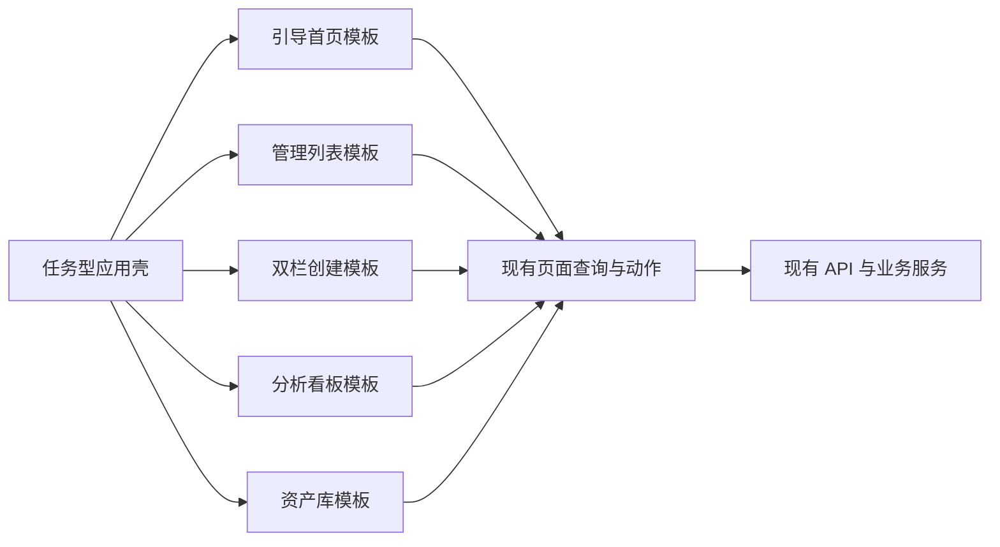

# GEO 成熟产品体验重构技术设计

Feature Name: geo-mature-product-ux-refresh
Updated: 2026-07-14

## Description

本设计基于 `当前工作区/GEO参考.zip` 中 30 张参考截图的页面范式，对当前 GEO 平台进行展示层重构。现有 API、领域模型、真实 AI 回复指标边界、品牌权限和深链接协议保持稳定。第一阶段通过共享页面骨架和五个核心页面改造建立统一体验基线。

## Architecture



展示层新增稳定模板，业务页面负责组合模板和映射现有 DTO。路由构造、查询缓存、品牌上下文和 API 调用继续复用当前实现。

## Design Principles

1. 每个页面在首屏呈现一个主任务。
2. 页面先给结论和下一步，再展开状态与证据。
3. 同类任务复用同一页面模板和交互位置。
4. 高级信息通过 Tab、抽屉、弹窗或二级区域展示。
5. 视觉资产和文案使用当前产品自有表达。

## Components and Interfaces

### AppShell

- 将导航收敛为开始、监测、优化、发布和分析五个任务域。
- 桌面端使用可折叠侧栏，移动端使用抽屉导航。
- 品牌切换保留在全局头部。
- 工作流步骤条仅在主链路页面显示当前阶段、上一阶段和下一阶段。

对应现有文件：

- `当前工作区/apps/web/src/layouts/AppLayout.tsx`
- `当前工作区/apps/web/src/layouts/navigation.ts`

### ProductPage

统一页面宽度、标题、说明、主操作、辅助操作和状态反馈。

```ts
type ProductPageProps = {
  title: string;
  description: string;
  primaryAction?: React.ReactNode;
  secondaryActions?: React.ReactNode;
  context?: React.ReactNode;
  children: React.ReactNode;
};
```

### GuidedEmptyState

统一空状态的原因、收益说明和单一下一步动作。

```ts
type GuidedEmptyStateProps = {
  title: string;
  description: string;
  actionLabel: string;
  onAction: () => void;
  supportingText?: string;
};
```

### UnifiedFilterBar

统一搜索、时间、平台、状态筛选和结果计数。筛选状态写入 URL query，保留可分享性。

### PlatformSwitch

- 固定平台显示名：豆包、Kimi、DeepSeek、通义千问、阶跃星辰。
- 支持全部平台和单平台切换。
- 同时展示文字名称与图形标识。

### InsightOverview

由关键结论、指标摘要、趋势或分布和证据明细组成。指标继续遵守真实 AI 回复样本边界。

### CreationWorkspace

- 左侧：模板、来源、目标、平台、语气和输出配置。
- 右侧：预期说明、加载状态、错误恢复、生成结果和后续动作。
- 小屏按配置、结果两个步骤纵向排列。

### AssetLibrary

- 左侧分类：基础信息、产品服务、目标用户、事实知识、媒体素材。
- 右侧展示对应表单或列表。
- 资料完整度和下一步建议保持可见。

## Page Mapping

| 当前页面 | 第一阶段模板 | 核心改造 |
| --- | --- | --- |
| 新手首页 | 引导首页 | 一个主任务、三个阶段、四项摘要、示例问题 |
| 品牌资料 | 资产库 | 左侧分类、右侧内容、资料完整度和单一保存动作 |
| AI 回复监测 | 分析看板 + 管理列表 | 平台切换、结论、趋势、明细、开始监测入口 |
| 内容生成 | 模板选择 + 双栏创建 | 模板前置、分组配置、结果预览、发布交接 |
| 发布准备 | 管理列表 | 状态筛选、发布记录、发布结果录入、再次监测入口 |

## Visual System

### Layout Tokens

- 页面最大阅读宽度：1440px
- 页面横向边距：桌面 32px，平板 24px，移动 16px
- 页面区域间距：24px
- 组件内部间距：16px
- 紧凑信息间距：8px
- 主要圆角：12px
- 控件圆角：8px

### Hierarchy

- 页面标题：28px，600 字重
- 区域标题：18px，600 字重
- 正文：14px 至 16px
- 辅助文本：13px
- 核心数字：28px 至 36px

### Color Roles

- 主行动色：品牌蓝
- 页面背景：低饱和中性灰
- 内容背景：白色
- 边界：浅灰蓝
- 成功、提醒、风险分别使用语义绿、琥珀和红

## State Model

每个核心页面统一支持：

- `loading`：骨架屏保持最终布局
- `ready`：展示真实业务数据
- `empty`：行动型空状态
- `partial`：展示可用区域和缺失原因
- `error`：展示用户可理解原因与重试动作

## Correctness Properties

1. 任意重构页面的主数据查询必须携带当前 `brandId`。
2. 任意公开平台配置区域只能展示脱敏状态和用户可理解原因。
3. 任意指标摘要只能使用真实 AI 回复、浏览器辅助结果或手动录入真实回复。
4. 任意现有工作流链接在重构后必须保留 query 和 hash 上下文。
5. 任意核心页面在桌面和移动布局中必须存在同一主任务入口。
6. 任意页面首屏最多存在一个实心主色按钮。

## Error Handling

- API 失败：保留页面骨架，展示错误摘要、重试和可继续操作区域。
- 样本不足：展示样本状态、平台范围和开始监测入口。
- 品牌资料不足：展示缺失资料及对监测或生成结果的影响。
- 生成失败：保留用户配置，展示失败原因和再次生成入口。
- 发布信息缺失：保留内容任务，提示补充账号、链接或发布时间。

## Test Strategy

### Unit Tests

- 导航分组和当前任务匹配
- 页面模板主操作数量
- 筛选 query 序列化与恢复
- 平台显示名和脱敏状态
- 空状态下一步映射

### Component Tests

- 新手首页三阶段状态
- 内容生成模板选择和双栏状态切换
- 监测页面平台切换和样本不足状态
- 发布记录录入和再次监测入口
- 桌面与移动导航行为

### Regression Tests

- 现有品牌深链接 query/hash 保留
- API 请求路径与品牌上下文保持一致
- 真实指标边界保持一致
- Web typecheck、测试和生产构建通过

### Visual Review

- 1440px 桌面首屏
- 1024px 平板布局
- 390px 移动布局
- 加载、空态、部分数据、完整数据和失败状态

## Delivery Sequence

1. 建立视觉令牌、应用壳和共享页面模板。
2. 重构新手首页，确认视觉方向和信息密度。
3. 重构 AI 回复监测和统一分析骨架。
4. 重构内容生成模板选择与双栏工作台。
5. 重构发布准备与再次监测交接。
6. 重构品牌资料资产库结构。
7. 完成响应式、可访问性和视觉回归验证。

## References

- `当前工作区/GEO参考.zip`：30 张 GEO 成熟产品参考截图
- `当前工作区/apps/web/src/layouts/AppLayout.tsx`：当前应用壳
- `当前工作区/apps/web/src/layouts/navigation.ts`：当前导航和工作流
- `当前工作区/apps/web/src/features/brand-workspace/pages/BrandWorkspacePage.tsx`：当前新手首页和品牌工作区
- `当前工作区/apps/web/src/styles/global.css`：当前全局视觉样式
