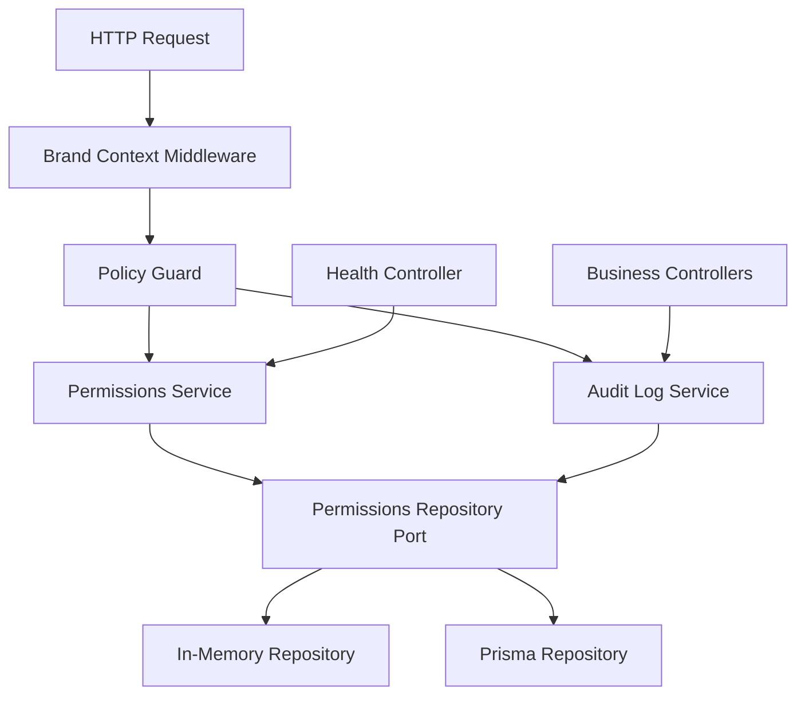

# Access Audit Production

Feature Name: access-audit-production
Updated: 2026-07-04

## Description

第四阶段在当前多品牌权限中间件和 Repository Port 基础上，引入真实组织、组织成员、角色、品牌授权、审计日志和生产试运行配置。实现策略保持渐进：先补数据模型与仓储契约，再接入权限策略和审计服务，最后补生产健康检查与运行手册。

## Architecture

请求继续通过 `x-brand-id` 和 `x-user-id` 进入品牌上下文。第四阶段将权限判断从固定中间件逐步升级为集中策略：策略定义描述模块、动作和最低角色要求，守卫或中间件从策略表取规则并调用 `PermissionsService`。审计日志服务通过 repository port 写入成功、失败和拒绝访问事件。

## Components and Interfaces

- `Organization` / `OrganizationMember` / `Role`: Prisma schema 与共享类型新增真实组织成员关系。
- `AuditLog`: Prisma schema 与共享类型新增品牌级审计事件模型。
- `PermissionsRepositoryPort`: 增加组织成员、角色、审计日志和策略查询相关方法。
- `PermissionsService`: 统一封装用户状态、组织成员状态、品牌角色和策略判断。
- `BrandAccessMiddleware` / Policy Guard: 复用当前中间件入口，后续可拆为 Nest guard；当前阶段优先保持现有请求链路稳定。
- `HealthController`: 扩展 readiness 响应，暴露 repository driver、runtime environment 和依赖状态摘要。
- `.monkeycode/docs/DEPLOYMENT_RUNBOOK.md`: 新增生产试运行手册，覆盖环境变量、迁移、启动、健康检查、回滚和排障。

## Data Models

### Organization

- `id`
- `name`
- `status`: active | suspended
- `createdAt`
- `updatedAt`

### OrganizationMember

- `id`
- `organizationId`
- `userId`
- `roleId`
- `status`: active | suspended
- `createdAt`
- `updatedAt`

### Role

- `id`
- `code`: owner | admin | operator | viewer
- `name`
- `scope`: organization | brand
- `permissions`: string array
- `createdAt`
- `updatedAt`

### AuditLog

- `id`
- `brandId`
- `organizationId`
- `actorUserId`
- `action`
- `resourceType`
- `resourceId`
- `result`: success | failure | denied
- `errorCode`
- `metadata`
- `createdAt`

## Correctness Properties

- 每条品牌级业务数据继续以 `brandId` 隔离。
- 禁用用户或禁用组织成员无法通过受保护品牌操作。
- 审计日志公开查询不返回凭据、token、provider 原始密钥或完整外部请求体。
- 权限策略要求集中声明，业务 controller 保持业务逻辑职责。
- 内存仓储和 Prisma 仓储保持相同契约，确保测试和生产切换行为一致。

## Error Handling

- 缺少 `x-brand-id` 返回结构化品牌上下文错误。
- 缺少用户上下文、用户禁用、组织成员禁用、品牌角色不足统一返回权限错误。
- 审计写入失败时记录服务端日志并保留业务错误响应；后续生产阶段可接入可靠队列。
- 健康检查发现依赖缺失时返回 degraded 状态和不含密钥值的配置缺口。

## Test Strategy

- Repository 契约测试覆盖组织、成员、角色、品牌授权和审计日志。
- 权限服务测试覆盖允许访问、拒绝访问、禁用用户和禁用成员。
- 审计日志测试覆盖成功事件、失败事件、拒绝事件和敏感字段过滤。
- 健康检查测试覆盖默认内存仓储、Prisma driver 配置和缺失环境变量摘要。
- 完整门禁使用 `npm run verify`、`git diff --check`、API 健康检查和前端入口检查。
