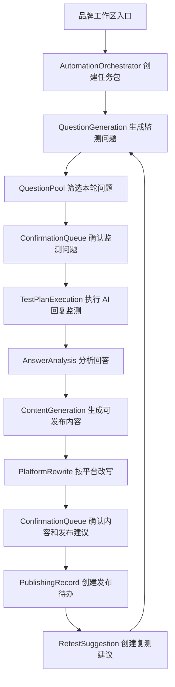

# AI 自动化运营员技术设计

Feature Name: ai-automation-operator
Updated: 2026-07-07

## Description

AI 自动化运营员在现有 GEO 平台能力之上增加一层任务编排。现有系统已经具备品牌档案、监测问题生成、监测计划执行、LLM 回答分析、增长优化计划、内容生成、发布中心和复测任务；本设计新增自动化任务包、确认队列和平台规则适配，让这些能力从分散按钮操作升级为串联流程。

第一版实现目标是让品牌方点击一次入口后，系统持续维护监测问题池，并从问题池中为当前轮次精选 5 到 6 个问题让用户确认。用户确认后，系统自动监测、自动分析结果、自动生成内容、按目标平台改写，并把发布建议和复测建议收口到确认队列。

## Architecture



新增编排层只负责步骤状态、输入收集、确认节点和错误转移。具体业务能力继续复用现有模块：监测问题复用 `TestQuestionService` 和 `LLMOrchestrationService.question_generation`，监测执行复用监测计划执行接口，回答分析复用 `answer_analysis` 和规则二次校验，内容生成复用 `ContentGenerationWorker`，发布和复测复用已有发布中心与任务复测能力。

## Components and Interfaces

### AutomationOrchestratorService

职责：创建并推进自动化任务包。

输入：`brandId`、启动来源、目标范围、可选平台列表、可选内容平台列表。

输出：自动化任务包详情、步骤状态、确认事项和下一步动作。

核心方法：

- `createPackage(input)`：创建自动化任务包并收集品牌上下文。
- `prepareQuestions(packageId)`：更新监测问题池，筛选 5 到 6 个本轮精选问题并创建确认事项。
- `continueAfterConfirmation(packageId)`：根据确认结果推进下一步。
- `runTestPlan(packageId)`：创建或复用监测计划并执行。
- `generateContent(packageId)`：基于分析结果创建内容生成任务。
- `rewriteForPlatform(packageId, platform)`：生成平台改写版本。
- `completePackage(packageId)`：保存发布建议和复测建议。

### ConfirmationQueueService

职责：收口用户确认事项。

确认类型：

- `test_questions`：监测问题确认。
- `analysis_review`：分析判断确认。
- `content_review`：内容草稿确认。
- `platform_rewrite_review`：平台改写确认。
- `publishing_suggestion`：发布建议确认。
- `manual_test_required`：手动录入确认。

确认动作：

- `approve`：确认通过。
- `edit`：用户编辑后确认。
- `regenerate`：要求系统重新生成。
- `skip`：跳过该事项。

### PlatformRewriteService

职责：根据目标平台规则改写内容版本。

第一版规则：

- 知乎：问答式结构、经验解释、可信依据、审慎表达。
- 百家号：资讯式标题、结构化正文、权威背书、本地服务信息。
- 小红书：笔记标题、家长视角、选择建议、话题标签。
- 公众号：完整推文结构、分段标题、品牌观点、行动引导。
- 官网 FAQ：问题答案结构、品牌事实、服务范围、审慎声明。

该服务优先调用 `LLMOrchestrationService.content_generation` 的平台适配 Prompt；LLM 不可用时使用规则模板生成可编辑版本。

### QuestionPoolService

职责：维护持续增长的监测问题池，并按当前运营目标筛选本轮精选问题。

输入来源：品牌档案、监测主题、历史监测问题、AI 回答分析、竞品变化、内容缺口、发布记录和复测结果。

核心规则：

- 问题池可以持续扩展，当前轮次只展示 5 到 6 个精选问题。
- 同一轮精选问题应覆盖不同监测角度，避免重复监测同一个意图。
- 已测问题保留历史表现，用于复测或趋势对比。
- 新资料、新内容发布和复测结果会触发下一轮候选问题生成。

### Automation API

建议新增接口：

```http
POST /api/v1/brands/:brandId/automation/packages
GET /api/v1/brands/:brandId/automation/packages/:packageId
POST /api/v1/brands/:brandId/automation/packages/:packageId/start
POST /api/v1/brands/:brandId/automation/packages/:packageId/confirmations/:confirmationId
POST /api/v1/brands/:brandId/automation/packages/:packageId/regenerate
POST /api/v1/brands/:brandId/automation/packages/:packageId/stop
```

公开响应继续使用 `ApiResponse<T>`，并只返回摘要、状态、用户可见内容和脱敏平台信息。

## Data Models

### AutomationPackage

```ts
type AutomationPackage = {
  packageId: string;
  brandId: BrandId;
  status: 'draft' | 'waiting_confirmation' | 'running' | 'completed' | 'failed' | 'stopped';
  source: 'brand_workspace' | 'monitoring' | 'growth_optimization' | 'content_generation';
  goal: string;
  targetPlatforms: string[];
  targetPublishingPlatforms: string[];
  currentStep: AutomationStepCode;
  stepSummaries: AutomationStepSummary[];
  relatedTestPlanId?: string;
  relatedGrowthPlanId?: string;
  relatedContentTaskIds: string[];
  relatedPublishingRecordIds: string[];
  createdBy: string;
  createdAt: string;
  updatedAt: string;
};
```

### AutomationConfirmation

```ts
type AutomationConfirmation = {
  confirmationId: string;
  packageId: string;
  brandId: BrandId;
  type: ConfirmationType;
  status: 'pending' | 'approved' | 'edited' | 'regenerate_requested' | 'skipped';
  title: string;
  impact: string;
  recommendation: string;
  evidenceSummary: string;
  payload: unknown;
  decision?: string;
  decidedBy?: string;
  decidedAt?: string;
};
```

### PlatformRewriteVersion

```ts
type PlatformRewriteVersion = {
  rewriteId: string;
  brandId: BrandId;
  contentVersionId: string;
  targetPlatform: 'zhihu' | 'baijiahao' | 'xiaohongshu' | 'wechat_official' | 'official_site_faq';
  title: string;
  body: string;
  tags: string[];
  rewriteNotes: string[];
  complianceNotes: string[];
  status: 'draft' | 'needs_review' | 'approved';
  createdAt: string;
};
```

### TestQuestionPoolItem

```ts
type TestQuestionPoolItem = {
  poolItemId: string;
  brandId: BrandId;
  question: string;
  angle: 'brand' | 'category' | 'local' | 'audience' | 'pain_point' | 'course' | 'competitor' | 'buying_decision' | 'content_gap' | 'retest';
  purposes: string[];
  targetPlatforms: string[];
  priority: 'high' | 'medium' | 'low';
  estimatedValue: string;
  source: 'llm' | 'rule_template' | 'analysis_gap' | 'retest' | 'user_edit';
  status: 'candidate' | 'selected' | 'tested' | 'paused';
  lastTestedAt?: string;
  createdAt: string;
  updatedAt: string;
};
```

第一版可以先使用 memory repository 保存新增结构，并在 Prisma schema 中增量加入对应模型。所有模型必须包含 `brandId`。

## Correctness Properties

1. 自动化任务包的所有业务记录必须绑定同一个 `brandId`。
2. 监测问题池可以持续增长，本轮精选问题数量默认控制在 5 到 6 个。
3. 自动化任务包进入下一步骤前，所有必需确认事项必须处于已处理状态。
4. 自动监测失败的平台必须保留可恢复路径：浏览器确认或手动录入。
5. 内容生成和平台改写结果必须保留原始内容版本关联，便于追溯来源。
6. 公开响应必须隐藏真实 API Key、cookies、storage state、浏览器 profile 路径和平台敏感凭据。
7. 风险表达、未经确认事实和平台规则限制必须进入确认队列。

## Error Handling

- 品牌资料不足：生成补充问题，允许用户确认后继续基础流程。
- LLM 平台未配置：使用规则模板 fallback，并在任务包中记录原因。
- LLM 输出无效：保留上一步结果，创建重新生成确认事项。
- API 调用失败：记录失败摘要，切换浏览器或手动录入路径。
- 浏览器异常：停止该平台自动步骤，创建 `manual_test_required` 确认事项。
- 内容风险：将内容或改写版本标记为 `needs_review`，展示审慎改法。
- 用户停止任务：保存当前进度、已生成内容和可恢复入口。

## Frontend Experience

新增或扩展页面：

- 品牌工作区：新增“让 AI 帮我跑一轮”主入口。
- AI 回复监测页：展示自动化任务包运行状态和监测问题确认卡片。
- 增长优化页：展示自动化生成的运营判断、内容建议和复测建议。
- 内容生成页：展示平台改写版本、发布建议和合规检查。
- 全局确认队列：展示待确认事项数量，并允许按影响排序处理。

页面用词保持业务化：使用“监测问题”“需要你确认”“可发布内容”“建议发布平台”“复测建议”等表达。

## Test Strategy

### Unit Tests

- `AutomationOrchestratorService`：覆盖创建任务包、步骤推进、确认阻塞和失败转移。
- `ConfirmationQueueService`：覆盖确认通过、编辑、重新生成和跳过。
- `PlatformRewriteService`：覆盖知乎、百家号、小红书、公众号和官网 FAQ 改写规则。
- 输出脱敏测试：覆盖 API Key、浏览器会话敏感信息和平台凭据不出现在公开响应中。

### Integration Tests

- 持续生成监测问题池，并从问题池中精选 5 到 6 个问题保存为监测计划。
- 监测计划确认后执行 API、浏览器和手动兜底路径。
- 分析结果驱动内容生成和平台改写。
- 内容确认后创建发布记录和复测建议。
- 追光小牛样例覆盖贵阳儿童运动、ACE 成长体系、5 家校区和冠军背书。

### Verification Commands

按现有项目验证口径执行：

```bash
npm run typecheck --workspace @geo-platform/api
npm run typecheck --workspace @geo-platform/web
npm run test --workspace @geo-platform/api
npm run test --workspace @geo-platform/web
npm run prisma:validate
npm run prisma:generate
```

## References

- 当前工作区/.monkeycode/docs/ARCHITECTURE.md
- 当前工作区/.monkeycode/docs/INTERFACES.md
- 当前工作区/.monkeycode/specs/beginner-friendly-geo-workflow/requirements.md
- 当前工作区/.monkeycode/specs/llm-api-integration/tasklist.md
