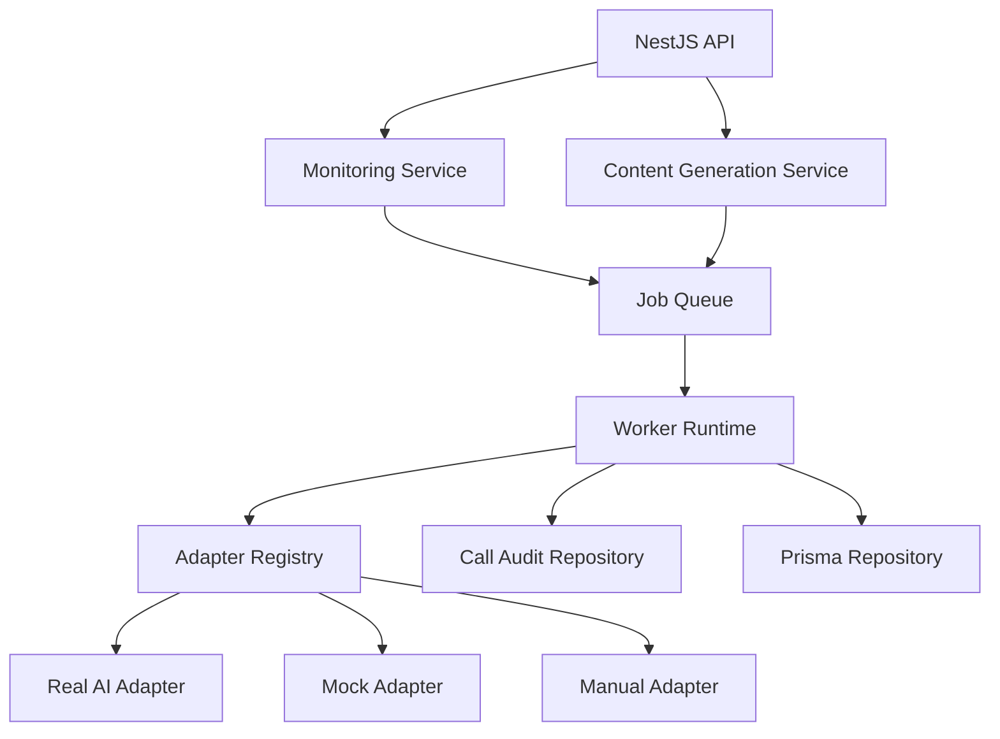

# 第三阶段真实 AI 平台集成与异步任务设计

Feature Name: ai-platform-async-tasks
Updated: 2026-07-03

## Description

第三阶段在现有 `AIPlatformAdapter`、平台配置、监测运行、内容生成任务和 Prisma repository 之上扩展真实 AI 调用与异步任务执行能力。设计目标是把外部调用、队列状态、失败重试、人工兜底、调用审计和内容生成步骤纳入后端稳定边界，同时保持第一版前端接口和品牌隔离语义稳定。

## Architecture

The API layer keeps the current controller routes. Create actions persist queued work and return the current monitoring run or content generation workspace. Worker execution advances persisted status and writes responses, versions, audit records and failure details.

## Components and Interfaces

### Adapter Registry

- Builds on `apps/api/src/modules/platforms/adapters/ai-platform.adapter.ts`.
- Registers adapters by `platformCode` and supported mode.
- Selects `MockAdapter` or `ManualInputAdapter` for deterministic tests and fallback paths.
- Selects real adapters only when platform config mode and environment configuration are present.

### Monitoring Job Service

- Creates monitoring jobs from existing `MonitoringRunInput`.
- Stores queued, running, succeeded, failed and retry state in persisted records.
- Delegates execution to worker runtime.
- Keeps existing `GET /api/v1/brands/:brandId/monitoring-runs` and detail responses compatible.

### Content Generation Job Service

- Creates generation jobs from existing `ContentGenerationTaskInput`.
- Records step status for context loading, outline generation, draft generation and rule checking.
- Writes `ContentVersion` after successful draft generation.
- Keeps export and publishing entry APIs compatible.

### Worker Runtime

- Runs jobs through deterministic handler functions.
- Applies retry policy based on normalized adapter errors.
- Writes failure context and manual fallback state.
- Can start as an in-process worker for development and later move to a queue-backed worker process.

### Call Audit Repository

- Stores brand-isolated call audit records.
- Records platform, model, call type, status, duration, token counts, cost estimate and normalized failure data.
- Exposes summaries through task detail responses without credentials.

## Data Models

New or extended Prisma models should be additive:

- `AIPlatformCallAudit`: `id`, `brandId`, `platformCode`, `modelName`, `callType`, `status`, `durationMs`, `inputTokenCount`, `outputTokenCount`, `costEstimate`, `errorCode`, `errorMessage`, `retryable`, `startedAt`, `completedAt`.
- `AsyncJob`: `id`, `brandId`, `jobType`, `status`, `entityId`, `attemptCount`, `maxAttempts`, `nextRunAt`, `lastErrorCode`, `lastErrorMessage`, `createdAt`, `updatedAt`.
- `ContentGenerationTask.steps`: continue using JSON for step-level state in this phase.
- `MonitoringRun.retryStatus` and `errorMessage`: continue using existing fields for user-facing status.

## Correctness Properties

- Property A1: For any external call, stored audit records must contain `brandId` and must not contain raw credential values.
- Property A2: A monitoring job can transition from queued to running to succeeded or failed, and retry exhaustion ends in failed.
- Property A3: A content generation job that succeeds must produce at least one content version linked to the source generation task.
- Property A4: Adapter errors must preserve monitoring run visibility and manual fallback ability.
- Property A5: Existing API response envelopes must remain `ApiResponse<T>`.

## Error Handling

- Missing adapter: mark job failed with `adapter_not_registered`, keep manual fallback available.
- Missing credential reference: mark job failed with `credential_missing`, keep validation message available.
- Provider timeout: mark job retryable and schedule retry according to policy.
- Provider rate limit: mark job retryable and store normalized rate limit message.
- Non-retryable provider error: mark job failed and store user-facing failure detail.
- Content generation step failure: store failed step name, message and retry state.

## Test Strategy

- Adapter contract tests cover success, validation, provider failure and credential missing cases.
- Worker state tests cover queued, running, succeeded, retryable failure and retry exhaustion transitions.
- Monitoring integration tests use fake adapters and persisted fixtures to verify response creation and analysis availability.
- Content generation tests verify step status, generated version creation, export and publish entry compatibility.
- Audit tests verify brand isolation, status updates and credential redaction.
- Full gate remains `npm run verify`, plus API health and preview checks when Web behavior changes.

## References

- `apps/api/src/modules/platforms/adapters/ai-platform.adapter.ts`
- `apps/api/src/modules/monitoring/monitoring.controller.ts`
- `apps/api/src/modules/content/content.controller.ts`
- `apps/api/prisma/schema.prisma`
