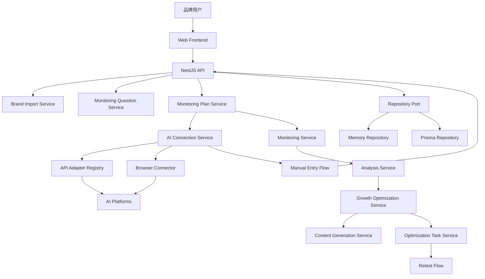

# 小白友好 GEO 自动监测与增长优化流程技术设计

Feature Name: beginner-friendly-geo-workflow
Updated: 2026-07-04

## Description

本设计将现有多品牌 GEO 平台从后台运营工具扩展为品牌方可自助使用的完整增长流程。系统围绕“上传资料、选择问法、连接平台、开始监测、查看建议、执行优化、复测增长”组织功能，复用现有品牌知识库、AI 平台配置、监测运行、回答分析、内容策略、内容生成、发布中心和任务复测能力，新增资料导入解析、监测主题与问法候选、监测计划、浏览器辅助连接、业务化结果解释和 GEO 增长优化计划边界。

第一版默认 AI 平台为豆包、Kimi、DeepSeek 和通义千问。第一版品牌资料导入格式为 Markdown、Word 和 PDF。产品体验采用全局小白友好原则，通过业务化用词、默认推荐、提示卡和步骤条降低理解成本，同时保留现有品牌隔离、凭据脱敏、调用审计和任务复测闭环。

## Architecture



前端保留当前 React Router、品牌上下文和后台布局，在品牌工作区、AI 监测、内容生成、发布中心和任务复测页面之间增加连续流程入口。后端继续通过 NestJS controller、repository port、Prisma schema 和 shared-types 维护前后端契约。真实 AI API 调用继续走 Adapter registry；浏览器辅助监测作为新的连接方式接入监测计划编排；手动录入作为稳定兜底路径复用现有人工回答录入能力。

## Components and Interfaces

### Brand Import Service

- 入口：`apps/api/src/modules/brands/`
- 负责 Markdown、Word、PDF 品牌资料上传、解析、字段置信度标记、待确认字段生成和品牌档案确认保存。
- 复用 `KnowledgeSource` 记录上传来源、解析状态、错误信息和确认状态。
- 输出 `BrandImportDraft`、`BrandImportField`、`BrandImportConfirmInput` 等共享契约。
- 覆盖需求 1.1-2.4。

### Monitoring Theme and Question Service

- 入口：可在 `apps/api/src/modules/brands/` 或独立 `apps/api/src/modules/test-plans/` 中实现。
- 根据 `BrandProfile` 生成监测主题：品牌词、品类词、地域词、人群年龄段、用户痛点、课程或产品、竞品对比、购买决策。
- 根据监测主题生成监测问法候选，标注监测目的、目标平台、推荐优先级和预计监测价值。
- 追光小牛样例作为 deterministic fixture，便于内测闭环验证。
- 覆盖需求 3.1-4.5、17.1-17.2。

### Monitoring Plan Service

- 入口：新增监测计划 controller 和 repository 方法，或扩展 monitoring 模块创建入口。
- 保存首轮监测计划、候选问法选择、目标平台、连接方式、预计耗时和需要用户确认事项。
- 根据平台状态分发到 API 自动监测、浏览器辅助监测或手动录入。
- 支持监测计划模板、复制、编辑和复测。
- 覆盖需求 5.1-5.4、13.1-13.4。

### AI Connection Service

- 入口：扩展 `apps/api/src/modules/platforms/`。
- 第一版默认平台为豆包、Kimi、DeepSeek、通义千问。
- 平台状态归类为可自动监测、可用浏览器辅助监测、可手动录入、需要配置。
- API 连接继续通过 `PlatformConfig` 保存 endpoint、model、mode、rate limit 和脱敏凭据状态。
- 浏览器连接通过 `BrowserConnectionSession` 保存平台、登录检测结果、最近可用时间、授权品牌范围和状态摘要。
- 覆盖需求 6.1-9.4、16.1-16.5。

### Browser Connector

- 入口：新增 `apps/api/src/modules/platforms/browser-connectors/`。
- 定义 `BrowserConnector` 接口：打开登录页、检测登录、发送问题、等待回答、提取回答、停止会话。
- 每个平台实现独立 connector：豆包、Kimi、DeepSeek、通义千问。
- 遇到验证码、登录失效、页面结构变化、平台限制时返回需要用户确认状态，并提供手动录入路径。
- 第一版可使用 fake connector 完成契约和状态流转，真实 Playwright 驱动在后续任务接入。
- 覆盖需求 7.1-7.7、16.2-16.4。

### Analysis Explanation Service

- 入口：扩展现有回答解析和评价分析模块。
- 将 `AnalysisResult` 转换为业务化解释：有没有出现、排第几、说得准不准、竞品表现、需要补什么内容。
- 标记“需要你确认”：高风险承诺、禁用表达、排名无法判断、情绪无法判断、浏览器连接异常。
- 追光小牛样例校验 ACE 成长体系、五家贵阳校区、世界冠军师资背书和禁用表达。
- 覆盖需求 10.1-11.4、17.3-17.4。

### Growth Optimization Service

- 入口：扩展内容策略、内容生成、任务复测和顾问服务模块。
- 根据推荐率、排名、表达准确性、竞品压制和内容缺口生成优化策略。
- 输出优化计划，字段包含负责人、截止时间、发布平台、复测时间。
- 支持内容类型：公众号推文、小红书图文、官网 FAQ、短视频脚本、平台介绍文案、图片创意需求。
- 关联 `ContentStrategy`、`ContentGenerationTask`、`OptimizationTask`、`PublishingRecord` 和复测运行。
- 覆盖需求 14.1-15.9、17.5。

### Frontend Experience Layer

- 品牌工作区：资料上传、档案确认、完整度提示、首轮步骤条。
- AI 监测页：监测问法候选、监测计划、一键监测、监测结果解释。
- 平台连接页：连接状态归类、API 高级设置、浏览器登录引导、手动录入入口。
- 内容生成和任务复测页：增长优化计划、内容任务、发布平台、负责人、截止时间和复测时间。
- 全局用词映射：Prompt 展示为监测问题，优化单元展示为监测主题，平台配置展示为连接 AI 平台。
- 覆盖需求 11.1-12.4、15.1-15.9。

## Data Models

第一版优先复用现有模型，通过增量字段或轻量新模型承载新增流程。

### Reused Models

- `Brand`: 保存品牌基础信息。
- `BrandProfile`: 保存品牌介绍、卖点、课程或产品、FAQ、推荐表达、禁用表达和完整度评分。
- `KnowledgeSource`: 保存上传资料来源、解析状态和错误信息。
- `OptimizationUnit`: 承载监测主题。
- `UserIntent`: 承载用户意图。
- `BrandPrompt`: 承载监测问法。
- `PlatformConfig`: 承载 API、浏览器、手动和 mock 连接状态。
- `MonitoringRun`: 承载单次监测运行。
- `AIResponse`: 保存原始 AI 回答。
- `AnalysisResult`: 保存解析结果和复核状态。
- `ContentStrategy`: 保存内容补强策略。
- `ContentGenerationTask`: 保存 AI 协助生成内容任务。
- `OptimizationTask`: 保存负责人、截止时间、处理说明、复测计划和复测结果。
- `PublishingRecord`: 保存发布平台和发布状态。

### New or Extended Contracts

```ts
type SupportedBrandImportFormat = 'markdown' | 'word' | 'pdf';
type BeginnerFriendlyPlatform = 'doubao' | 'kimi' | 'deepseek' | 'qianwen';
type AIConnectionMethod = 'api' | 'browser' | 'manual';
type AIConnectionStatus = 'ready' | 'browser_available' | 'manual_available' | 'needs_configuration' | 'needs_confirmation';
type TestThemeType = 'brand' | 'category' | 'location' | 'age_group' | 'pain_point' | 'offering' | 'competitor' | 'buying_decision';
type TestQuestionPurpose = 'brand_mentioned' | 'rank_first' | 'value_prop_accuracy' | 'competitor_presence' | 'risk_expression';
type GrowthContentType = 'wechat_article' | 'xiaohongshu_note' | 'website_faq' | 'short_video_script' | 'platform_profile_copy' | 'image_creative_brief';
```

`BrandImportDraft`:
- `id`, `brandId`, `sourceId`, `fields`, `confidenceSummary`, `missingFields`, `status`, `createdAt`, `updatedAt`

`TestTheme`:
- `id`, `brandId`, `type`, `name`, `businessExplanation`, `priority`, `estimatedValue`, `enabled`, `sourceProfileFields`

`TestQuestionCandidate`:
- `id`, `brandId`, `themeId`, `question`, `purposes`, `targetPlatforms`, `priority`, `estimatedValue`, `editable`, `selected`

`TestPlan`:
- `id`, `brandId`, `name`, `questionIds`, `platformCodes`, `connectionSummary`, `estimatedDuration`, `confirmationItems`, `status`, `createdBy`

`BrowserConnectionSession`:
- `id`, `brandId`, `platformCode`, `status`, `loginDetected`, `lastAvailableAt`, `authorizedScope`, `lastMessage`, `createdAt`, `updatedAt`

`GrowthOptimizationPlan`:
- `id`, `brandId`, `sourcePlanId`, `sourceRunIds`, `summary`, `reasonCandidates`, `priority`, `owner`, `dueDate`, `publishingPlatforms`, `retestAt`, `tasks`, `status`

## Correctness Properties

- Property B1: 所有新增业务记录必须包含 `brandId`，并通过现有品牌访问策略校验。覆盖需求 1.5、16.3。
- Property B2: API Key、浏览器会话和外部平台敏感信息只通过状态、引用或脱敏摘要出现在公开响应中。覆盖需求 6.3、16.1-16.2。
- Property B3: 任意监测问法候选必须包含监测目的和至少一个目标平台。覆盖需求 4.3-4.4。
- Property B4: 任意浏览器回答成功记录必须关联品牌、平台、监测问题和原始回答。覆盖需求 7.3-7.4。
- Property B5: 任意高风险表达分析结果必须生成“需要你确认”状态和建议改法。覆盖需求 10.4、17.4。
- Property B6: 任意第一版优化计划必须包含负责人、截止时间、发布平台和复测时间。覆盖需求 15.9。
- Property B7: 复测结果必须能关联原始监测计划和优化计划，便于对比优化前后的推荐率、排名和表达准确性。覆盖需求 14.2-15.7。

## Error Handling

- 资料导入失败：返回支持格式、失败原因和手动填写入口。
- 品牌资料缺失：允许继续首轮监测，并标记结果可信度提示。
- AI 平台 API 配置错误：标记平台为需要配置，保留监测计划和手动录入入口。
- 浏览器验证码或风控：停止当前平台自动操作，返回需要用户确认状态和手动录入路径。
- 浏览器登录失效：更新会话状态，提示重新登录。
- 回答匹配失败：提示用户选择对应监测问题或重新粘贴回答。
- 分析结果无法判断：标记需要你确认，并提供可编辑分析表单。
- 优化动作未提升指标：生成下一轮策略建议并保留历史优化记录。

## Test Strategy

- 品牌资料导入测试覆盖 Markdown、Word、PDF 成功路径、解析失败和完整度缺失项。
- 监测主题和问法测试覆盖完整资料、缺少城市、缺少竞品、追光小牛样例和属性 B3。
- 监测计划编排测试覆盖 API、浏览器、手动和无可用连接方式。
- 平台连接测试覆盖默认四个平台、凭据脱敏、连接失败和状态归类。
- 浏览器连接测试使用 fake connector 覆盖登录成功、回答成功、验证码、登录失效、读取失败和属性 B4。
- 分析解释测试覆盖品牌提及、推荐排名、竞品、风险表达、无法判断和属性 B5。
- 增长优化测试覆盖策略生成、内容类型、负责人字段、复测联动、指标未提升和属性 B6、B7。
- 前端测试覆盖品牌导入入口、步骤条、问法选择、平台连接状态、手动录入、结果解释、优化计划和全局业务化用词。
- 验证门禁继续使用 `npm run typecheck`、`npm run test`、`npm run build`、`npm run prisma:validate` 和 `npm run prisma:generate`。

## References

- `当前工作区/.monkeycode/specs/beginner-friendly-geo-workflow/requirements.md`
- `当前工作区/.monkeycode/specs/beginner-friendly-geo-workflow/tasklist.md`
- `当前工作区/.monkeycode/specs/ai-platform-async-tasks/design.md`
- `当前工作区/.monkeycode/specs/multi-brand-geo-platform/design.md`
- `当前工作区/packages/shared-types/src/index.ts`
- `当前工作区/apps/api/prisma/schema.prisma`
- `当前工作区/apps/web/src/features/brand-workspace/`
- `当前工作区/apps/web/src/features/monitoring/`
