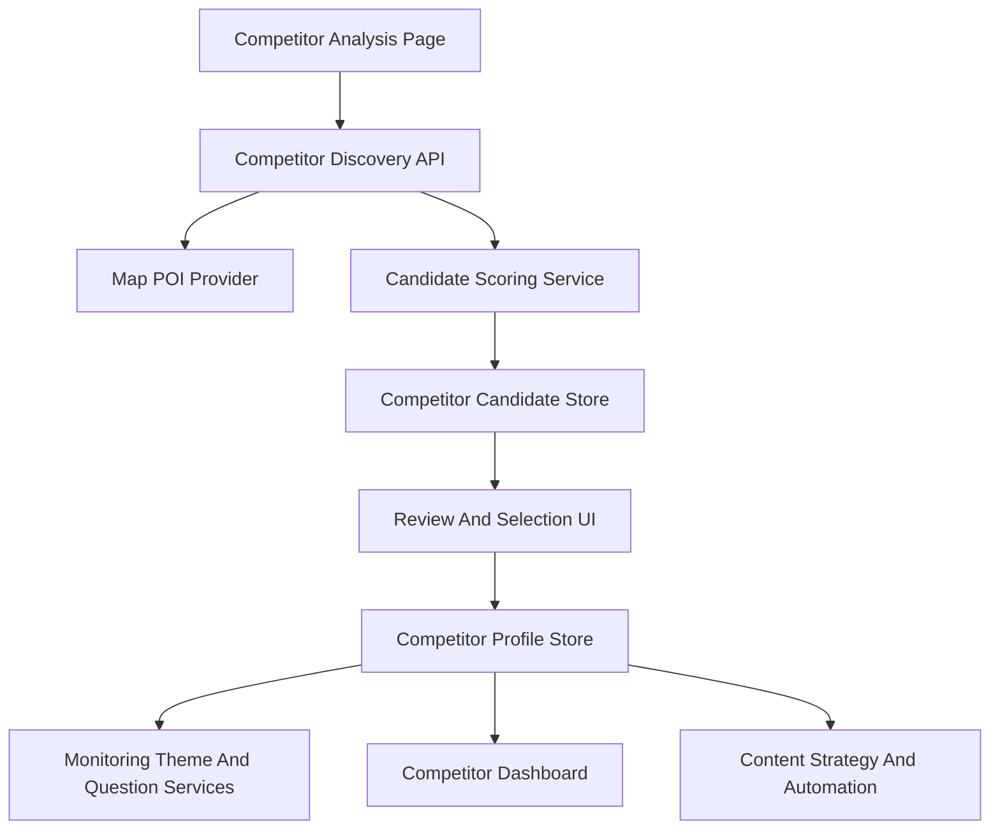

# 竞品地图发现技术设计

Feature Name: competitor-map-discovery
Updated: 2026-07-10

## Description

竞品地图发现用于把品牌竞品维护从手动输入升级为地图 POI 辅助发现。系统基于品牌城市、校区地址、课程品类和儿童线下服务关键词拉取候选机构，自动计算匹配分数和建议标签，再由用户勾选确认后写入竞品档案，并影响后续监测问题、竞品压制分析、内容对标和增长优化建议。

## Architecture



前端在竞品分析页新增“地图发现竞品”抽屉或页面。后端新增竞品发现服务，服务端读取地图 API Key，通过统一 provider 拉取 POI，候选结果先进入候选表，用户确认后再进入现有竞品档案。自动化运营员和监测问题生成服务读取确认后的竞品标签，区分本地直接竞品、校区周边重点竞品和全国标杆品牌。

## Components and Interfaces

- **CompetitorDiscoveryController**: 提供发现任务创建、候选列表查询、候选确认、候选排除和标签修改接口。
- **MapPoiProvider**: 封装地图 POI 检索，第一版实现高德地图 provider，输入城市、关键词、中心点和半径，输出标准候选 POI。
- **CompetitorCandidateScoringService**: 计算候选匹配分数，输出建议标签、匹配理由和置信度。
- **CompetitorCandidateRepository**: 保存候选 POI、来源、评分、建议标签、确认状态和审计摘要。
- **CompetitorProfileRepository Extension**: 将确认候选写入现有竞品档案，并扩展竞品标签字段。
- **CompetitorAnalysisPage Extension**: 展示地图发现入口、筛选条件、候选列表、地图点位、勾选确认和标签管理。

建议接口：

```text
POST /api/v1/brands/:brandId/competitors/discovery-runs
GET /api/v1/brands/:brandId/competitors/discovery-runs/:runId/candidates
PATCH /api/v1/brands/:brandId/competitors/candidates/:candidateId/decision
POST /api/v1/brands/:brandId/competitors/candidates/:candidateId/confirm
```

## Data Models

```typescript
type CompetitorDiscoveryRun = {
  runId: string;
  brandId: string;
  city: string;
  campusRadiusKm: number;
  keywords: string[];
  status: 'running' | 'completed' | 'failed';
  createdBy: string;
  createdAt: string;
  completedAt?: string;
};

type CompetitorCandidate = {
  candidateId: string;
  runId: string;
  brandId: string;
  sourceProvider: 'amap' | 'tencent' | 'baidu' | 'manual';
  sourcePoiId?: string;
  name: string;
  address: string;
  city: string;
  latitude?: number;
  longitude?: number;
  category?: string;
  distanceToNearestCampusKm?: number;
  matchedKeywords: string[];
  score: number;
  suggestedLabel: CompetitorConfirmationLabel;
  matchReasons: string[];
  decisionStatus: 'pending' | 'confirmed' | 'excluded';
  confirmedLabel?: CompetitorConfirmationLabel;
  excludedReason?: string;
  createdAt: string;
  updatedAt: string;
};

type CompetitorConfirmationLabel = 'direct_competitor' | 'indirect_competitor' | 'local_alternative' | 'national_benchmark' | 'excluded';
```

现有 `Competitor` 需要补充字段：确认标签、来源候选 ID、距离最近校区、来源平台、是否全国标杆、是否校区周边重点竞品。

## Correctness Properties

- 候选 POI 使用来源平台、来源 POI ID、名称、地址和经纬度去重。
- 只有用户确认后的候选进入竞品档案。
- 校区周边重点竞品由距离最近校区和半径规则计算得出。
- 全国标杆品牌只参与内容对标和品牌表达参考，直接竞品参与压制率和排名差分析。
- 地图 API Key 只在服务端读取，接口响应不返回真实密钥。

## Error Handling

- 地图 provider 超时或返回错误时，发现任务标记为 failed，并展示稍后重试和手动录入入口。
- 候选缺少地址、城市或名称时，候选标记为资料不足，并要求用户确认后保存。
- 用户确认候选时，如果候选已被确认或排除，接口返回当前最新状态。
- 地图配额耗尽时，系统提示地图服务暂不可用，并保留已缓存候选。

## Test Strategy

- 单元测试覆盖关键词扩展、POI 去重、距离计算、评分规则和建议标签。
- API 测试覆盖创建发现任务、获取候选、确认候选、排除候选和标签修改。
- 前端测试覆盖筛选条件默认值、候选勾选、标签选择、排除原因和保存状态。
- 集成测试使用 fake map provider，固定返回贵阳儿童运动机构、全国连锁本地门店和无关机构，验证候选分类结果。

## References

[^1]: `.monkeycode/docs/ARCHITECTURE.md` - 当前竞品分析、监测问题和自动化运营员架构说明。
[^2]: `geo-platform/apps/web/src/features/competitors/pages/CompetitorAnalysisPage.tsx` - 当前竞品分析前端页面。
[^3]: `geo-platform/apps/api/src/modules/competitors/competitors.controller.ts` - 当前竞品分析 API 入口。
