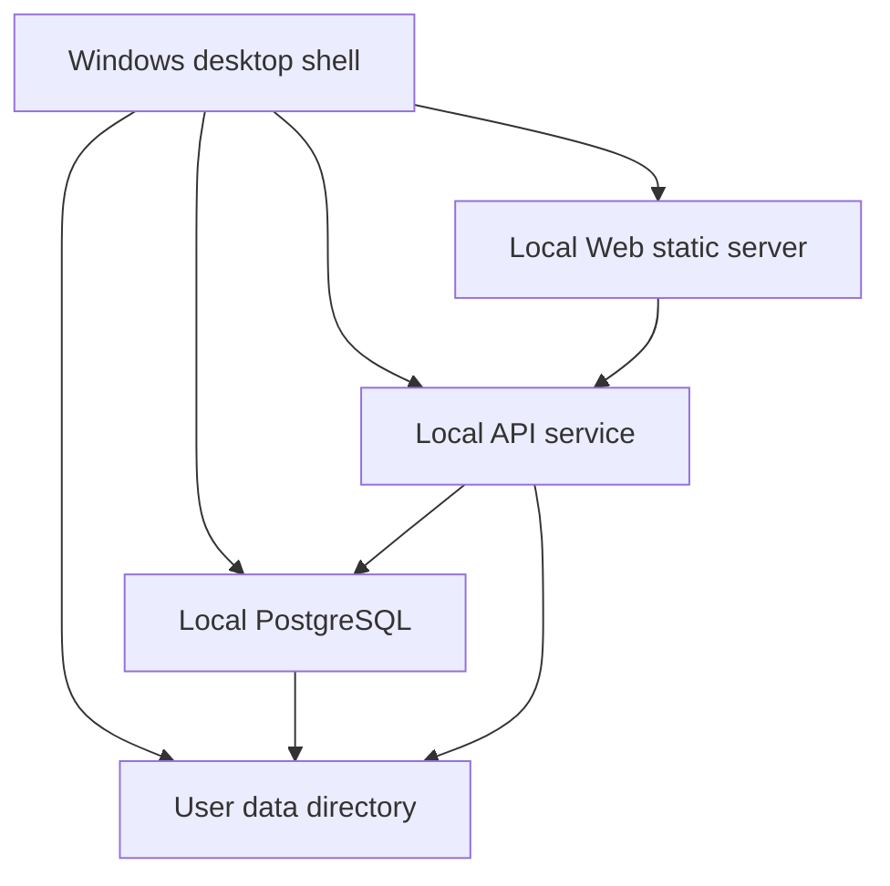

# Windows 独立桌面应用

Feature Name: desktop-windows-app  
Updated: 2026-08-18

## Description

将当前依赖 Docker Desktop 的 Windows 启动方式改为自包含桌面应用。桌面壳负责启动和停止本地服务，Web 页面继续复用现有 Vite 构建产物，API 继续复用 NestJS 生产构建，数据库继续使用 PostgreSQL 以保持 Prisma schema 和业务能力稳定。

## Architecture

桌面壳采用 Electron，主进程负责服务生命周期、健康检查、窗口创建和退出清理。发布包随应用交付 Node.js runtime、API/Web 构建产物、PostgreSQL Windows runtime 和初始化脚本。每次启动使用随机可用本地端口，API 的 `DATABASE_URL` 指向用户数据目录中的本地实例。

## Components and Interfaces

### Desktop shell

- `desktop/main.cjs`：创建 BrowserWindow，启动本地服务，等待健康检查，处理退出。
- `desktop/runtime.cjs`：解析安装目录和用户数据目录，启动 PostgreSQL、API 与静态 Web 服务。
- `desktop/health.cjs`：轮询 API 健康接口并提供有界超时。
- `desktop/preload.cjs`：保留最小 Electron preload 边界。

### API and Web

- API 使用现有 `apps/api/dist` 构建产物。
- Web 使用现有 `apps/web/dist` 构建产物，通过本地静态服务器提供资源。
- API 增加静态生产启动入口配置，继续监听动态 `PORT`。

### PostgreSQL runtime

- 发布流水线下载固定版本的 PostgreSQL Windows archive。
- 首次启动执行 `initdb`，随后使用 `pg_ctl` 管理实例。
- 数据目录归属用户数据目录，升级过程保留该目录。

## Data Models

业务数据模型保持现有 PostgreSQL Prisma schema。桌面运行时新增以下本地配置边界：

- `GEO_DESKTOP_DATA_DIR`：用户数据目录。
- `DATABASE_URL`：桌面壳为 API 生成的本地 PostgreSQL 连接字符串。
- `PORT`：API 本地端口。
- `GEO_WEB_PORT`：本地 Web 静态服务端口。

## Correctness Properties

1. 每个由桌面壳启动的子进程都必须在退出路径被回收。
2. API 健康检查通过前，桌面窗口不得加载业务页面。
3. 启动失败时，日志必须写入用户数据目录并包含失败阶段。
4. 升级与重启不得删除已有 PostgreSQL 数据目录。
5. API 只能绑定本机回环地址，桌面服务不得暴露为局域网服务。

## Error Handling

- PostgreSQL 初始化失败：显示数据库初始化失败，并提供日志路径。
- PostgreSQL 端口冲突：选择可用端口并重新生成 `DATABASE_URL`。
- API 启动失败：记录子进程 stderr，显示 API 启动失败。
- Web 启动失败：记录静态服务错误，显示 Web 启动失败。
- 关闭清理超时：强制结束由桌面壳创建的子进程，并写入关闭日志。

## Test Strategy

- Node 单元测试覆盖路径解析、端口选择、健康检查和进程清理。
- 生产构建验证 API/Web 产物和 Prisma Client 存在。
- Windows CI 验证 Electron 依赖、PostgreSQL archive、安装包和启动脚本。
- 发布前执行现有 `npm run verify`，并执行桌面打包校验脚本。

## References

- `.monkeycode/docs/ARCHITECTURE.md`
- `.monkeycode/docs/DEPLOYMENT_RUNBOOK.md`
- `apps/api/prisma/schema.prisma`
