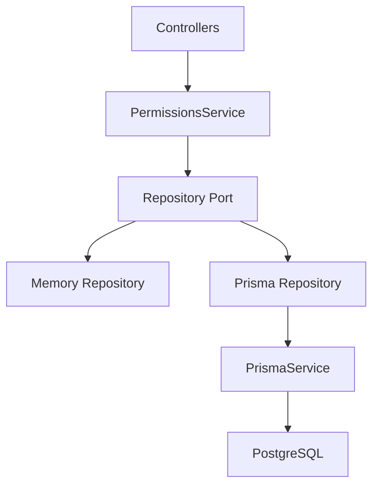

# GEO 平台数据持久化技术设计

Feature Name: geo-platform-persistence
Updated: 2026-07-03

## Description

第二阶段在第一版 monorepo 基础上引入可注入的 Prisma 数据访问层，并按领域逐步替换 `PermissionsRepository` 内的内存数组和 Map。迁移期间保持 `PermissionsService` 和各 Controller 的调用面稳定，降低前端和 API 契约变更风险。

## Architecture

## Components

- `PrismaModule`: 全局或模块级数据库访问模块，导出 `PrismaService`。
- `PrismaService`: 继承 `PrismaClient`，集中管理连接生命周期。
- Repository Port: 从当前 `PermissionsRepository` 提取调用面接口，用于保持 service 层稳定。
- `PrismaPermissionsRepository`: 数据库版 repository，逐步覆盖品牌、权限、知识库和运营闭环能力。
- Repository Tests: 用同一批行为用例验证 memory repository 和 Prisma repository 的关键一致性。

## Data Mapping

- 现有共享类型继续作为 API 契约。
- Prisma 模型字段使用 `brandId` 作为业务隔离基础。
- JSON 字段用于数组、FAQ、快照、生成步骤、数据缺口和富结构内容。
- 平台凭据只在数据库内部保存 `credentialRef`，公开响应仍只返回 `hasCredential` 和 `credentialRefMasked`。

## Migration Strategy

1. 先引入 Prisma 基础设施和 repository port。
2. 迁移品牌、用户、权限和拒绝访问日志。
3. 迁移品牌知识库、素材来源、优化单元、用户意图和 Prompt。
4. 迁移平台配置和监测运行。
5. 迁移内容、发布、任务、报告和顾问服务。
6. 用 `npm run verify` 作为每个阶段门禁。

## Correctness Properties

- P1: 对任意公开 `PlatformConfig` 响应，结果不得包含真实 `credentialRef`。
- P2: 对任意 `brandId` 查询，返回数据必须属于该品牌或当前用户有权限访问的品牌。
- P3: 对任意运营闭环创建链路，后续工作区快照计数必须反映已创建对象。
- P4: 对任意缺失数据库配置的环境，`npm run typecheck` 和前端构建仍可执行。

## Verification

- `npm run verify`
- `npm run prisma:validate`
- `npm run prisma:generate`
- Repository 行为测试
- 品牌隔离和凭据脱敏契约测试
