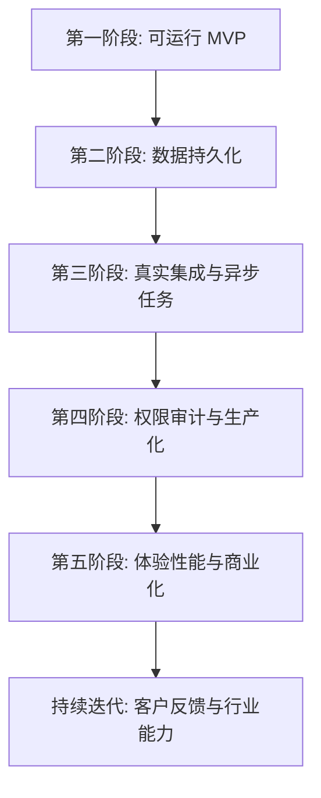

# GEO 平台持续开发阶段规划设计

Feature Name: geo-platform-roadmap
Updated: 2026-07-03

## Description

本设计用于约束第一阶段之后的持续开发路径。后续阶段延续第一阶段的规格化交付模式：每个阶段均包含需求、设计、任务清单、检查点、自动化验证和交付文档同步。编码任务只在对应阶段任务清单明确后执行。

## Stage Architecture

## Stage Boundaries

### 第二阶段：数据持久化

- 目标：将内存仓储迁移到 Prisma + PostgreSQL。
- 主要产物：Prisma repository、repository port、seed/fixture、数据库行为测试。
- 保持稳定：现有 API 契约、前端调用和第一版运营闭环。
- 退出条件：`npm run verify` 通过，数据库 repository 通过核心闭环测试。

### 第三阶段：真实集成与异步任务

- 目标：接入真实 AI 平台和任务队列。
- 主要产物：真实 Adapter、调用审计、队列 worker、重试和人工兜底。
- 保持稳定：平台凭据脱敏、失败记录、手动录入模式。
- 退出条件：至少一个真实 AI 平台完成端到端监测链路。

### 第四阶段：权限、审计与生产化

- 目标：引入真实用户组织权限、审计日志和部署运行手册。
- 主要产物：组织/角色模型、审计日志、生产配置、部署文档。
- 保持稳定：`brandId` 数据隔离和已有角色语义。
- 退出条件：生产试运行门禁通过。

### 第五阶段：产品体验、性能和商业化

- 目标：完善产品体验、性能、报告交付和试点客户可用性。
- 主要产物：页面体验优化、路由拆包、报告模板、客户交付流程。
- 保持稳定：核心运营闭环和数据一致性。
- 退出条件：试点演示和客户交付检查清单通过。

## Cross-Stage Rules

- 每个阶段开始前必须确认对应 `tasklist.md` 已存在且任务足够可执行。
- 每个阶段至少包含一个检查点任务。
- 每次完成阶段任务后运行 `npm run verify`。
- 涉及数据库变更时运行 `npm run prisma:validate` 和 `npm run prisma:generate`。
- 涉及 Web 功能变更时复查预览地址和 API 健康检查。
- 涉及公开响应契约时更新共享类型测试或 API 契约测试。

## Verification Gates

- 基础门禁：`npm run verify`
- 数据库门禁：Prisma schema 校验、Prisma Client 生成、repository 行为测试
- 集成门禁：Adapter 契约测试、失败重试测试、调用审计测试
- 生产化门禁：权限隔离测试、审计日志测试、健康检查和部署文档
- 产品化门禁：路由冒烟测试、关键页面状态测试、报告导出测试
