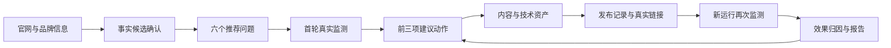
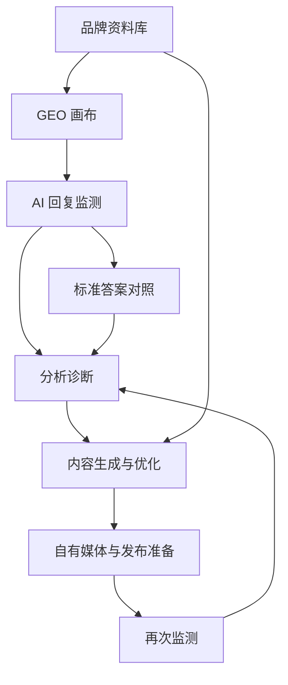

# GEO Product Experience Refinement Design

Feature Name: geo-product-experience-refinement
Updated: 2026-08-02

## Description

本设计把现有 GEO 平台重组为面向运营人员的 AI 可见性工作台。核心变化是从“页面功能并列”转为“品牌资料准备 -> GEO 画布规划 -> AI 回复监测 -> 内容生成与优化 -> 发布准备 -> 再次监测 -> 分析诊断”的闭环。

实施时应优先复用现有 Sprint、品牌工作区、监测、内容生成、优化单元、任务复测、模型设置和展示标签能力。新增能力主要集中在页面信息架构、资料库字段、分析模块聚合、内容资产流转和全局用词治理。

公开文案遵循四项规则：标题直接说明页面用途；按钮使用“动作 + 对象”；说明文字优先使用一句话；失败和空状态同时说明当前情况与具体下一步。业务页面继续使用“优化单元、用户意图、AI 回复监测、内容生成、发布准备、再次监测”等既有术语，内部 code、ID、枚举、provider、fallback 和实现细节仅进入日志或开发信息。

第二阶段升级同时优化方便使用和实际效果。方便使用以“减少首次输入、每页一个主行动、上下文连续、失败可恢复”为原则；实际效果以“真实样本、同条件再次监测、周期快照、动作归因”为原则。第一阶段已经完成的导航、资料资产库、内容创作台、发布运营和分析诊断页面继续复用。

## Phase 2 Upgrade Architecture



### Product Success Targets

- 受控试用中，至少 80% 的新用户在 15 分钟内到达首轮监测执行页。
- 品牌项目主页首屏只提供一个主行动，前三项待办按阻断程度和业务价值排序。
- 进入效果比较的再次监测记录全部关联不同于基线的真实监测运行。
- 报告快照中的监测、内容、发布、任务和再次监测数据全部满足所选统计周期。
- 每项“已改善”结论都能回溯基线运行、优化动作、发布证据和再次监测运行。

## Reference Capability Traceability

| 来源 | 核心机制 | 对易用性或效果的价值 | Geo 落点 |
| --- | --- | --- | --- |
| GeoLook | 三步接入与一键周期执行 | 缩短从官网到首份结果的路径 | `QuickStartWizard`、`OperationCycleService` |
| GeoLook | 15 引擎采样与人工导入 | 扩大真实平台覆盖并保留可操作兜底 | 现有 Adapter、浏览器辅助、人工录入和 `SampleEvidencePanel` |
| GeoLook | 原始样本回放与证据等级 | 让指标可复核并区分证据强度 | `SampleEvidenceService` |
| GeoLook | 测量口径与基线纪律 | 控制模型、联网、语言和区域变化造成的伪趋势 | `MeasurementScope`、`BaselineVersion` |
| GeoLook | 竞品引用与 19 类渠道地图 | 将内容分发建立在真实引用来源上 | `OpportunityDiscoveryService` |
| GeoLook | 结构化工单与自动 checker | 将诊断转为可执行、可验收任务 | `AcceptanceRuleService`、现有任务中心 |
| GeoLook | 内容抽取块与捏造风险检查 | 提高内容可抽取性和事实可信度 | `ContentReadinessService` |
| GeoLook | llms.txt、JSON-LD、HTML 资产 | 直接产出可部署结果 | `TechnicalAssetService` |
| GeoLook | GitHub、WordPress、微信和 Webhook 发布 | 缩短内容到真实上线的距离 | `PublishingAdapterRegistry` |
| GeoLook | 报告、CSV 与客户交付包 | 支持顾问和企业持续交付 | `DeliveryBundleService` |
| GEORank | 网站提交与快速四维诊断 | 降低首次体验门槛 | `QuickDiagnosisService` |
| GEORank | 八维关键词拓展与确定性降级 | 扩大高价值问题覆盖 | `OpportunityDiscoveryService` |
| GEORank | RAG 问答与公司资料流水线 | 统一品牌知识并输出引用依据 | `KnowledgeRetrievalService` |
| GEORank | Provider 池、BYOK 与故障转移 | 提升模型调用稳定性和企业可控性 | `ProviderGovernanceService` |
| GEORank | 额度预占、结算与全局预算 | 控制多品牌使用成本 | `QuotaService`、`UsageLedger` |
| GEORank | Celery 异步任务与后台管理 | 支持长任务恢复和统一运维 | `JobOrchestrator`、`RuntimeOperationsDashboard` |
| GEORank | 结构化数据工具 | 提供可直接部署的 GEO 技术资产 | `TechnicalAssetService` |
| GEORank | 教程、专家与公开工具入口 | 提升方法理解和首次获客转化 | 现有教程抽屉、场景化指导和快速诊断入口 |

### Selective Adoption Boundaries

- Qdrant、Neo4j 和 MinIO 代表向量检索、关系发现和对象存储能力。首期通过服务接口和 PostgreSQL 现有模型实现；当单品牌资料片段超过 10,000 条、关系查询成为稳定需求或对象资产超过数据库存储边界时，再引入对应基础设施。
- GEORank 的多套前端和 12 服务部署拓扑属于工程组织方式。Geo 保持现有 React、NestJS、PostgreSQL 和模块化 monorepo，通过独立 Worker 渐进扩展。
- 公共专家目录、教程内容站和公司收录页属于获客与内容生态。首期将其价值转化为场景化指导和快速诊断入口，公共内容平台进入商业增长阶段。
- GeoLook 的本地 JSON 主存储和 CLI 子进程属于单机实施方式。Geo 继续使用 Prisma、PostgreSQL、RBAC 和持久任务边界。

### Deep Adoption Additions

- 测量层将品牌点名探测题与无提示发现题分开，进一步按市场、API/Web/App 访问端、采集方式、模型、语言和联网状态隔离序列。复合指标仅对已测项归一权重，平台比较与趋势结论通过最低样本门禁。
- 机会层增加竞品候选证据生命周期、失守与独占问题池、搜索补全快照、需求上升观察、渠道覆盖和 30/60/90 天路线图。
- 引用层建立“被列为引用”和“引用内容被答案吸收”两级漏斗，保存回答句、引用片段、支持范围、冲突和人工复核。
- 执行层增加内容类型专属规则、每次发布确认、渠道草稿语义、首次与当前验收快照、checker 回归重开和差异化复查频率。
- 平台层增加 Provider 主动健康测试、额度拒绝原因、人工额度调整审计、成本步骤租约、追加式成本和原子重试补偿。
- 资料层增加官网来源页面计划、页面角色和人工范围调整；高级检索保持全文与结构化检索的确定性连续性。
- 交付层将诊断报告、优化方案和执行方案拆为三个共享冻结快照的正式文档，并在商业增长阶段提供受控预览与公开品牌档案。

### Source-Level Adoption Verification Matrix

| 来源 | 源码机制 | 需求落点 | 实施任务 | 阶段 |
| --- | --- | --- | --- | --- |
| GeoLook | 品牌点名探测题与无提示可见性隔离 | Requirement 28.1-28.3 | Task 20.7、20.12 | P1 |
| GeoLook | 市场、API/Web/App 访问端与采集方式独立序列 | Requirement 28.4 | Task 20.7、20.12 | P1 |
| GeoLook | 未测子指标权重归一和平台比较门禁 | Requirement 28.5-28.7 | Task 20.8、20.12 | P1 |
| GeoLook | 连续两期同向变化升级为趋势 | Requirement 28.8-28.10 | Task 20.8、20.12 | P1 |
| GeoLook | 竞品候选由真实回答或用户确认 | Requirement 29.1-29.3 | Task 20.9、20.12 | P1 |
| GeoLook | 竞品失守、品牌独占和竞品最强平台 | Requirement 29.4-29.6 | Task 20.9、20.12 | P1 |
| GeoLook | 百度与 Google 搜索补全、人工入库和需求快照 | Requirement 29.7-29.9 | Task 20.10、20.12 | P1 |
| GeoLook | 渠道内容形态、数量、节奏、负责人和覆盖率 | Requirement 30.1、30.3 | Task 20.11、20.12 | P1 |
| GeoLook | 0-30、30-60、60-90 天建设路线图 | Requirement 30.2 | Task 20.11、20.12 | P1 |
| GeoLook | 引用广度与答案吸收深度漏斗 | Requirement 30.4-30.6 | Task 21.7、21.10 | P1 |
| GeoLook | 对比、榜单和 FAQ 专属内容规则 | Requirement 31.1-31.3 | Task 21.8、21.10 | P1 |
| GeoLook | 首次与当前验收进度、证据历史和回归重开 | Requirement 32.3-32.5 | Task 19.7、19.8 | P1 |
| GeoLook | 每次发布确认与 WordPress、微信公众号草稿语义 | Requirement 31.4、31.5 | Task 24.4、24.5 | P2 |
| GeoLook | 诊断报告、优化方案和执行方案三文档分工 | Requirement 35.4、35.5 | Task 26.6、26.7 | P2 |
| GeoLook | 站点每周与 AI 回答双周的差异化周期 | Requirement 35.1-35.3 | Task 26.5、26.7 | P2 |
| GEORank | 四维诊断评分、权重和规则版本 | Requirement 32.1、32.2 | Task 19.6、19.8 | P1 |
| GEORank | 官网候选页面、资料角色、选取原因和范围调整 | Requirement 34.1、34.2 | Task 18.4、18.5 | P1 |
| GEORank | Provider 最小请求、延迟和健康有效期 | Requirement 33.1、33.2 | Task 25.6、25.10 | P2 |
| GEORank | 稳定额度拒绝原因和恢复动作 | Requirement 33.3 | Task 25.7、25.10 | P2 |
| GEORank | 人工额度调整原因、前后状态和审计轨迹 | Requirement 33.4、33.5 | Task 25.7、25.10 | P2 |
| GEORank | Provider 成本步骤租约和追加式成本 | Requirement 33.6-33.8 | Task 25.8、25.10 | P2 |
| GEORank | 失败任务原子重试和派发失败补偿 | Requirement 33.9、33.10 | Task 25.9、25.10 | P2 |
| GEORank | 向量失败后的检索连续性与 BYOK Embedding 边界 | Requirement 34.3-34.5 | Task 21.9、21.10 | P1 |
| GEORank | 审核预览、公开品牌档案、结构化数据与撤回 | Requirement 36.1-36.4 | Task 27.5、27.6 | P2 |

矩阵中的业务机制全部进入需求和任务。基础设施实现继续遵守 `Selective Adoption Boundaries`，使业务价值可以先交付，存储与部署复杂度随规模演进。

## Architecture



### Existing Foundation

- 品牌工作区：`apps/web/src/features/brand-workspace/pages/BrandWorkspacePage.tsx`
- 品牌知识卡片：`apps/web/src/features/brand-workspace/components/BrandKnowledgeCard.tsx`
- 优化单元：`apps/web/src/features/brand-workspace/components/OptimizationUnitsCard.tsx`
- GEO 画布：`apps/web/src/features/canvas/pages/GeoCanvasPage.tsx`
- AI 回复监测：`apps/web/src/features/monitoring/pages/MonitoringPage.tsx`
- 内容生成：`apps/web/src/features/content-generation/pages/ContentGenerationPage.tsx`
- 优化计划：`apps/web/src/features/growth-optimization/pages/GrowthOptimizationPage.tsx`
- 任务复测：`apps/web/src/features/tasks/pages/TaskRetestPage.tsx`
- AI 平台管理：`apps/web/src/features/model-settings/pages/ModelSettingsPage.tsx`
- 平台显示：`apps/web/src/utils/displayLabels.ts`

## Navigation Design

参考产品使用“数据总览、营销画布、内容中心、发布中心、数据分析、品牌信息、AI 平台管理”等业务对象命名。现有 24 个路由按功能归属收口为五组：

1. 工作台：数据总览、营销画布、AI 平台管理、内测反馈。
2. 品牌信息：品牌信息、竞品信息、优化单元、用户意图、AI 回复监测。
3. 内容中心：优化建议、内容生成、内容优化、内容策略、内容资产、顾问服务。
4. 发布中心：自有媒体、媒体平台、发布记录、再次监测。
5. 数据分析：竞品分析、评价分析、信源分析、事实分析、报告中心。

导航入口和页面主标题共享相同业务名称。路由地址、品牌化别名、八阶段工作流顺序和上下文参数保持现有契约。参考产品中的商品中心、付费媒体采购、余额充值和报价属于独立业务能力，本次命名治理不扩展对应模块。

## Page-Level Design

### 品牌工作台

- 顶部：品牌选择、Sprint 阶段、推荐下一步、配置状态。
- 指标：AI 可见度、推荐排名、提及率、引用率、事实准确度、内容任务完成率。
- 模块矩阵：品牌资料库、GEO 画布、AI 回复监测、内容生成、内容优化、自有媒体、竞品分析、评价分析、信源分析、事实分析。
- 待办：缺资料、待监测、待审核内容、待发布内容、待复测问题。

### 品牌资料库

- 使用分组表单或 Tabs：基础信息、产品服务、目标用户、品牌知识、媒体资产、自有媒体账号、竞品信息。
- 每个分组显示完整度、最近更新时间、可用于标准答案状态。
- 缺失字段使用可执行空状态，直接进入编辑或上传。
- 资料条目需要来源、可信状态、审核状态和关联标准答案。

### GEO 画布

- 布局：左侧优化单元列表，中间关系图，右侧详情抽屉。
- 节点类型：优化单元、用户意图、监测问题、平台表现、内容任务、复测结果。
- 节点颜色表达状态：资料不足、待监测、表现较差、内容处理中、已复测。
- 节点详情提供“查看真实回复”“生成内容任务”“补充标准答案”“再次监测”。

### AI 回复监测

- 保持现有可信边界：真实 API、浏览器辅助、手动录入。
- 页面首屏展示监测计划、平台配置状态、最近监测结果和待补充真实回复。
- 创建流程按“选优化单元 -> 选用户意图 -> 选问题 -> 选平台 -> 选方式”组织。
- 缺失真实回复的任务进入待补充队列。

### 内容生成与内容优化

- 内容生成使用左右分栏创作台：左侧输入与上下文，右侧草稿与审稿信息。
- 输入包括优化单元、用户意图、内容类型、渠道、目标平台、语气、参考资料。
- 输出包括标题、摘要、正文、FAQ、引用依据、审核提醒和复测建议。
- 内容优化支持粘贴已有内容，输出事实补强、结构优化、FAQ 补充、信源建议和平台适配。

### 自有媒体与媒体平台

- 自有媒体管理品牌可控账号和主页。
- 媒体平台提供渠道规则、适合内容类型、适合用户意图和发布建议。
- 发布准备把内容资产、渠道、负责人、发布时间和复测计划串联。

### 分析诊断页面

竞品分析、评价分析、信源分析和事实分析复用统一结构：

- 顶部诊断卡：本期关键发现、影响范围、建议动作。
- 趋势区：按平台、优化单元、用户意图筛选。
- 明细区：真实回复、引用、事实、评价或竞品条目。
- 任务区：生成内容、补充资料、创建复测、更新标准答案。

## Components and Interfaces

### Phase 2 Frontend Components

- `QuickStartWizard`: 收集官网、品牌、市场和竞品，并承接事实候选确认与首轮问题选择。
- `BrandActionDashboard`: 展示当前阶段、唯一主行动、前三项待办、最新有效样本和周期效果。
- `EffectEvidencePanel`: 展示基线、优化动作、发布记录、再次监测和指标变化。
- `RetestExecutionPanel`: 从原问题创建新监测运行并跟踪采集、分析和验收状态。
- `ReportScopePreview`: 在生成前展示日期范围、预计纳入记录数和数据缺口。
- `SiteAuditWorkbench`: 展示站点检查证据、任务和可生成技术资产。
- `SampleEvidencePanel`: 从指标、趋势和任务回放原始问题、回答、引用与测量条件。
- `OpportunityMap`: 汇总问题类型、竞品优势主题、引用域名和推荐渠道。
- `ContentReadinessPanel`: 展示事实风险、抽取结构、引用依据和渠道发布检查。
- `DeliveryBundleBuilder`: 预览并生成报告、明细、任务、资产和证据交付包。
- `RuntimeOperationsDashboard`: 展示 Provider、额度、任务队列和依赖健康状态。
- `PromptMeasurementBreakdown`: 分开展示无提示发现、品牌探测、访问端和测量状态。
- `ChannelRoadmapBoard`: 展示渠道覆盖、内容形态、负责人和 30/60/90 天执行窗口。
- `CitationAbsorptionReview`: 对照回答句与引用片段并承接人工复核。
- `SourcePagePlanEditor`: 在深度抓取前展示并调整官网来源页面范围。
- `PublicBrandProfilePreview`: 提供审核预览和公开字段检查。

### Phase 2 Backend Services

- `BrandAccessPolicyResolver`: 按请求方法和具体业务资源判定最低角色，并输出前端可复用的能力摘要。
- `QuickDiagnosisService`: 聚合官网抓取、事实候选、站点审计、问题推荐和首轮执行准备状态。
- `RetestEvidenceService`: 创建同题新监测运行、验证有效样本并计算基线与复测变化。
- `PeriodReportSnapshotService`: 使用明确时间区间查询并冻结报告快照。
- `EffectAttributionService`: 串联任务、内容资产、发布记录、基线运行和复测运行。
- `SiteAuditService`: 执行受控站点检查并将问题映射为任务与验收规则。
- `SampleEvidenceService`: 聚合样本证据、测量条件、证据等级和指标明细。
- `OpportunityDiscoveryService`: 执行八维问题拓展、竞品主题识别和真实信源渠道排序。
- `ContentReadinessService`: 检查事实来源、抽取结构、引用和发布渠道要求。
- `KnowledgeRetrievalService`: 建立品牌资料片段索引并返回带来源的检索结果。
- `ProviderGovernanceService`: 管理 Provider 池、BYOK、故障转移、额度和使用账本。
- `JobOrchestrator`: 持久化长任务步骤、重试、幂等和恢复状态。
- `OperationCycleService`: 编排周期抓取、审计、监测、验收、报告和交付。
- `DeliveryBundleService`: 冻结并导出客户交付包。
- `MetricIntegrityService`: 处理探测题隔离、权重归一、样本门禁和趋势状态。
- `DemandSnapshotService`: 采集搜索补全候选并生成跨期需求观察。
- `ChannelRoadmapService`: 将信源机会映射为渠道覆盖和分阶段执行计划。
- `CitationAbsorptionService`: 计算引用片段对回答事实与结论的支持范围。
- `DiagnosticScorePolicyService`: 版本化站点诊断维度、权重和综合分规则。
- `AcceptanceHistoryService`: 保存首次与当前验收快照并处理 checker 回归。
- `QuotaAdjustmentService`: 管理人工额度调整和只追加审计记录。
- `PublicBrandProfileService`: 管理审核预览、发布、撤回和公开字段白名单。

### Frontend Components

- `WorkspaceModuleGrid`: 工作台模块卡片矩阵。
- `BrandProfileLibrary`: 品牌资料库容器。
- `BrandProfileCompleteness`: 资料完整度组件。
- `GeoCanvasWorkbench`: GEO 画布容器。
- `GeoCanvasNodeDetails`: 画布节点详情。
- `MonitoringPlanWizard`: 监测计划创建向导。
- `ContentStudio`: 内容生成与优化创作台。
- `OwnedMediaManager`: 自有媒体账号管理。
- `AnalysisWorkbench`: 分析诊断通用容器。
- `TerminologyText`: 业务标签和平台显示封装。

### Backend Interfaces

建议按能力分层补齐 API：

- `GET /api/v1/brands/:brandId/profile-library`
- `PATCH /api/v1/brands/:brandId/profile-library`
- `GET /api/v1/brands/:brandId/geo-canvas`
- `POST /api/v1/brands/:brandId/monitoring-plans`
- `GET /api/v1/brands/:brandId/content-assets`
- `POST /api/v1/brands/:brandId/content-assets`
- `GET /api/v1/brands/:brandId/owned-media`
- `POST /api/v1/brands/:brandId/owned-media`
- `GET /api/v1/brands/:brandId/analysis/competitors`
- `GET /api/v1/brands/:brandId/analysis/reviews`
- `GET /api/v1/brands/:brandId/analysis/sources`
- `GET /api/v1/brands/:brandId/analysis/facts`
- `GET /api/v1/brands/:brandId/action-dashboard`
- `POST /api/v1/brands/:brandId/quick-diagnosis`
- `POST /api/v1/brands/:brandId/tasks/:taskId/retest-executions`
- `GET /api/v1/brands/:brandId/tasks/:taskId/effect-evidence`
- `POST /api/v1/brands/:brandId/reports/scope-preview`
- `POST /api/v1/brands/:brandId/site-audits`
- `POST /api/v1/brands/:brandId/technical-assets`
- `GET /api/v1/brands/:brandId/samples/:sampleId/evidence`
- `GET /api/v1/brands/:brandId/opportunities`
- `POST /api/v1/brands/:brandId/keyword-expansions`
- `POST /api/v1/brands/:brandId/content-assets/:assetId/readiness-checks`
- `POST /api/v1/brands/:brandId/knowledge/search`
- `POST /api/v1/brands/:brandId/operation-cycles`
- `POST /api/v1/brands/:brandId/delivery-bundles`
- `GET /api/v1/admin/providers`
- `GET /api/v1/admin/runtime-operations`
- `GET /api/v1/brands/:brandId/measurement-breakdown`
- `POST /api/v1/brands/:brandId/search-demand-snapshots`
- `GET /api/v1/brands/:brandId/channel-roadmap`
- `GET /api/v1/brands/:brandId/citation-absorption`
- `GET /api/v1/brands/:brandId/source-page-plan`
- `PATCH /api/v1/brands/:brandId/source-page-plan`
- `POST /api/v1/admin/providers/:providerId/test`
- `POST /api/v1/admin/quota-adjustments`
- `GET /api/v1/admin/quota-adjustments`
- `POST /api/v1/brands/:brandId/public-profile/previews`
- `POST /api/v1/brands/:brandId/public-profile/publish`

已有 API 可继续作为底层来源，BFF 或 service 层聚合成页面模型。

## Data Models

### BrandProfileLibrary

- `brandId`
- `basicInfo`
- `products`
- `audiences`
- `knowledgeItems`
- `mediaAssets`
- `ownedMediaAccounts`
- `competitors`
- `completionSummary`
- `reviewStatus`

### GeoCanvasView

- `brandId`
- `sprintId`
- `optimizationUnits`
- `intentNodes`
- `questionNodes`
- `platformResultNodes`
- `contentTaskNodes`
- `retestNodes`
- `edges`
- `recommendedActions`

### ContentAsset

- `id`
- `brandId`
- `optimizationUnitId`
- `intentId`
- `type`
- `channel`
- `title`
- `body`
- `faqItems`
- `sourceReferences`
- `reviewStatus`
- `publishStatus`
- `retestPlanId`

### OwnedMediaAccount

- `id`
- `brandId`
- `platformType`
- `accountName`
- `homepageUrl`
- `contentFormats`
- `owner`
- `status`
- `notes`

### AnalysisFinding

- `id`
- `brandId`
- `type`
- `optimizationUnitId`
- `intentId`
- `platform`
- `sourceAnswerId`
- `severity`
- `summary`
- `evidence`
- `recommendedAction`
- `linkedTaskId`

### EffectEvidence

- `brandId`
- `taskId`
- `sourceRunId`
- `retestRunId`
- `contentAssetIds`
- `publishingRecordIds`
- `baselineMetrics`
- `afterMetrics`
- `metricDelta`
- `sampleSummary`
- `evidenceStatus`
- `dataGaps`

### ReportScopePreview

- `brandId`
- `periodStart`
- `periodEnd`
- `monitoringRunCount`
- `validSampleCount`
- `contentAssetCount`
- `publishingRecordCount`
- `completedRetestCount`
- `dataGaps`

### SiteAuditResult

- `brandId`
- `siteUrl`
- `checkedAt`
- `checks`
- `scoreSummary`
- `recommendedTasks`
- `generatedAssetIds`

### MeasurementScope

- `platformCode`
- `modelName`
- `collectionMethod`
- `searchEnabled`
- `market`
- `language`
- `evidenceLevel`
- `manualConfirmed`
- `baselineVersion`

### OpportunityMap

- `questionDimensions`
- `diagnosticTypes`
- `competitorThemes`
- `citedDomains`
- `channelRecommendations`
- `contentOpportunities`
- `generationMethod`

### KnowledgeChunk

- `brandId`
- `sourceId`
- `sourceUrl`
- `content`
- `contentHash`
- `reviewStatus`
- `sourceVersion`
- `updatedAt`

### OperationCycle

- `brandId`
- `periodStart`
- `periodEnd`
- `steps`
- `currentStep`
- `status`
- `retryState`
- `reportId`
- `deliveryBundleId`

### MetricIntegrityContext

- `promptKind`
- `clientSurface`
- `metricState`
- `normalizedWeights`
- `comparisonEligibility`
- `trendState`
- `consecutiveDirectionCount`

### CompetitorCandidate

- `brandId`
- `competitorName`
- `status`
- `candidateSource`
- `evidenceSampleIds`
- `confirmedAt`

### DemandSnapshot

- `seedTerm`
- `source`
- `market`
- `capturedAt`
- `candidateQuestions`
- `previousSnapshotId`

### ChannelRoadmap

- `channelCode`
- `contentFormats`
- `recommendedQuantity`
- `cadence`
- `ownerRole`
- `priority`
- `evidence`
- `window`
- `coverageStatus`

### CitationAbsorptionEvidence

- `sampleId`
- `citationId`
- `answerSentence`
- `sourceExcerpt`
- `supportType`
- `confidence`
- `reviewStatus`

### DiagnosticScorePolicy

- `version`
- `dimensions`
- `normalizedWeights`
- `effectiveAt`
- `retiredAt`

### ProviderSpendStage

- `jobId`
- `stepCode`
- `attemptId`
- `leaseExpiresAt`
- `reservationId`
- `providerAttempts`
- `settlementState`
- `incurredCost`

### SourcePagePlan

- `url`
- `title`
- `sourceRole`
- `selectionReason`
- `included`
- `processingStatus`

### PublicBrandProfile

- `brandId`
- `slug`
- `status`
- `publicFieldSet`
- `canonicalUrl`
- `previewGrantExpiresAt`
- `publishedAt`
- `withdrawnAt`

## Phase 2 Key Designs

### Resource-Aware Authorization

`brand-access.policy.ts` 当前先匹配 `/api/v1/brands`，品牌嵌套路由因此继承品牌主体写入的 admin 门槛。第二阶段将权限解析输入规范化为请求方法与业务路由模板，优先匹配具体嵌套资源，再匹配品牌主体资源。

权限矩阵固定为：viewer 读取授权数据；analyst 执行分析与报告读取；operator 执行监测、内容、发布、任务和再次监测；admin 管理品牌资料、成员和平台配置；owner 管理组织级高风险操作。API 测试遍历全部角色、资源和请求方法，前端能力摘要使用同一矩阵生成按钮状态。

### Evidence-Based Retest

安排再次监测时只保存 `sourceRunId`、原问题和计划时间，`retestRunId` 保持为空。执行再次监测时复用原问题与目标平台创建新的 `MonitoringRun`，成功创建后回写 `retestRunId`。再次监测完成条件包括真实原始回答存在、分析完成、运行标识与基线不同。

任务验收分为 `planned`、`collecting`、`analyzing`、`improved`、`unchanged` 和 `regressed`。`actualScore` 从再次监测分析派生，用户输入仅用于目标值和备注。首期继续复用 `OptimizationTask.retestRecords` JSON，先强化状态与校验；数据量和查询需求达到独立统计门槛后再迁移为规范化 `RetestExecution` 表。

### Period-Scoped Reports

`PeriodReportSnapshotService` 接收 `periodStart` 和 `periodEnd`，统一转换为包含起始日和结束日的 UTC 查询边界。所有快照构建器都接收同一时间区间，并在 repository 查询层过滤监测运行、内容资产、发布记录、任务状态变化和已完成再次监测。

报告生成前先返回范围预览。生成后冻结 snapshot、样本摘要、数据缺口和口径版本，使历史报告在后续数据变化后仍可复核。多品牌报告对每个品牌使用相同统计区间和有效样本规则。

### Action-Oriented Project Home

`BrandActionDashboard` 继续复用现有 `BeginnerHomeDashboard` 与 Sprint 状态。服务端按“数据阻断、待人工确认、待执行任务、计划到期、预期业务价值”生成主行动和前三项待办，前端只负责展示与跳转。

用户完成当前动作后重新读取聚合状态。深链继续使用现有 `workflowStagePath`，避免重复选择品牌、优化单元、用户意图、问题和来源运行。

### Quick Diagnosis

快速接入分为官网信息、事实确认、问题选择和执行准备四步。每一步独立保存，用户离开后可恢复。官网抓取结果以候选事实进入资料库，关键品牌事实经过用户确认后才能用于标准答案和内容生成。

问题推荐默认展示 6 个高价值问题，覆盖品牌词、品类词、地域词、购买决策、竞品比较和用户痛点。高级问题管理继续保留在现有用户意图页面。

### Site Audit And Technical Assets

站点审计采用独立 Adapter 边界，首期只访问用户提交的公开官网及同源公开资源。检查结果使用固定规则输出 `pass`、`warning`、`fail` 和 `unavailable`，每个问题都带证据、影响说明、任务模板和验收规则。

技术资产生成复用品牌事实库与内容生成基础能力。生成结果进入内容资产体系，保存资产类型、目标页面、来源事实、审核状态和部署说明，再由发布准备流程承接。

### Sample Replay And Measurement Discipline

指标聚合输出同时携带 `MeasurementScope` 和样本引用。任何趋势比较先验证平台、模型、联网状态、市场与语言是否可比；条件变化时创建新的 `baselineVersion`。指标页只展示聚合摘要，`SampleEvidencePanel` 按需加载原始回答和引用证据。

证据等级分为人工或浏览器真实样本、API 可复现样本和仅供演示的样例。演示样例继续排除在生产指标之外。归因输出使用“观察相关”作为默认置信表达，并允许记录活动、模型升级和平台规则变化等外部事件。

### Opportunity Discovery

问题拓展先执行确定性维度生成与去重，再由 AI 补充候选、业务价值和推荐概率。AI 调用失败时保留确定性结果。渠道推荐优先统计当前品牌有效样本中的实际引用域名，再使用行业参考数据补充样本稀疏场景。

### Knowledge Retrieval

首期使用 PostgreSQL 全文检索与现有品牌资料结构建立 `KnowledgeRetrievalService`，服务接口保持存储实现无关。资料片段保存来源、版本、审核状态和内容哈希。向量召回或知识关系查询达到明确规模条件后，通过 Adapter 接入 Qdrant 或 Neo4j。

### Provider And Job Governance

Provider 凭据保持服务端加密与脱敏边界。任务提交前由额度服务执行预占，完成后按真实使用结算，失败或取消任务释放余额。长任务通过持久化状态机记录步骤、幂等键和重试，前端可离开页面并在任务中心恢复查看。

### Delivery Bundle

周期服务按配置串联抓取、审计、监测、任务验收、报告和交付包。交付包从冻结快照生成 HTML、PDF、Markdown 与 CSV，并保存包含文件清单、口径版本和生成时间的 manifest。客户只读空间只读取已授权品牌和已冻结交付数据。

默认周期将站点审计设置为每周，将 AI 回答采样设置为每两周。两个计划独立运行和恢复，采样频率调整前展示预计问题数、平台数、轮次和成本。正式交付包生成诊断报告、优化方案与执行方案三个文档，三者引用同一快照和口径版本。

### Advanced Metric Integrity

问题保存 `discovery` 或 `brand_probe` 类型。品牌规范名、别名和官网域名由确定性分类器识别，用户可复核分类。无提示发现指标排除 `brand_probe`，品牌探测结果独立展示品牌识别、事实准确和自有域名引用。

`MetricIntegrityService` 仅对已测子指标重新归一配置权重。平台比较至少需要同一市场两个有效且存在差异的平台结果。单期变化为观察，三个连续可比快照形成两次同向变化后升级为趋势；基线版本变化重置连续计数。

### Opportunity Validation And Roadmap

竞品候选使用 `candidate`、`sample_confirmed`、`user_confirmed` 和 `excluded` 状态。分析、内容和报告只消费两类 confirmed 状态。搜索补全通过 Adapter 保存来源快照，用户确认后进入稳定问题库，新出现词只表达为需求上升观察。

`ChannelRoadmapService` 将实际引用域名、问题缺口和内容库存映射为渠道、内容形态、数量、节奏、负责角色与证据，再分配到 0 至 30 天、30 至 60 天和 60 至 90 天窗口。

### Citation Absorption And Content Rules

`CitationAbsorptionService` 将回答拆成可审计句子，将引用页面拆成带位置的片段，输出 supports、partial、conflicts 和 unavailable。自动结果保存置信度，低置信或冲突证据进入人工复核。

内容规则按类型版本化。对比内容检查同口径维度、自身局限与核验日期；榜单检查方法、数据和利益披露；FAQ 检查答案首句直接结论。发布动作在执行时进行本次确认，WordPress 与微信公众号结果固定进入渠道草稿状态。

### Versioned Diagnosis And Acceptance History

站点诊断评分将原始检查、四维分数、归一权重、规则版本和综合分一起冻结。规则更新只影响新诊断。任务保存首次进度、当前进度、目标值和每次 checker 证据；已验收任务发生回归时重新进入待处理。

### Provider Transaction Safety

Provider 启用前执行受限最小请求并保存延迟、时间、结果和有效期。额度拒绝使用稳定公开原因。人工额度调整必须提供原因并创建只追加审计记录。

每个产生 Provider 成本的任务步骤获取有限期租约。Provider 返回后立即追加成本，任务最终状态不会回滚已发生成本。管理员重试通过状态比较交换完成旧预占结清、新尝试和新预占创建；派发失败执行补偿释放。

### Source Planning And Retrieval Continuity

官网发现先生成 `SourcePagePlan`，按首页、产品、关于、FAQ、案例、联系和政策等角色解释选取原因。用户确认范围后再进入深度抓取。检索按向量、全文、结构化顺序组合召回并去重，任何降级都返回 `retrievalMode`。BYOK 场景显式配置 Embedding 使用组织凭据、平台额度或全文降级。

### Public Brand Profile

公开档案仅消费确认且进入公开字段白名单的品牌资料。审核预览授权绑定品牌和有效期并输出 `noindex`。正式发布输出稳定 canonical、Organization 与 WebPage JSON-LD；撤回后公开路由返回不可用状态并停止新增浏览统计。

## Correctness Properties

1. 监测指标只使用真实 AI 回复、浏览器辅助获取结果或用户手动录入的真实回复。
2. 标准答案作为对照和生成输入保存，指标计算层不把标准答案当作 AI 回复。
3. 内容资产必须关联来源资料、优化单元或用户意图中的至少一类上下文。
4. 平台密钥只在服务端凭据引用中使用，公开响应只返回脱敏配置状态。
5. 平台名称在 UI 中统一显示为业务名称，例如豆包、Kimi、DeepSeek、通义千问、阶跃星辰。
6. 页面展示状态必须转成用户可理解的业务状态。
7. operator 对监测、内容、发布、任务和再次监测资源的授权结果必须与公开能力摘要一致。
8. 任意已完成再次监测的 `sourceRunId` 与 `retestRunId` 必须指向同品牌的不同监测运行。
9. 任意效果改善结论必须同时存在基线分析、再次监测分析和至少一个可追溯优化动作。
10. 任意报告快照中的业务记录时间必须位于报告统计周期内。
11. 任意快速接入候选事实必须保留来源与确认状态。
12. 任意指标样本必须关联测量条件、证据等级和原始回答引用。
13. 任意跨周期趋势只允许比较同一基线版本内的可比测量条件。
14. 任意内容事实或数字在发布检查中必须关联来源或待确认状态。
15. 任意 Provider 使用结算必须对应一次预占、释放或完成结算记录。
16. 任意客户交付包必须引用冻结快照和完整文件 manifest。
17. 任意无提示发现指标必须排除品牌探测题样本。
18. 任意复合指标权重总和必须在排除未测项后重新归一为 1。
19. 任意趋势结论必须由三个连续可比快照中的两次同向变化支持。
20. 任意竞品分析、内容或报告记录必须关联已确认竞品。
21. 任意引用吸收结论必须关联回答句、引用片段和复核状态。
22. 任意历史诊断必须能够使用冻结的评分规则版本复现。
23. 任意已验收任务在 checker 回归失败后必须重新进入待处理状态。
24. 任意人工额度调整必须生成包含原因和前后状态的只追加审计记录。
25. 任意产生 Provider 成本的步骤在有效租约内最多执行一次外部调用。
26. 任意公开品牌档案字段必须来自公开字段白名单和已确认资料。

## Error Handling

- 平台未配置：显示配置入口、手动录入入口和影响范围。
- AI 调用失败：显示平台名称、失败阶段、重试入口和替代方式。
- 资料缺失：显示缺失字段、影响模块和补充入口。
- 引用缺失：显示未识别来源并允许人工补充。
- 内容生成失败：保留输入上下文，提供重试和手动编辑。
- 事实冲突：显示冲突来源、可信资料和人工确认入口。
- 权限不足：显示目标业务资源、当前角色、所需角色和申请路径。
- 再次监测缺少新运行：保持待执行状态并创建同题监测入口。
- 再次监测缺少分析：保持待分析状态并提供分析重试入口。
- 报告范围无有效样本：展示范围预览、数据缺口和补充监测入口。
- 站点访问失败：保留审计任务并展示失败证据和重试入口。
- 测量条件变化：创建新基线并解释趋势分段原因。
- 问题拓展失败：返回确定性候选并标记生成方式。
- 资料检索缺少依据：返回资料缺口并进入确认流程。
- Provider 故障：按策略重试或切换并保留尝试记录。
- 额度不足：保留任务输入并展示额度归属和恢复动作。
- 交付包部分生成失败：保留已生成文件并展示失败文件重试入口。
- 仅有品牌探测题：展示品牌认知结果，并将无提示可见性标记为未测。
- 平台比较样本不足：保留各平台事实数据，并隐藏强弱排序结论。
- checker 回归失败：保留历史通过证据并将任务重新打开。
- Provider 健康结果过期：显示最近结果和重新测试入口。
- 并发任务重试：保留已生效尝试并将后续请求标记为状态已变化。
- 高级检索不可用：使用审核后的全文或结构化结果并标记检索方式。
- 公开档案预览过期：关闭预览访问并保留审核草稿。

## Test Strategy

### Unit Tests

- 平台显示名映射。
- 资料完整度计算。
- GEO 画布节点聚合。
- 分析 finding 聚合。
- 内容资产状态流转。
- 角色资源权限矩阵。
- 再次监测状态与证据完整性。
- 报告 UTC 日期边界和范围统计。
- 项目主页主行动排序。
- 站点检查到任务和资产的映射。
- 测量条件可比性与基线版本。
- 八维问题拓展、去重与确定性降级。
- 内容事实来源和发布准备检查。
- Provider 预占、结算与释放账本。
- 交付包 manifest 完整性。
- 探测题分类、无提示指标隔离和品牌认知指标。
- 未测权重归一、平台比较门禁和连续趋势状态。
- 竞品确认、失守与独占问题、搜索需求快照。
- 渠道覆盖、路线图窗口和引用吸收匹配。
- 诊断评分版本与任务验收历史。
- Provider 健康有效期、额度调整审计和步骤租约。
- 来源页面计划与检索连续性。

### API Tests

- 品牌资料库读取和更新。
- GEO 画布聚合返回。
- 内容资产创建和查询。
- 自有媒体账号创建和查询。
- 四类分析诊断接口。
- AI 平台配置公开响应脱敏。
- operator 对品牌嵌套业务资源的写入权限。
- 再次监测新运行创建和真实结果验收。
- 报告周期过滤及冻结快照。
- 快速诊断分步保存与恢复。
- 站点审计结果与品牌隔离。
- 样本证据回放与指标下钻。
- 品牌资料检索的来源和版本隔离。
- Provider 故障转移与额度处理。
- 周期任务恢复与交付包生成。
- 竞品候选确认和搜索需求快照。
- Provider 主动测试、额度调整与原子重试。
- 公开品牌档案预览、发布和撤回。

### Web Tests

- 工作台模块入口展示。
- 品牌资料库缺失项引导。
- GEO 画布节点详情和任务创建。
- AI 回复监测缺密钥和手动录入路径。
- 内容生成创作台保存草稿。
- 竞品、评价、信源、事实分析筛选。
- 快速接入四步流程和中断恢复。
- 项目主页单一主行动与上下文深链。
- 再次监测采集、分析和验收状态。
- 报告生成前范围预览。
- 效果证据面板的完整证据和数据缺口状态。
- 样本回放、测量条件变化和新基线提示。
- 问题机会与真实信源渠道地图。
- 内容发布准备和事实风险定位。
- 管理员运行中心和客户只读交付空间。
- 无提示发现与品牌探测指标分区。
- 渠道 30/60/90 路线图和引用吸收复核。
- 官网来源页面范围确认和公开品牌档案预览。

### Verification Commands

```bash
# Run repository verification
npm run verify

# Check formatting-sensitive whitespace
git diff --check
```

## Implementation Plan

第一阶段计划已经完成。第二阶段建议按以下顺序实施：

1. 修复资源权限矩阵，并补齐嵌套品牌路由回归测试。
2. 强制再次监测创建新运行，并移除人工结果分数作为验收依据。
3. 将报告快照改为统计周期查询，并增加生成前范围预览。
4. 升级品牌项目主页，输出单一主行动、前三项待办和本周期效果。
5. 建立官网快速接入、事实候选确认和 6 个推荐问题流程。
6. 增加效果证据聚合与报告展示。
7. 增加站点审计和技术资产生成。
8. 增加产品关键步骤事件与运营效果看板。
9. 增加样本回放、测量基线、八维问题拓展和信源机会地图。
10. 增加内容质量检查、资料检索增强和周期客户交付包。
11. 增加 Provider、BYOK、额度、持久任务和运行中心。
12. 增加探测题隔离、未测权重归一、趋势门禁和跨访问端测量。
13. 增加竞品候选验证、搜索需求快照、渠道路线图和引用吸收深度。
14. 增加版本化诊断、回归验收、Provider 成本事务和额度调整审计。
15. 增加来源页面计划、差异化周期、三类正式交付文档和公开品牌档案。

## Risks

- 分析模块范围大，首版需要复用统一容器降低开发量。
- GEO 画布如果直接引入复杂图编辑能力会增加测试成本，首版应以可读关系图和详情抽屉为主。
- 内容生成依赖品牌资料和标准答案质量，资料缺失时需要清晰阻塞和补充路径。
- 真实平台 API 覆盖受密钥配置影响，内测阶段继续保留手动录入路径。
- 权限矩阵调整会影响全部品牌嵌套路由，需要以控制器级 API 回归测试锁定行为。
- 再次监测强制新运行后，历史同运行记录需要显示为“历史证据不足”，避免改写既有记录。
- 报告周期过滤需要为 memory 和 Prisma repository 使用同一时间边界测试。
- 官网抓取和站点审计需要限制访问范围、响应大小和执行时间，并记录失败证据。

## References

[^1]: `apps/api/src/common/access-control/brand-access.policy.ts` - 当前品牌访问策略。
[^2]: `apps/api/src/modules/permissions/permissions.repository.ts` - 内存仓储再次监测与报告快照逻辑。
[^3]: `apps/api/src/modules/permissions/prisma-permissions.repository.ts` - Prisma 仓储再次监测与报告快照逻辑。
[^4]: `apps/api/prisma/schema.prisma` - OptimizationTask 与 Report 数据模型。
[^5]: `apps/web/src/features/tasks/pages/TaskRetestPage.tsx` - 当前再次监测交互。
[^6]: `apps/web/src/features/reports/pages/ReportCenterPage.tsx` - 当前报告周期交互。
