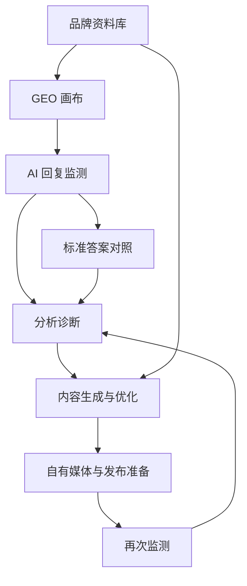

# GEO Product Experience Refinement Design

Feature Name: geo-product-experience-refinement
Updated: 2026-07-14

## Description

本设计把现有 GEO 平台重组为面向运营人员的 AI 可见性工作台。核心变化是从“页面功能并列”转为“品牌资料准备 -> GEO 画布规划 -> AI 回复监测 -> 内容生成与优化 -> 发布准备 -> 再次监测 -> 分析诊断”的闭环。

实施时应优先复用现有 Sprint、品牌工作区、监测、内容生成、优化单元、任务复测、模型设置和展示标签能力。新增能力主要集中在页面信息架构、资料库字段、分析模块聚合、内容资产流转和全局用词治理。

## Architecture



### Existing Foundation

- 品牌工作区：`apps/web/src/features/brand-workspace/pages/BrandWorkspacePage.tsx`
- 品牌知识卡片：`apps/web/src/features/brand-workspace/components/BrandKnowledgeCard.tsx`
- 优化单元：`apps/web/src/features/brand-workspace/components/OptimizationUnitsCard.tsx`
- GEO 画布：`apps/web/src/features/canvas/pages/GeoCanvasPage.tsx`
- AI 回复监测：`apps/web/src/features/monitoring/pages/MonitoringPage.tsx`
- 内容生成：`apps/web/src/features/content-generation/pages/ContentGenerationPage.tsx`
- 优化计划：`apps/web/src/features/growth-optimization/pages/GrowthOptimizationPage.tsx`
- 任务复测：`apps/web/src/features/tasks/pages/TaskRetestPage.tsx`
- AI 平台管理：`apps/web/src/features/model-settings/pages/ModelSettingsPage.tsx`
- 平台显示：`apps/web/src/utils/displayLabels.ts`

## Navigation Design

建议把导航重组为四组：

1. 运营工作台
   - 品牌工作台
   - GEO 画布
   - AI 回复监测
   - 再次监测
2. 品牌资料
   - 品牌资料库
   - 用户意图
   - 优化单元
   - 竞品资料
3. 内容与发布
   - 内容生成
   - 内容优化
   - 内容资产
   - 自有媒体
   - 媒体平台
4. 分析诊断
   - 竞品分析
   - 评价分析
   - 信源分析
   - 事实分析
   - AI 平台管理

首版可以先在现有路由内完成页面重组，避免一次性新增过多路由。独立导航页面可以用统一 `AnalysisWorkbench` 容器逐步拆分。

## Page-Level Design

### 品牌工作台

- 顶部：品牌选择、Sprint 阶段、推荐下一步、配置状态。
- 指标：AI 可见度、推荐排名、提及率、引用率、事实准确度、内容任务完成率。
- 模块矩阵：品牌资料库、GEO 画布、AI 回复监测、内容生成、内容优化、自有媒体、竞品分析、评价分析、信源分析、事实分析。
- 待办：缺资料、待监测、待审核内容、待发布内容、待复测问题。

### 品牌资料库

- 使用分组表单或 Tabs：基础信息、产品服务、目标用户、品牌知识、媒体资产、自有媒体账号、竞品信息。
- 每个分组显示完整度、最近更新时间、可用于标准答案状态。
- 缺失字段使用可执行空状态，直接进入编辑或上传。
- 资料条目需要来源、可信状态、审核状态和关联标准答案。

### GEO 画布

- 布局：左侧优化单元列表，中间关系图，右侧详情抽屉。
- 节点类型：优化单元、用户意图、监测问题、平台表现、内容任务、复测结果。
- 节点颜色表达状态：资料不足、待监测、表现较差、内容处理中、已复测。
- 节点详情提供“查看真实回复”“生成内容任务”“补充标准答案”“再次监测”。

### AI 回复监测

- 保持现有可信边界：真实 API、浏览器辅助、手动录入。
- 页面首屏展示监测计划、平台配置状态、最近监测结果和待补充真实回复。
- 创建流程按“选优化单元 -> 选用户意图 -> 选问题 -> 选平台 -> 选方式”组织。
- 缺失真实回复的任务进入待补充队列。

### 内容生成与内容优化

- 内容生成使用左右分栏创作台：左侧输入与上下文，右侧草稿与审稿信息。
- 输入包括优化单元、用户意图、内容类型、渠道、目标平台、语气、参考资料。
- 输出包括标题、摘要、正文、FAQ、引用依据、审核提醒和复测建议。
- 内容优化支持粘贴已有内容，输出事实补强、结构优化、FAQ 补充、信源建议和平台适配。

### 自有媒体与媒体平台

- 自有媒体管理品牌可控账号和主页。
- 媒体平台提供渠道规则、适合内容类型、适合用户意图和发布建议。
- 发布准备把内容资产、渠道、负责人、发布时间和复测计划串联。

### 分析诊断页面

竞品分析、评价分析、信源分析和事实分析复用统一结构：

- 顶部诊断卡：本期关键发现、影响范围、建议动作。
- 趋势区：按平台、优化单元、用户意图筛选。
- 明细区：真实回复、引用、事实、评价或竞品条目。
- 任务区：生成内容、补充资料、创建复测、更新标准答案。

## Components and Interfaces

### Frontend Components

- `WorkspaceModuleGrid`: 工作台模块卡片矩阵。
- `BrandProfileLibrary`: 品牌资料库容器。
- `BrandProfileCompleteness`: 资料完整度组件。
- `GeoCanvasWorkbench`: GEO 画布容器。
- `GeoCanvasNodeDetails`: 画布节点详情。
- `MonitoringPlanWizard`: 监测计划创建向导。
- `ContentStudio`: 内容生成与优化创作台。
- `OwnedMediaManager`: 自有媒体账号管理。
- `AnalysisWorkbench`: 分析诊断通用容器。
- `TerminologyText`: 业务标签和平台显示封装。

### Backend Interfaces

建议按能力分层补齐 API：

- `GET /api/v1/brands/:brandId/profile-library`
- `PATCH /api/v1/brands/:brandId/profile-library`
- `GET /api/v1/brands/:brandId/geo-canvas`
- `POST /api/v1/brands/:brandId/monitoring-plans`
- `GET /api/v1/brands/:brandId/content-assets`
- `POST /api/v1/brands/:brandId/content-assets`
- `GET /api/v1/brands/:brandId/owned-media`
- `POST /api/v1/brands/:brandId/owned-media`
- `GET /api/v1/brands/:brandId/analysis/competitors`
- `GET /api/v1/brands/:brandId/analysis/reviews`
- `GET /api/v1/brands/:brandId/analysis/sources`
- `GET /api/v1/brands/:brandId/analysis/facts`

已有 API 可继续作为底层来源，BFF 或 service 层聚合成页面模型。

## Data Models

### BrandProfileLibrary

- `brandId`
- `basicInfo`
- `products`
- `audiences`
- `knowledgeItems`
- `mediaAssets`
- `ownedMediaAccounts`
- `competitors`
- `completionSummary`
- `reviewStatus`

### GeoCanvasView

- `brandId`
- `sprintId`
- `optimizationUnits`
- `intentNodes`
- `questionNodes`
- `platformResultNodes`
- `contentTaskNodes`
- `retestNodes`
- `edges`
- `recommendedActions`

### ContentAsset

- `id`
- `brandId`
- `optimizationUnitId`
- `intentId`
- `type`
- `channel`
- `title`
- `body`
- `faqItems`
- `sourceReferences`
- `reviewStatus`
- `publishStatus`
- `retestPlanId`

### OwnedMediaAccount

- `id`
- `brandId`
- `platformType`
- `accountName`
- `homepageUrl`
- `contentFormats`
- `owner`
- `status`
- `notes`

### AnalysisFinding

- `id`
- `brandId`
- `type`
- `optimizationUnitId`
- `intentId`
- `platform`
- `sourceAnswerId`
- `severity`
- `summary`
- `evidence`
- `recommendedAction`
- `linkedTaskId`

## Correctness Properties

1. 监测指标只使用真实 AI 回复、浏览器辅助获取结果或用户手动录入的真实回复。
2. 标准答案作为对照和生成输入保存，指标计算层不把标准答案当作 AI 回复。
3. 内容资产必须关联来源资料、优化单元或用户意图中的至少一类上下文。
4. 平台密钥只在服务端凭据引用中使用，公开响应只返回脱敏配置状态。
5. 平台名称在 UI 中统一显示为业务名称，例如豆包、Kimi、DeepSeek、通义千问、阶跃星辰。
6. 页面展示状态必须转成用户可理解的业务状态。

## Error Handling

- 平台未配置：显示配置入口、手动录入入口和影响范围。
- AI 调用失败：显示平台名称、失败阶段、重试入口和替代方式。
- 资料缺失：显示缺失字段、影响模块和补充入口。
- 引用缺失：显示未识别来源并允许人工补充。
- 内容生成失败：保留输入上下文，提供重试和手动编辑。
- 事实冲突：显示冲突来源、可信资料和人工确认入口。

## Test Strategy

### Unit Tests

- 平台显示名映射。
- 资料完整度计算。
- GEO 画布节点聚合。
- 分析 finding 聚合。
- 内容资产状态流转。

### API Tests

- 品牌资料库读取和更新。
- GEO 画布聚合返回。
- 内容资产创建和查询。
- 自有媒体账号创建和查询。
- 四类分析诊断接口。
- AI 平台配置公开响应脱敏。

### Web Tests

- 工作台模块入口展示。
- 品牌资料库缺失项引导。
- GEO 画布节点详情和任务创建。
- AI 回复监测缺密钥和手动录入路径。
- 内容生成创作台保存草稿。
- 竞品、评价、信源、事实分析筛选。

### Verification Commands

```bash
# Run repository verification
npm run verify

# Check formatting-sensitive whitespace
git diff --check
```

## Implementation Plan

1. 重组导航和品牌工作台模块矩阵。
2. 扩展品牌资料库 UI 和页面模型。
3. 完成 GEO 画布最小闭环视图。
4. 重构 AI 回复监测创建与待补充真实回复队列。
5. 改造内容生成页为创作台，并增加内容优化入口。
6. 新增自有媒体和媒体平台页面模型。
7. 新增竞品、评价、信源、事实分析通用诊断容器。
8. 执行全局用词扫描和公开响应脱敏回归。

## Risks

- 分析模块范围大，首版需要复用统一容器降低开发量。
- GEO 画布如果直接引入复杂图编辑能力会增加测试成本，首版应以可读关系图和详情抽屉为主。
- 内容生成依赖品牌资料和标准答案质量，资料缺失时需要清晰阻塞和补充路径。
- 真实平台 API 覆盖受密钥配置影响，内测阶段继续保留手动录入路径。
