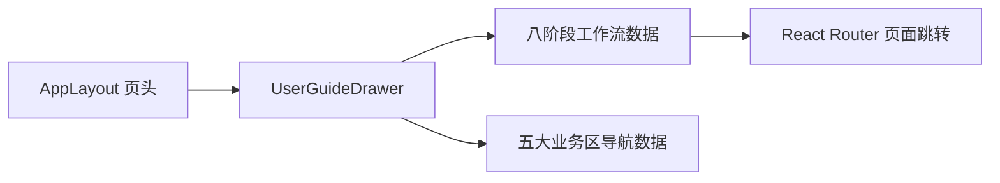

# 平台内可视化使用教程设计

Feature Name: in-app-visual-user-guide
Updated: 2026-07-20

## Description

在现有应用壳页头增加“使用教程”按钮。按钮打开右侧抽屉，用户可以查看首次小闭环、八阶段流程、业务区地图、术语和故障处理，并从阶段卡片直接进入对应页面。

## Architecture

## Components and Interfaces

- `AppLayout`：维护教程抽屉开关状态，处理阶段跳转。
- `UserGuideDrawer`：渲染教程内容并通过 `onNavigate(path)` 请求页面跳转。
- `userGuideContent`：集中维护小闭环、阶段说明、业务区和故障处理内容。

## Data Models

教程内容使用前端只读常量，不新增后端模型和持久化接口。工作流路径复用 `operationWorkflow`，业务区复用 `navigationGroups`。

## Correctness Properties

1. 每个教程阶段必须映射到现有业务路由。
2. 教程入口不得改变现有 24 个业务导航入口。
3. 教程关闭后必须保留当前路由和品牌上下文。
4. 移动端教程内容必须保持可滚动和可操作。

## Error Handling

- 当前品牌缺失时，教程继续可读，阶段跳转后由应用壳展示品牌上下文提示。
- 页面数据加载失败时，教程抽屉独立可用。

## Test Strategy

- 测试八阶段内容与 `operationWorkflow` 路由一一对应。
- 静态渲染教程抽屉，验证标题、小闭环、术语和故障处理可见。
- 运行 Web 类型检查、测试和生产构建。

## References

- `apps/web/src/layouts/AppLayout.tsx`
- `apps/web/src/layouts/navigation.ts`
- `.monkeycode/docs/GEO_PLATFORM_VISUAL_USER_GUIDE.md`
