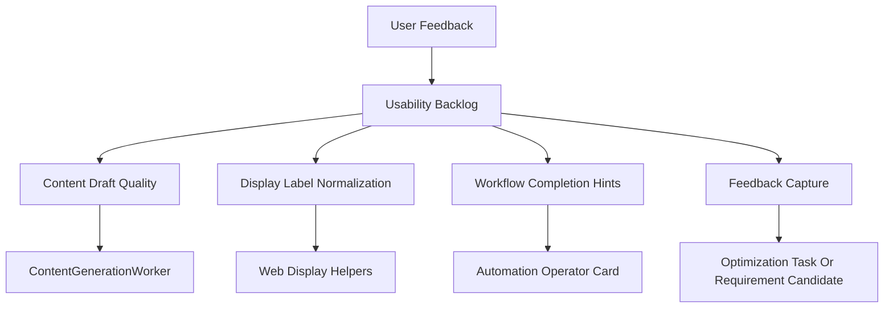

# 内测可用性优化技术设计

Feature Name: inner-test-usability-hardening
Updated: 2026-07-10

## Description

内测可用性优化围绕用户真实试用障碍进行加固。第一批代码改动聚焦内容生成 fallback 质量、测试痕迹隐藏、平台名称中文化和伪链接治理；后续批次补齐竞品地图发现、发布中心人工闭环、反馈入口和外部能力接入提示。

## Architecture



## Components and Interfaces

- **ContentGenerationWorker**: 强化默认草稿生成逻辑，使真实 LLM 不可用时也能输出可审稿内容。
- **displayLabels helper**: 统一平台、负责人和演示路径的中文显示。
- **Core Page Display Updates**: 在自动化确认、AI 回复监测记录、任务跟进和监测问题编辑中使用中文化 helper。
- **Publishing Draft State**: 未真实发布的内容保持草稿状态，避免输出不可访问链接。
- **Future Feedback Module**: 后续新增内测反馈接口，将页面反馈转成优化任务或需求候选。

## Data Models

第一批修复不新增数据模型。

后续反馈模块建议新增：

```typescript
type InnerTestFeedback = {
  feedbackId: string;
  brandId: string;
  pagePath: string;
  moduleName: string;
  issueType: 'content_quality' | 'display_copy' | 'workflow_blocker' | 'data_error' | 'missing_feature';
  severity: 'high' | 'medium' | 'low';
  description: string;
  screenshotUrl?: string;
  status: 'new' | 'triaged' | 'in_progress' | 'resolved';
  createdBy: string;
  createdAt: string;
  updatedAt: string;
};
```

## Correctness Properties

- 内容草稿必须包含正文主体和固定审稿章节，避免短句占位。
- 面向用户的默认列表使用中文平台名和业务化负责人名称。
- 内部 ID 可保留在数据层和调试场景，默认业务页面使用可读名称。
- 未发布内容使用草稿状态，只有真实发布后显示外部链接。

## Error Handling

- LLM 内容生成失败时，系统使用业务模板生成草稿并继续后续流程。
- 平台名未知时，系统保留原值并避免阻断页面展示。
- 反馈保存失败时，系统提示用户重试并保留输入内容。

## Test Strategy

- API 测试覆盖 fallback 草稿结构、正文长度、审稿章节和伪链接治理。
- Web 测试覆盖平台名中文预览、中文输入平台保存为内部 code、自动化确认抽屉平台显示。
- 类型检查覆盖新增 helper 在关键页面的使用。
- 回归测试覆盖自动化内容生成、内容生成 worker 和前端自动化卡片。

## References

[^1]: `geo-platform/apps/api/src/modules/content/content-generation.worker.ts` - 内容生成 worker 与 fallback 草稿。
[^2]: `geo-platform/apps/web/src/utils/displayLabels.ts` - 前端中文显示 helper。
[^3]: `.monkeycode/specs/competitor-map-discovery/requirements.md` - 竞品地图发现规格。
