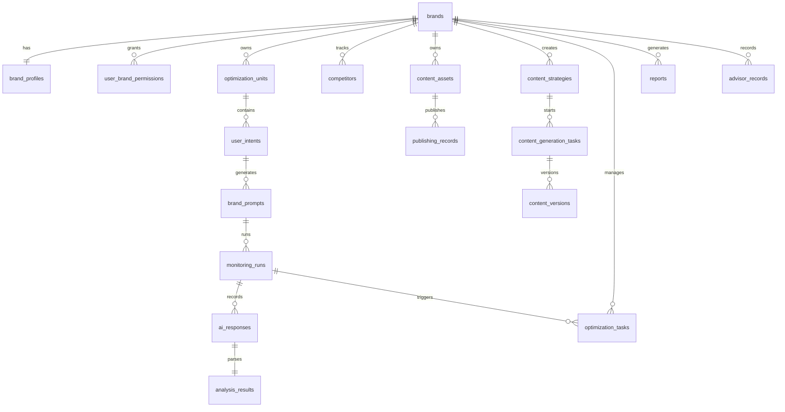

# 多品牌 GEO 管理平台数据库结构规格

## 1. 设计目标

数据库设计围绕多品牌 GEO 运营闭环展开，核心原则是：

- 所有品牌业务数据必须带 `brand_id`
- 监测数据必须能追溯到品牌、优化单元、用户意图、Prompt 和 AI 平台
- 内容策略、内容生成、发布记录和复测任务必须形成闭环
- 报告和顾问服务必须能引用历史监测、任务和服务记录

## 2. 命名约定

- 表名使用复数蛇形命名，例如 `brands`
- 主键统一使用 `id`
- 品牌外键统一使用 `brand_id`
- 时间字段统一使用 `created_at`、`updated_at`
- 软删除字段使用 `deleted_at`
- 状态字段使用 `status`

## 3. 核心关系图

## 4. 基础权限表

### 4.1 users

| 字段 | 类型 | 说明 |
|---|---|---|
| id | uuid | 用户 ID |
| name | varchar | 用户名称 |
| email | varchar | 邮箱，唯一 |
| avatar_url | varchar | 头像 |
| status | varchar | active、inactive |
| created_at | timestamp | 创建时间 |
| updated_at | timestamp | 更新时间 |

索引：

- `unique_users_email` unique(`email`)
- `idx_users_status` (`status`)

### 4.2 brands

| 字段 | 类型 | 说明 |
|---|---|---|
| id | uuid | 品牌 ID |
| name | varchar | 品牌名称 |
| aliases | json | 品牌别名数组 |
| industry | varchar | 所属行业 |
| website | varchar | 官网 |
| target_cities | json | 目标城市数组 |
| business_scope | text | 业务范围 |
| target_audience | text | 目标用户 |
| status | varchar | active、inactive、archived |
| created_at | timestamp | 创建时间 |
| updated_at | timestamp | 更新时间 |
| deleted_at | timestamp | 软删除时间 |

索引：

- `idx_brands_status` (`status`)
- `idx_brands_industry` (`industry`)

### 4.3 user_brand_permissions

| 字段 | 类型 | 说明 |
|---|---|---|
| id | uuid | 权限 ID |
| user_id | uuid | 用户 ID |
| brand_id | uuid | 品牌 ID |
| role | varchar | owner、admin、operator、analyst、viewer |
| created_at | timestamp | 创建时间 |
| updated_at | timestamp | 更新时间 |

约束与索引：

- `fk_user_brand_permissions_user_id` -> `users.id`
- `fk_user_brand_permissions_brand_id` -> `brands.id`
- `unique_user_brand_role` unique(`user_id`, `brand_id`)
- `idx_user_brand_permissions_brand_id` (`brand_id`)

## 5. 品牌知识库

### 5.1 brand_profiles

| 字段 | 类型 | 说明 |
|---|---|---|
| brand_id | uuid | 品牌 ID，主键 |
| intro | text | 品牌介绍 |
| value_props | json | 核心卖点 |
| offerings | json | 产品或课程体系 |
| proof_points | json | 权威背书 |
| target_customers | json | 目标客户 |
| recommended_expressions | json | 推荐表达 |
| blocked_expressions | json | 禁用表达 |
| content_rules | json | 内容规则 |
| faqs | json | FAQ |
| completeness_score | integer | 完整度评分，0-100 |
| missing_fields | json | 缺失字段 |
| updated_at | timestamp | 更新时间 |

约束：

- `fk_brand_profiles_brand_id` -> `brands.id`
- `check_completeness_score_range` `completeness_score between 0 and 100`

### 5.2 knowledge_sources

| 字段 | 类型 | 说明 |
|---|---|---|
| id | uuid | 知识来源 ID |
| brand_id | uuid | 品牌 ID |
| name | varchar | 素材名称 |
| source_type | varchar | file、webpage、wechat_article、external_document |
| source_url | varchar | 来源链接 |
| file_ref | varchar | 文件引用 |
| status | varchar | pending、processing、completed、failed |
| error_message | text | 错误信息 |
| created_at | timestamp | 创建时间 |
| updated_at | timestamp | 更新时间 |

索引：

- `idx_knowledge_sources_brand_id` (`brand_id`)
- `idx_knowledge_sources_status` (`status`)

## 6. GEO 优化对象

### 6.1 optimization_units

| 字段 | 类型 | 说明 |
|---|---|---|
| id | uuid | 优化单元 ID |
| brand_id | uuid | 品牌 ID |
| name | varchar | 优化单元名称 |
| type | varchar | brand、category、scenario、location、competitor |
| target_keywords | json | 目标关键词 |
| priority | varchar | high、medium、low |
| enabled | boolean | 是否启用 |
| created_at | timestamp | 创建时间 |
| updated_at | timestamp | 更新时间 |

索引：

- `idx_optimization_units_brand_id` (`brand_id`)
- `idx_optimization_units_type` (`type`)
- `idx_optimization_units_enabled` (`enabled`)

### 6.2 user_intents

| 字段 | 类型 | 说明 |
|---|---|---|
| id | uuid | 用户意图 ID |
| brand_id | uuid | 品牌 ID |
| optimization_unit_id | uuid | 优化单元 ID |
| category | varchar | 意图分类 |
| text | text | 用户意图描述 |
| monitoring_frequency | varchar | daily、weekly、monthly、manual |
| enabled | boolean | 是否启用 |
| created_at | timestamp | 创建时间 |
| updated_at | timestamp | 更新时间 |

索引：

- `idx_user_intents_brand_id` (`brand_id`)
- `idx_user_intents_optimization_unit_id` (`optimization_unit_id`)
- `idx_user_intents_category` (`category`)

### 6.3 prompt_templates

| 字段 | 类型 | 说明 |
|---|---|---|
| id | uuid | 模板 ID |
| name | varchar | 模板名称 |
| industry | varchar | 适用行业 |
| category | varchar | 场景分类 |
| text | text | 模板文本 |
| target_keywords | json | 目标关键词 |
| platform_codes | json | 目标平台 |
| frequency | varchar | 监测频率 |
| created_at | timestamp | 创建时间 |
| updated_at | timestamp | 更新时间 |

### 6.4 brand_prompts

| 字段 | 类型 | 说明 |
|---|---|---|
| id | uuid | 品牌 Prompt ID |
| brand_id | uuid | 品牌 ID |
| optimization_unit_id | uuid | 优化单元 ID |
| intent_id | uuid | 用户意图 ID |
| template_id | uuid | 模板 ID |
| text | text | 实际问题文本 |
| target_keywords | json | 目标关键词 |
| platform_codes | json | 目标平台 |
| enabled | boolean | 是否启用 |
| created_at | timestamp | 创建时间 |
| updated_at | timestamp | 更新时间 |

索引：

- `idx_brand_prompts_brand_id` (`brand_id`)
- `idx_brand_prompts_intent_id` (`intent_id`)
- `idx_brand_prompts_enabled` (`enabled`)

## 7. AI 平台与监测

### 7.1 platform_configs

| 字段 | 类型 | 说明 |
|---|---|---|
| id | uuid | 平台配置 ID |
| platform_code | varchar | 平台代码 |
| name | varchar | 平台名称 |
| mode | varchar | api、manual、semi_auto、mock |
| model_name | varchar | 模型名称 |
| rate_limit | integer | 调用限制 |
| credential_ref | varchar | 凭据引用 |
| enabled | boolean | 是否启用 |
| created_at | timestamp | 创建时间 |
| updated_at | timestamp | 更新时间 |

索引：

- `unique_platform_configs_platform_code` unique(`platform_code`)
- `idx_platform_configs_enabled` (`enabled`)

### 7.2 monitoring_runs

| 字段 | 类型 | 说明 |
|---|---|---|
| id | uuid | 运行 ID |
| brand_id | uuid | 品牌 ID |
| optimization_unit_id | uuid | 优化单元 ID |
| intent_id | uuid | 用户意图 ID |
| prompt_id | uuid | Prompt ID |
| platform_code | varchar | 平台代码 |
| status | varchar | pending、running、completed、failed、review_required |
| started_at | timestamp | 开始时间 |
| completed_at | timestamp | 完成时间 |
| error_message | text | 失败原因 |
| created_at | timestamp | 创建时间 |

索引：

- `idx_monitoring_runs_brand_id` (`brand_id`)
- `idx_monitoring_runs_prompt_platform` (`prompt_id`, `platform_code`)
- `idx_monitoring_runs_status` (`status`)
- `idx_monitoring_runs_created_at` (`created_at`)

### 7.3 ai_responses

| 字段 | 类型 | 说明 |
|---|---|---|
| id | uuid | 回答 ID |
| run_id | uuid | 运行 ID |
| brand_id | uuid | 品牌 ID |
| raw_text | text | 原始回答 |
| citations | json | 原始引用列表 |
| model_name | varchar | 模型名称 |
| responded_at | timestamp | 回答时间 |
| parse_status | varchar | pending、parsed、review_required、failed |
| created_at | timestamp | 创建时间 |

索引：

- `idx_ai_responses_run_id` (`run_id`)
- `idx_ai_responses_brand_id` (`brand_id`)

### 7.4 analysis_results

| 字段 | 类型 | 说明 |
|---|---|---|
| response_id | uuid | 回答 ID，主键 |
| brand_mentioned | boolean | 品牌是否出现 |
| brand_rank | integer | 品牌推荐位置 |
| sentiment | varchar | positive、neutral、negative、unknown |
| accuracy_score | integer | 准确分，0-100 |
| citation_score | integer | 引用分，0-100 |
| platform_evaluation | text | AI 平台评价 |
| recommendation_reason | text | 推荐理由 |
| ranking_reason | text | 排名原因 |
| expression_completeness | integer | 优势表达完整度，0-100 |
| expression_deviation | text | 表达偏差 |
| competitor_mentions | json | 竞品提及 |
| review_required | boolean | 是否需要复核 |
| updated_at | timestamp | 更新时间 |

约束：

- `check_accuracy_score_range` `accuracy_score between 0 and 100`
- `check_citation_score_range` `citation_score between 0 and 100`
- `check_expression_completeness_range` `expression_completeness between 0 and 100`

## 8. 指标、竞品、引用与评价

### 8.1 geo_metric_snapshots

| 字段 | 类型 | 说明 |
|---|---|---|
| id | uuid | 快照 ID |
| brand_id | uuid | 品牌 ID |
| period | varchar | 统计周期 |
| platform_code | varchar | 平台代码 |
| optimization_unit_id | uuid | 优化单元 ID |
| intent_id | uuid | 用户意图 ID |
| category | varchar | 场景分类 |
| mention_score | integer | 提及分 |
| ranking_score | integer | 推荐分 |
| accuracy_score | integer | 准确分 |
| sentiment_score | integer | 正向分 |
| citation_score | integer | 引用分 |
| competitor_score | integer | 竞品对比分 |
| knowledge_completeness_score | integer | 完整度影响项 |
| total_score | integer | 总分 |
| sample_count | integer | 样本数 |
| calculated_at | timestamp | 计算时间 |

索引：

- `idx_geo_metric_snapshots_brand_period` (`brand_id`, `period`)
- `idx_geo_metric_snapshots_platform` (`platform_code`)
- `idx_geo_metric_snapshots_unit` (`optimization_unit_id`)

### 8.2 competitors

| 字段 | 类型 | 说明 |
|---|---|---|
| id | uuid | 竞品 ID |
| brand_id | uuid | 品牌 ID |
| name | varchar | 竞品名称 |
| aliases | json | 竞品别名 |
| website | varchar | 官网 |
| industry_tags | json | 行业标签 |
| comparison_note | text | 对比说明 |
| created_at | timestamp | 创建时间 |
| updated_at | timestamp | 更新时间 |

### 8.3 citation_sources

| 字段 | 类型 | 说明 |
|---|---|---|
| id | uuid | 引用来源 ID |
| brand_id | uuid | 品牌 ID |
| response_id | uuid | AI 回答 ID |
| content_asset_id | uuid | 内容资产 ID |
| title | varchar | 来源标题 |
| url | varchar | 来源链接 |
| source_type | varchar | official_site、media、social、encyclopedia、third_party |
| authority_level | varchar | high、medium、low、unknown |
| citation_count | integer | 引用次数 |
| created_at | timestamp | 创建时间 |

索引：

- `idx_citation_sources_brand_id` (`brand_id`)
- `idx_citation_sources_response_id` (`response_id`)
- `idx_citation_sources_source_type` (`source_type`)

### 8.4 evaluation_issues

| 字段 | 类型 | 说明 |
|---|---|---|
| id | uuid | 评价问题 ID |
| brand_id | uuid | 品牌 ID |
| response_id | uuid | AI 回答 ID |
| issue_type | varchar | 错误信息、缺失卖点、负向表达、表达偏差 |
| raw_fragment | text | 原始回答片段 |
| suggested_expression | text | 正确表达建议 |
| severity | varchar | high、medium、low |
| status | varchar | open、resolved、ignored |
| created_at | timestamp | 创建时间 |
| updated_at | timestamp | 更新时间 |

## 9. 内容、发布、任务与报告

### 9.1 content_assets

| 字段 | 类型 | 说明 |
|---|---|---|
| id | uuid | 内容资产 ID |
| brand_id | uuid | 品牌 ID |
| title | varchar | 标题 |
| type | varchar | 内容类型 |
| platform | varchar | 发布平台 |
| url | varchar | 内容链接 |
| target_keywords | json | 目标关键词 |
| status | varchar | draft、published、archived |
| published_at | timestamp | 发布时间 |
| created_at | timestamp | 创建时间 |
| updated_at | timestamp | 更新时间 |

### 9.2 content_strategies

| 字段 | 类型 | 说明 |
|---|---|---|
| id | uuid | 策略 ID |
| brand_id | uuid | 品牌 ID |
| optimization_unit_id | uuid | 优化单元 ID |
| intent_id | uuid | 用户意图 ID |
| type | varchar | gap、correction、enhancement、authority_citation、competitor_response |
| priority | varchar | high、medium、low |
| suggested_title | varchar | 建议标题 |
| target_platform | varchar | 目标平台 |
| target_keywords | json | 目标关键词 |
| related_prompt_ids | json | 关联 Prompt |
| status | varchar | draft、task_created、completed |
| created_at | timestamp | 创建时间 |
| updated_at | timestamp | 更新时间 |

### 9.3 content_generation_tasks

| 字段 | 类型 | 说明 |
|---|---|---|
| id | uuid | 生成任务 ID |
| brand_id | uuid | 品牌 ID |
| strategy_id | uuid | 内容策略 ID |
| target_platform | varchar | 目标平台 |
| content_type | varchar | 内容类型 |
| status | varchar | pending、running、completed、failed |
| steps | json | 生成步骤状态 |
| draft_ref | varchar | 草稿引用 |
| error_message | text | 失败原因 |
| created_at | timestamp | 创建时间 |
| updated_at | timestamp | 更新时间 |

### 9.4 content_versions

| 字段 | 类型 | 说明 |
|---|---|---|
| id | uuid | 内容版本 ID |
| generation_task_id | uuid | 生成任务 ID |
| title | varchar | 标题 |
| body | text | 正文 |
| version | integer | 版本号 |
| export_format | varchar | 导出格式 |
| created_at | timestamp | 创建时间 |
| updated_at | timestamp | 更新时间 |

### 9.5 publishing_accounts

| 字段 | 类型 | 说明 |
|---|---|---|
| id | uuid | 发布账号 ID |
| brand_id | uuid | 品牌 ID |
| platform | varchar | 发布平台 |
| account_name | varchar | 账号名称 |
| login_mode | varchar | 登录方式 |
| auth_status | varchar | connected、expired、error、disconnected |
| last_authorized_at | timestamp | 最近授权时间 |
| created_at | timestamp | 创建时间 |
| updated_at | timestamp | 更新时间 |

### 9.6 publishing_records

| 字段 | 类型 | 说明 |
|---|---|---|
| id | uuid | 发布记录 ID |
| brand_id | uuid | 品牌 ID |
| content_asset_id | uuid | 内容资产 ID |
| account_id | uuid | 发布账号 ID |
| status | varchar | draft、pending、published、failed |
| published_url | varchar | 发布链接 |
| error_message | text | 失败原因 |
| created_at | timestamp | 创建时间 |
| updated_at | timestamp | 更新时间 |

### 9.7 optimization_tasks

| 字段 | 类型 | 说明 |
|---|---|---|
| id | uuid | 任务 ID |
| brand_id | uuid | 品牌 ID |
| type | varchar | 任务类型 |
| status | varchar | todo、doing、review、retest、done、reopened |
| owner_id | uuid | 负责人 |
| optimization_unit_id | uuid | 优化单元 ID |
| related_prompt_id | uuid | 关联 Prompt |
| related_platform_code | varchar | 关联平台 |
| source_run_id | uuid | 原始监测运行 ID |
| retest_run_id | uuid | 复测运行 ID |
| due_date | date | 截止日期 |
| created_at | timestamp | 创建时间 |
| updated_at | timestamp | 更新时间 |

### 9.8 reports

| 字段 | 类型 | 说明 |
|---|---|---|
| id | uuid | 报告 ID |
| brand_id | uuid | 品牌 ID |
| type | varchar | weekly、monthly、multi_brand、customer_delivery |
| title | varchar | 报告标题 |
| period_start | date | 周期开始 |
| period_end | date | 周期结束 |
| status | varchar | pending、generated、failed |
| content | text | Markdown 内容 |
| created_by | uuid | 创建人 |
| created_at | timestamp | 创建时间 |

### 9.9 advisor_records

| 字段 | 类型 | 说明 |
|---|---|---|
| id | uuid | 顾问记录 ID |
| brand_id | uuid | 品牌 ID |
| type | varchar | diagnosis、service、training、rule_update |
| title | varchar | 标题 |
| content | text | 内容 |
| related_report_id | uuid | 关联报告 ID |
| follow_up_items | json | 跟进事项 |
| created_by | uuid | 创建人 |
| created_at | timestamp | 创建时间 |

## 10. 数据隔离与一致性规则

### 10.1 品牌隔离

- 所有带 `brand_id` 的表必须按用户授权品牌过滤。
- 所有关联对象写入时必须校验属于同一 `brand_id`。
- 报告导出和内容导出必须记录创建人和品牌上下文。

### 10.2 分数约束

- GEO 子分和总分范围为 0-100。
- 知识库完整度评分范围为 0-100。
- 表达完整度评分范围为 0-100。

### 10.3 任务闭环

- 从监测问题创建的任务必须保存 `source_run_id`。
- 任务进入待复测时必须创建或绑定 `retest_run_id`。
- 复测失败后任务状态可变更为 `reopened`。

### 10.4 内容闭环

- 内容策略可以创建内容生成任务。
- 内容生成任务可以生成多个内容版本。
- 内容版本可以转换为内容资产。
- 内容资产可以创建发布记录。

## 11. 首版迁移顺序

1. 创建用户、品牌和权限表。
2. 创建品牌知识库和知识来源表。
3. 创建优化单元、用户意图和 Prompt 表。
4. 创建 AI 平台、监测运行、AI 回答和解析结果表。
5. 创建指标快照、竞品、引用和评价问题表。
6. 创建内容资产、内容策略、内容生成和内容版本表。
7. 创建发布账号、发布记录和优化任务表。
8. 创建报告和顾问服务表。
9. 添加索引、唯一约束和评分区间约束。
10. 写入首版种子数据。

## 12. 首版种子数据

### 12.1 AI 平台

- 豆包：`doubao`
- Kimi：`kimi`
- DeepSeek：`deepseek`
- 通义千问：`qianwen`

### 12.2 优化单元类型

- 品牌词
- 品类词
- 场景词
- 地域词
- 竞品词

### 12.3 用户意图分类

- 品牌认知
- 品类推荐
- 痛点解决
- 本地决策
- 竞品对比
- 价格决策

### 12.4 追光小牛示例品牌

- 品牌名称：追光小牛
- 行业：儿童体适能
- 目标城市：深圳
- 示例优化单元：儿童体适能品牌推荐、孩子不爱运动怎么办、深圳儿童体适能机构、追光小牛怎么样

## 13. 后续扩展预留

- 企业级多租户组织表：`organizations`
- AI 平台调用账单表：`platform_usage_logs`
- 自动发布授权 token 表：`publishing_credentials`
- 内容审核流表：`content_review_workflows`
- CRM 线索归因表：`lead_attributions`
- 门店和地域表现表：`store_geo_metrics`
