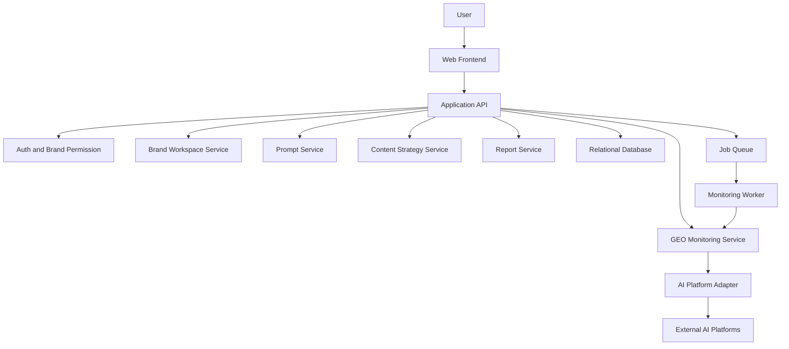

# 多品牌 GEO 管理平台技术设计

Feature Name: multi-brand-geo-platform
Updated: 2026-07-03

## Description

第一版建设一个多品牌 GEO 管理 Web 应用，支持品牌工作区切换、品牌档案、Prompt 场景库、AI 平台配置、GEO 监测记录、结果解析、竞品对比、内容资产、运营任务和报告中心。系统优先支持人工录入与半自动采集，并为后续接入各平台 API、自动分发和智能策略生成预留服务边界。

## Architecture



第一版建议采用前后端分离架构：前端提供多品牌运营后台，后端提供品牌、Prompt、监测、内容、任务和报告 API。数据库使用关系型模型承载多租户数据隔离，所有业务表带 `brand_id`。AI 平台调用通过 Adapter 层隔离，第一版允许 API 调用、手动录入和半自动采集三种模式。

## Components and Interfaces

### Frontend

- `BrandSwitcher`: 品牌切换组件，展示用户可访问品牌并切换当前工作区。
- `GlobalDashboard`: 多品牌总览，展示品牌排行、平台表现和高优先级问题。
- `BrandDashboard`: 单品牌看板，展示 GEO 指数、平台趋势、关键词趋势和任务进度。
- `BrandProfileEditor`: 品牌档案编辑器，维护品牌介绍、标准表达、禁用表达、FAQ 和关键词。
- `PromptLibrary`: Prompt 模板与品牌 Prompt 管理。
- `MonitoringConsole`: 监测任务创建、执行状态、原始回答和解析结果查看。
- `CompetitorPanel`: 竞品列表、竞品提及和推荐差距分析。
- `ContentAssetCenter`: 内容资产管理和内容缺口查看。
- `TaskBoard`: GEO 优化任务看板和复测状态。
- `ReportCenter`: 单品牌报告和多品牌报告生成。

### Backend Services

- `AuthService`: 用户身份、角色和品牌权限校验，对应需求 1。
- `BrandService`: 品牌工作区、品牌档案、品牌别名和标准口径管理，对应需求 1、2。
- `KnowledgeService`: 品牌知识库、完整度评分和多来源素材导入管理，对应需求 2、12。
- `OptimizationUnitService`: 品牌词、品类词、场景词、地域词和竞品词优化单元管理，对应需求 11。
- `IntentService`: 用户意图、意图分类和意图表现管理，对应需求 3、11。
- `PromptService`: 通用模板、品牌 Prompt、场景分类和监测频率管理，对应需求 3。
- `PlatformService`: AI 平台配置、调用方式、模型版本和凭据管理，对应需求 4。
- `MonitoringService`: 监测任务、运行记录、原始回答和解析状态管理，对应需求 5。
- `AnalysisService`: 品牌提及、推荐排序、情绪、准确性、平台评价、引用和竞品识别，对应需求 5、6、7、13。
- `MetricService`: GEO 指数计算、趋势快照和多品牌排行，对应需求 6。
- `CompetitorService`: 竞品维护和竞品对比分析，对应需求 7。
- `CitationService`: 引用来源分类、引用趋势和引用增强入口管理，对应需求 13。
- `EvaluationService`: 正向、中性、负向、准确表达和错误表达分析，对应需求 13。
- `ContentService`: 内容资产、内容缺口和策略建议管理，对应需求 8。
- `ContentGenerationService`: 内容生成任务、进度步骤、编辑版本和导出记录管理，对应需求 14。
- `PublishingService`: 发布平台、平台账号、授权状态和发布记录管理，对应需求 15。
- `TaskService`: 优化任务、审核状态、复测计划和问题重开，对应需求 9。
- `AdvisorService`: 顾问诊断、服务记录、培训记录和行业规则更新管理，对应需求 16。
- `ReportService`: Markdown、PDF、结构化数据和客户交付报告生成，对应需求 10、16。

### External Adapter Interface

```typescript
interface AIPlatformAdapter {
  platformCode: string;
  runPrompt(input: RunPromptInput): Promise<RunPromptResult>;
  validateConfig(config: PlatformConfig): Promise<ValidationResult>;
}
```

第一版内置 `ManualInputAdapter` 和 `MockAdapter`，用于人工录入、演示数据和本地开发。真实平台 API 后续以插件式 Adapter 接入。

## Data Models

### Brand

- `id`: 品牌 ID
- `name`: 品牌名称
- `aliases`: 品牌别名列表
- `industry`: 所属行业
- `website`: 官网地址
- `targetCities`: 目标城市
- `businessScope`: 业务范围
- `targetAudience`: 目标用户
- `status`: 启用状态

### BrandProfile

- `brandId`: 品牌 ID
- `intro`: 品牌介绍
- `valueProps`: 核心卖点
- `offerings`: 产品或课程体系
- `proofPoints`: 权威背书
- `recommendedExpressions`: 推荐表达
- `blockedExpressions`: 禁用表达
- `faqs`: FAQ 列表
- `targetCustomers`: 目标客户
- `contentRules`: 内容规则
- `completenessScore`: 知识库完整度评分

### UserBrandPermission

- `userId`: 用户 ID
- `brandId`: 品牌 ID
- `role`: `owner | admin | operator | analyst | viewer`

### KnowledgeSource

- `id`: 知识来源 ID
- `brandId`: 品牌 ID
- `name`: 素材名称
- `sourceType`: `file | webpage | wechat_article | external_document`
- `sourceUrl`: 来源链接
- `fileRef`: 文件引用
- `status`: `pending | processing | completed | failed`
- `errorMessage`: 错误信息

### OptimizationUnit

- `id`: 优化单元 ID
- `brandId`: 品牌 ID
- `name`: 优化单元名称
- `type`: `brand | category | scenario | location | competitor`
- `targetKeywords`: 目标关键词
- `priority`: 优先级
- `enabled`: 启用状态

### UserIntent

- `id`: 用户意图 ID
- `brandId`: 品牌 ID
- `optimizationUnitId`: 优化单元 ID
- `category`: 意图分类
- `text`: 用户意图描述
- `status`: 启用状态
- `monitoringFrequency`: 监测频率

### PromptTemplate

- `id`: 模板 ID
- `category`: 场景分类
- `text`: Prompt 文本
- `industry`: 适用行业
- `targetKeywords`: 目标关键词
- `platformCodes`: 目标平台
- `frequency`: 监测频率

### BrandPrompt

- `id`: 品牌 Prompt ID
- `brandId`: 品牌 ID
- `optimizationUnitId`: 优化单元 ID
- `intentId`: 用户意图 ID
- `templateId`: 模板 ID
- `text`: 实际问题文本
- `category`: 场景分类
- `targetKeywords`: 目标关键词
- `platformCodes`: 目标平台
- `enabled`: 启用状态

### PlatformConfig

- `id`: 平台配置 ID
- `platformCode`: 平台代码
- `name`: 平台名称
- `mode`: `api | manual | semi_auto | mock`
- `modelName`: 模型名称
- `rateLimit`: 调用限制
- `credentialRef`: 凭据引用
- `enabled`: 启用状态

### MonitoringRun

- `id`: 运行 ID
- `brandId`: 品牌 ID
- `optimizationUnitId`: 优化单元 ID
- `intentId`: 用户意图 ID
- `promptId`: Prompt ID
- `platformCode`: 平台代码
- `status`: `pending | running | completed | failed | review_required`
- `startedAt`: 开始时间
- `completedAt`: 完成时间
- `errorMessage`: 失败原因

### AIResponse

- `id`: 回答 ID
- `runId`: 运行 ID
- `brandId`: 品牌 ID
- `rawText`: 原始回答
- `citations`: 引用来源
- `modelName`: 模型名称
- `respondedAt`: 回答时间
- `parseStatus`: 解析状态

### AnalysisResult

- `responseId`: 回答 ID
- `brandMentioned`: 品牌是否出现
- `brandRank`: 品牌推荐位置
- `sentiment`: 情绪倾向
- `accuracyScore`: 信息准确分
- `citationScore`: 引用分
- `platformEvaluation`: AI 平台评价
- `recommendationReason`: 推荐理由
- `rankingReason`: 排名原因
- `expressionCompleteness`: 优势表达完整度
- `expressionDeviation`: 表达偏差
- `competitorMentions`: 竞品提及列表
- `reviewRequired`: 人工复核标记

### GEOMetricSnapshot

- `brandId`: 品牌 ID
- `period`: 统计周期
- `platformCode`: 平台代码
- `optimizationUnitId`: 优化单元 ID
- `intentId`: 用户意图 ID
- `category`: 场景分类
- `mentionScore`: 提及分
- `rankingScore`: 推荐分
- `accuracyScore`: 准确分
- `sentimentScore`: 正向分
- `citationScore`: 引用分
- `competitorScore`: 竞品对比分
- `knowledgeCompletenessScore`: 知识库完整度影响项
- `totalScore`: 总分

### CitationSource

- `id`: 引用来源 ID
- `brandId`: 品牌 ID
- `responseId`: AI 回答 ID
- `contentAssetId`: 内容资产 ID
- `title`: 来源标题
- `url`: 来源链接
- `sourceType`: `official_site | media | social | encyclopedia | third_party`
- `authorityLevel`: 权威等级
- `citationCount`: 引用次数

### ContentAsset

- `id`: 内容资产 ID
- `brandId`: 品牌 ID
- `title`: 标题
- `type`: 内容类型
- `platform`: 发布平台
- `url`: 内容链接
- `targetKeywords`: 目标关键词
- `status`: 内容状态
- `publishedAt`: 发布时间

### ContentStrategy

- `id`: 策略 ID
- `brandId`: 品牌 ID
- `type`: `gap | correction | enhancement | competitor_response`
- `priority`: 优先级
- `suggestedTitle`: 建议标题
- `targetPlatform`: 目标平台
- `targetKeywords`: 目标关键词
- `optimizationUnitId`: 优化单元 ID
- `intentId`: 用户意图 ID
- `relatedPromptIds`: 关联 Prompt

### ContentGenerationTask

- `id`: 生成任务 ID
- `brandId`: 品牌 ID
- `strategyId`: 内容策略 ID
- `targetPlatform`: 目标平台
- `contentType`: 内容类型
- `status`: `pending | running | completed | failed`
- `steps`: 生成步骤状态
- `draftRef`: 草稿引用
- `errorMessage`: 失败原因

### ContentVersion

- `id`: 内容版本 ID
- `generationTaskId`: 生成任务 ID
- `title`: 标题
- `body`: 正文
- `version`: 版本号
- `exportFormat`: 导出格式

### PublishingAccount

- `id`: 发布账号 ID
- `brandId`: 品牌 ID
- `platform`: 发布平台
- `accountName`: 账号名称
- `loginMode`: 登录方式
- `authStatus`: `connected | expired | error | disconnected`
- `lastAuthorizedAt`: 最近授权时间

### PublishingRecord

- `id`: 发布记录 ID
- `brandId`: 品牌 ID
- `contentAssetId`: 内容资产 ID
- `accountId`: 发布账号 ID
- `status`: `draft | pending | published | failed`
- `publishedUrl`: 发布链接
- `errorMessage`: 失败原因

### OptimizationTask

- `id`: 任务 ID
- `brandId`: 品牌 ID
- `type`: 任务类型
- `status`: `todo | doing | review | done | reopened`
- `ownerId`: 负责人
- `optimizationUnitId`: 优化单元 ID
- `relatedPromptId`: 关联 Prompt
- `relatedPlatformCode`: 关联平台
- `dueDate`: 截止日期
- `retestRunId`: 复测运行 ID

### AdvisorRecord

- `id`: 顾问记录 ID
- `brandId`: 品牌 ID
- `type`: `diagnosis | service | training | rule_update`
- `title`: 标题
- `content`: 内容
- `relatedReportId`: 关联报告 ID
- `followUpItems`: 跟进事项

## Correctness Properties

1. **品牌隔离属性**: 任意带 `brand_id` 的业务查询只返回当前用户授权品牌范围内的数据，对应需求 1。
2. **Prompt 生成属性**: 从模板生成品牌 Prompt 时，生成结果必须包含目标品牌名称或品牌别名，对应需求 3。
3. **监测溯源属性**: 每条 `AIResponse` 必须关联一个 `MonitoringRun`，每个 `MonitoringRun` 必须关联一个品牌、平台和 Prompt，对应需求 5。
4. **GEO 指数边界属性**: 每个子分和总分必须处于 0 到 100 区间，对应需求 6。
5. **任务闭环属性**: 由监测问题创建的优化任务必须保留原始监测记录和复测记录的关联，对应需求 9。
6. **优化单元链路属性**: 每个用户意图、品牌 Prompt、内容策略和复测任务必须能追溯到一个品牌或优化单元，对应需求 11。
7. **知识库完整度属性**: 品牌知识库完整度评分必须根据配置项计算，且结果处于 0 到 100 区间，对应需求 12。
8. **引用归属属性**: 每条引用来源必须关联 AI 回答，绑定内容资产时必须属于同一品牌，对应需求 13。
9. **内容版本属性**: 内容生成任务的每个可编辑版本必须保留生成任务、版本号和导出格式，对应需求 14。
10. **发布记录属性**: 每条发布记录必须关联品牌、内容资产和发布账号，对应需求 15。

## Error Handling

- 品牌权限错误返回标准权限提示，并记录用户、品牌、时间和访问路径。
- 品牌档案、知识库导入、优化单元、用户意图、Prompt、平台配置和内容资产保存前执行字段校验，错误信息返回到对应表单字段。
- AI 平台调用失败时记录请求上下文和失败原因，监测任务进入 `failed` 状态。
- 自动解析置信度不足时进入 `review_required` 状态，允许人工修正。
- GEO 指数计算样本不足时保留可计算子项，并在快照中标记 `insufficient_sample`。
- 内容生成失败时记录失败步骤和失败原因，允许用户重试或保留当前草稿版本。
- 发布账号授权异常时记录平台、账号、异常原因和最近授权时间。
- 报告生成失败时保留生成任务记录，并允许重新生成。

## Test Strategy

- 针对品牌权限、品牌知识库校验、优化单元、用户意图、Prompt 生成、平台配置校验、GEO 指数计算和任务状态流转编写单元测试。
- 针对品牌隔离、Prompt 生成、监测溯源、指数边界、任务闭环、知识库完整度、引用归属和发布记录编写 property-based tests。
- 针对品牌切换、GEO 画布、监测录入、结果解析、引用分析、评价分析、内容策略生成、内容生成、发布记录和报告导出编写集成测试。
- 第一版可使用 `MockAdapter` 构造多平台返回样例，验证解析和指标计算稳定性。

## First Version Scope

第一版实现范围：

- 多品牌工作区和品牌切换
- 用户与品牌权限
- 品牌知识库、标准口径、完整度评分和多来源导入
- GEO 优化单元
- 用户意图、Prompt 模板和品牌 Prompt
- 平台配置与手动录入/示例监测方式
- 监测记录、原始回答、平台评价和人工修正解析
- GEO 指数计算和单品牌/多品牌看板
- GEO 画布工作台
- 竞品配置和基础对比
- 引用分析和评价分析
- 内容资产、内容策略建议和内容生成工作台
- 发布中心和账号接入
- 优化任务和复测关联
- Markdown 报告导出和客户交付报告
- 顾问服务工作台

后续版本扩展范围：

- 真实 AI 平台 API 批量接入
- 更深度的自动内容分发
- 更复杂的 AI 内容生成和多版本协作
- PDF 报告模板
- CRM、门店数据和转化数据接入
- 更复杂的自然语言解析和引用质量识别
- 行业模板市场和服务商品化配置

## References

[^1]: (requirements.md) - 多品牌 GEO 管理平台需求文档
