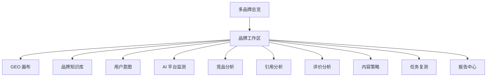

# 多品牌 GEO 管理平台产品设计方案

## 1. 产品定位

多品牌 GEO 管理平台是一套面向 AI 搜索时代的品牌运营中台，帮助企业管理多个品牌在主流 AI 平台中的推荐度、引用率、表达准确度和竞品表现，并将监测结果转化为内容策略、发布任务和复测闭环。

平台第一版定位为：

**让品牌在 AI 回答中被看见、被推荐、被正确表达。**

核心用户包括：

- 集团品牌负责人
- 市场增长负责人
- 内容运营团队
- GEO 运营顾问
- 多品牌代运营团队

## 2. 产品价值主张

### 2.1 面向老板和品牌负责人

- 看清品牌在 AI 平台中的推荐位置
- 判断品牌是否被 AI 正确理解
- 对比竞品在不同 AI 平台中的优势
- 用 GEO 指数衡量品牌在 AI 搜索时代的增长资产

### 2.2 面向市场和运营团队

- 发现用户真实提问意图
- 找到品牌内容缺口
- 生成不同平台的内容策略
- 追踪内容发布后的 AI 端变化

### 2.3 面向多品牌管理方

- 在一个系统中切换和管理多个品牌
- 横向比较不同品牌的 GEO 表现
- 复用行业 Prompt 模板和内容策略模板
- 用统一方法服务不同品牌或客户

## 3. 参考网站启发

参考 `https://geo.xiaoliebian.com/` 后，第一版产品设计建议吸收以下表达和功能结构：

- **AI 平台覆盖感**: 首屏明确展示豆包、Kimi、DeepSeek 和通义千问等第一版平台。
- **GEO 画布**: 用一个策略画布串联目标用户、优化单元、用户意图、内容生成和结果监测。
- **用户意图管理**: 把真实用户提问作为 GEO 优化的核心入口，并持续监测推荐度、AI 平台评价、平均排名和内容引用率。
- **品牌知识库**: 让品牌基础信息、业务介绍、竞品、目标客户、内容规则和标准表达统一沉淀。
- **内容生成与分发**: 第一版先做内容策略和任务，后续扩展为自动生成和授权发布。
- **实时监测看板**: 用数据总览、竞品分析、引用分析和评价分析构成运营驾驶舱。
- **服务化交付**: 平台可以配套 GEO 诊断、产品培训、运营顾问和行业规则同步服务。

## 4. 第一版产品边界

### 4.1 第一版必须具备

- 多品牌切换
- 品牌知识库
- 用户意图与 Prompt 场景库
- GEO 监测记录
- GEO 指数看板
- 竞品分析
- 引用与评价分析
- 内容策略建议
- 内容任务和复测闭环
- Markdown 报告导出

### 4.2 后续版本扩展

- AI 内容自动生成
- 主流内容平台自动发布
- 平台账号授权管理
- PDF 报告模板
- AI 平台真实 API 批量接入
- 行业模板市场
- GEO 顾问服务工作台

## 5. 信息架构

## 6. 页面设计方案

### 6.1 登录后首页：多品牌总览

目标：让管理者一眼看到所有品牌的 GEO 表现。

核心内容：

- 品牌切换器
- 多品牌 GEO 排名
- 总 GEO 指数趋势
- 各品牌 AI 提及率
- 各品牌 Top3 推荐率
- 各品牌正向表达率
- 高风险品牌和高优先级问题

关键操作：

- 新增品牌
- 进入品牌工作区
- 生成多品牌报告

### 6.2 品牌工作区首页：单品牌 GEO 驾驶舱

目标：呈现单个品牌的 AI 推荐表现。

核心内容：

- 品牌 GEO 总分
- AI 平台分布：豆包、Kimi、DeepSeek 和通义千问
- 用户意图分类表现
- 推荐排名趋势
- 内容引用率趋势
- 竞品压制场景
- 待处理优化任务

关键操作：

- 立即监测
- 查看弱项场景
- 创建内容策略
- 导出品牌报告

### 6.3 GEO 画布

目标：把 GEO 运营从零散动作变成结构化策略。

画布分为五个区域：

- 目标用户：用户画像、地域、购买阶段、痛点
- 优化单元：品牌词、品类词、场景词、地域词、竞品词
- 用户意图：真实提问、Prompt 模板、平台覆盖
- 内容策略：内容缺口、建议标题、目标平台、优先级
- 结果监测：推荐度、平均排名、引用率、评价倾向

关键操作：

- 从画布创建 Prompt
- 从画布创建内容任务
- 从画布进入监测详情

### 6.4 品牌知识库

目标：建立 AI 能够正确理解品牌的标准素材库。

核心内容：

- 品牌基础信息
- 品牌别名
- 业务范围
- 产品或课程体系
- 核心卖点
- 目标客户
- 竞品列表
- 推荐表达
- 禁用表达
- FAQ
- 权威背书
- 内容规则

关键操作：

- 更新品牌档案
- 检查资料完整度
- 生成品牌标准介绍
- 同步到内容策略模块

### 6.5 用户意图与 Prompt 场景库

目标：管理真实用户会向 AI 提出的关键问题。

核心内容：

- 意图分类：品牌认知、品类推荐、痛点解决、地域选择、竞品对比、价格决策
- Prompt 模板
- 品牌专属 Prompt
- 目标平台
- 监测频率
- 推荐度
- 平均排名
- 内容引用率

关键操作：

- 新建 Prompt 模板
- 批量生成品牌 Prompt
- 启动监测
- 查看历史结果

### 6.6 AI 平台监测

目标：记录各平台对品牌和竞品的回答表现。

核心内容：

- 平台列表
- 监测任务状态
- 原始 AI 回答
- 品牌是否出现
- 推荐位置
- 引用来源
- 情绪倾向
- 信息准确性
- 人工复核状态

关键操作：

- 手动录入回答
- 使用示例数据验证
- 修正解析结果
- 生成优化建议

### 6.7 竞品分析

目标：解释 AI 为什么推荐竞品。

核心内容：

- 竞品提及次数
- 竞品推荐排名
- 竞品被推荐理由
- 竞品引用来源
- 目标品牌与竞品差距
- 连续压制场景

关键操作：

- 新增竞品
- 查看对比详情
- 创建竞品回应内容任务

### 6.8 引用分析

目标：识别 AI 回答引用了哪些内容来源。

核心内容：

- 官网引用情况
- 第三方媒体引用情况
- 社媒内容引用情况
- 引用质量评分
- 未被引用的重点内容资产

关键操作：

- 绑定内容资产
- 标记权威来源
- 创建引用增强任务

### 6.9 评价分析

目标：判断 AI 对品牌的表达是否正向、准确、完整。

核心内容：

- 正向表达率
- 中性表达率
- 负向表达率
- 错误信息列表
- 缺失卖点列表
- 表达偏差记录

关键操作：

- 标记错误表达
- 创建修正内容任务
- 更新品牌知识库

### 6.10 内容策略中心

目标：把监测问题转成内容动作。

策略类型：

- 内容缺口型
- 信息修正型
- 权威引用型
- 竞品回应型
- 关键词增强型

核心内容：

- 建议标题
- 目标平台
- 目标关键词
- 关联 Prompt
- 关联竞品
- 优先级
- 预期提升指标

关键操作：

- 生成内容任务
- 标记执行状态
- 进入复测计划

### 6.11 任务复测中心

目标：把 GEO 优化动作闭环管理。

核心内容：

- 任务状态
- 负责人
- 截止日期
- 内容链接
- 审核记录
- 复测结果
- 指标变化

关键操作：

- 创建任务
- 提交内容链接
- 标记完成
- 发起复测
- 重新打开问题

### 6.12 报告中心

目标：形成可对内汇报和对客户交付的 GEO 运营报告。

报告类型：

- 单品牌周报
- 单品牌月报
- 多品牌对比报告
- 竞品压制专题报告
- 内容缺口专题报告

报告内容：

- GEO 总指数
- 平台表现
- 用户意图表现
- 竞品差距
- 引用来源
- 评价分析
- 本期优化动作
- 下期建议任务

## 7. 第一版核心指标

### 7.1 监测指标

- 品牌提及率
- Top3 推荐率
- 平均推荐排名
- 正向表达率
- 内容引用率
- 官网引用率
- 竞品压制率

### 7.2 运营指标

- 内容策略生成数
- 内容任务完成数
- 复测完成数
- 问题关闭率
- 高优先级问题数量

### 7.3 管理指标

- 多品牌 GEO 排名
- 品牌环比变化
- 平台覆盖率
- Prompt 覆盖率
- 品牌知识库完整度

## 8. 第一版交互流程

### 8.1 新品牌初始化流程

1. 创建品牌
2. 填写品牌知识库
3. 添加竞品
4. 选择行业 Prompt 模板
5. 批量生成品牌 Prompt
6. 配置目标 AI 平台
7. 启动首轮监测
8. 生成首份诊断报告

### 8.2 GEO 日常运营流程

1. 查看品牌 GEO 驾驶舱
2. 筛选低分平台和低分意图
3. 查看原始 AI 回答和竞品表现
4. 生成内容策略
5. 创建内容任务
6. 填写发布链接
7. 发起复测
8. 更新 GEO 报告

### 8.3 多品牌复盘流程

1. 进入多品牌总览
2. 查看品牌排名和环比变化
3. 识别异常下滑品牌
4. 对比不同品牌的强弱平台
5. 导出多品牌报告
6. 制定下期重点优化品牌和场景

## 9. 视觉与体验方向

### 9.1 视觉基调

- 面向 B 端运营后台，整体风格应清晰、稳定、专业
- 首页和看板可以适度使用深色或高对比数据视觉
- 表单、任务和内容管理页面保持高密度、强可读

### 9.2 关键体验原则

- 品牌切换始终可见
- 当前品牌上下文始终明确
- 数据指标可追溯到原始 Prompt 和 AI 回答
- 策略建议可直接转成任务
- 任务完成后可以直接进入复测

## 10. 第一版优先级

P0：

- 多品牌工作区
- 品牌知识库
- Prompt 场景库
- 手动录入和示例监测
- GEO 指数看板
- 竞品基础分析

P1：

- 内容策略中心
- 任务复测中心
- 引用分析
- 评价分析
- Markdown 报告

P2：

- 自动内容生成
- 自动发布
- PDF 报告
- 顾问服务工作台
- 行业模板市场

## 11. 与现有规格文件的关系

- `requirements.md`: 定义系统必须满足的业务需求和验收标准。
- `design.md`: 定义技术架构、服务边界、数据模型和正确性属性。
- `tasklist.md`: 定义面向开发执行的任务列表。
- `product-design-plan.md`: 定义产品定位、页面结构、交互流程、指标体系和第一版体验方案。

## 12. 参考截图后的界面规划

### 12.1 总体布局规范

参考目标网站的产品截图后，平台后台建议统一采用 **左侧导航 + 右侧工作区** 的 SaaS 布局。

左侧导航负责建立产品心智：

- 多品牌总览
- GEO 画布
- 用户意图
- AI 平台监测
- 内容中心
- 发布中心
- 数据分析
- 品牌知识库
- 设置中心

右侧工作区按照页面类型分为五种版式：

- 数据总览型：KPI 卡片 + 趋势图 + 明细表
- 画布编排型：起点节点 + 意图节点 + 结果指标节点
- 表格管理型：搜索筛选 + 主按钮 + 父子展开表格
- 内容生产型：流程进度 + 内容编辑器 + 发布动作
- 配置接入型：对象列表 + 详情配置 + 接入状态

### 12.2 页面一：多品牌总览 Dashboard

参考截图：数据概览演示、推荐度指标卡、引用趋势分析。

页面目标：让管理者在第一屏判断多个品牌的 GEO 运营状态。

界面布局：

- 顶部：页面标题、时间范围切换、品牌范围筛选
- 第一行：4 个核心 KPI 卡片
- 第二行：2 个并列趋势图
- 第三行：多品牌排行表和高优先级问题表

核心 KPI 卡片：

- 总 GEO 指数
- 平均推荐度
- Top3 推荐率
- 内容引用率

KPI 卡片规范：

- 左上角展示指标名称和说明 icon
- 中部展示大号主数值
- 下方展示较上周期变化
- 右上角展示标签，例如“核心指标”“需关注”“监测中”

趋势图规范：

- 右上角使用 7 天、30 天、90 天分段切换
- 图表使用折线面积图表达变化趋势
- 底部使用平台图标和品牌色图例
- 鼠标悬停展示每日具体数值

多品牌排行表字段：

- 品牌名称
- GEO 总分
- AI 提及率
- Top3 推荐率
- 正向表达率
- 内容引用率
- 环比变化
- 当前状态

### 12.3 页面二：单品牌 GEO 驾驶舱

参考截图：数据概览演示。

页面目标：让品牌负责人查看当前品牌在各 AI 平台的表现。

界面布局：

- 顶部：品牌切换器、品牌名称、行业标签、时间范围
- 第一行：推荐度、平均排名、内容引用数、内容引用率
- 第二行：推荐度趋势、引用率趋势
- 第三行：优化单元表现明细表

优化单元明细表字段：

- 优化单元
- 用户意图数量
- 推荐度
- 平均排名
- AI 平台评价
- 内容引用率
- 主要问题
- 操作

操作入口：

- 查看意图
- 生成内容策略
- 查看检测记录
- 创建任务

### 12.4 页面三：GEO 画布

参考截图：GEO 画布演示。

页面目标：把品牌 GEO 策略从“零散任务”变成可视化的策略链路。

界面布局：

- 左侧：优化单元节点
- 中间：用户意图节点
- 右侧：数据表现节点
- 背景：浅色点阵画布
- 连线：表示优化单元、用户意图和数据表现之间的关系

节点设计：

- 优化单元节点使用紫色标签，表示策略起点
- 用户意图节点使用蓝色标签，表示用户真实提问
- 数据表现节点使用粉色标签，表示监测结果

数据表现节点字段：

- 推荐度
- 平均排名
- 内容引用率
- AI 平台评价

画布交互：

- 点击优化单元，展示关联意图
- 点击用户意图，展示关联 Prompt 和平台表现
- 点击数据表现，进入监测详情
- 支持从画布直接创建内容策略任务

### 12.5 页面四：用户意图与 Prompt 管理

参考截图：用户意图演示。

页面目标：管理真实用户会向 AI 提出的关键问题，并追踪每个意图在不同平台的表现。

界面布局：

- 顶部：页面标题、说明文案、创建意图按钮
- 筛选区：搜索用户意图、搜索优化单元、平台筛选、状态筛选
- 主体：父子展开表格

父级行字段：

- 用户意图
- 关联优化单元
- 推荐度
- 平均排名
- 评价
- 内容引用率
- 操作

展开行字段：

- AI 平台图标
- 平台名称
- 平台推荐度
- 平台排名
- 平台评价
- 引用率
- 检测时间

行内操作：

- 生成内容
- 检测记录
- 编辑
- 停用

设计要点：

- 平台使用 logo + 名称，提升扫读效率
- 指标单元格使用颜色表达状态
- 表格操作使用文字链接，控制视觉噪音
- 创建意图按钮保留为页面唯一主 CTA

### 12.6 页面五：内容生成与编辑工作台

参考截图：内容生成演示。

页面目标：把“内容策略、AI 生成、人工编辑、发布准备”放在一个连续工作面中完成。

界面布局：

- 左侧：全局导航
- 顶部：返回、导出、复制内容、去发布、保存
- 中左：生成进度与步骤状态
- 中右：内容编辑器
- 顶部标签页：内容概览、生成进度、历史记录、内容配置

生成进度组件：

- 当前进度百分比
- 策略解析
- 品牌知识库读取
- 内容大纲生成
- 正文生成
- GEO 规则检查
- 完成状态

内容编辑器组件：

- 标题输入
- 富文本工具栏
- 正文编辑
- 引用素材提示
- GEO 规则提示

顶部动作：

- 保存
- 复制内容
- 导出 Markdown
- 去发布

设计要点：

- 右侧编辑器是主工作区
- 中间进度栏增强 AI 生成过程可信度
- 生成、编辑、发布动作保持连续

### 12.7 页面六：发布中心与账号接入

参考截图：自动化发布演示。

页面目标：管理公众号、头条号、搜狐号、百家号等内容平台账号接入和发布记录。

界面布局：

- 顶部：页面标题和说明文案
- 页签：发布记录、账号管理
- 提示条：说明授权范围、平台限制和发布规则
- 左列：平台列表
- 右列：账号接入和账号详情

平台列表字段：

- 平台 logo
- 平台名称
- 登录方式标签
- 已授权账号数量
- 当前选中状态

右侧账号区状态：

- 未接入：展示大号接入账号卡片
- 已接入：展示账号名称、授权状态、最近发布、操作日志
- 授权异常：展示异常原因和重新授权按钮

设计要点：

- 采用“先选平台，再接账号”的左右分栏结构
- 新增接入入口使用大卡片，提高动作识别度
- 平台状态和授权数量前置展示

### 12.8 页面七：品牌知识库

参考截图：品牌知识库演示。

页面目标：沉淀品牌基础信息、业务介绍、内容规则、竞品资料和外部素材。

列表页布局：

- 顶部：标题、搜索框、上传知识库按钮
- 主体：知识库表格
- 表格字段：名称、类型、来源、关联品牌、更新时间、状态、操作

上传弹窗布局：

- 顶部：上传知识库标题
- 风险提示：版权、隐私和内容合规说明
- 输入区：知识库名称
- 类型选择：本地文件、网页、飞书、公众号
- 上传区：拖拽上传或点击上传
- 底部：取消、立即上传

设计要点：

- 使用弹窗承接上传流程
- 类型选择使用卡片，降低理解成本
- 合规提示放在输入之前
- 上传按钮在必填项完成前保持弱化状态

### 12.9 页面八：引用分析

参考截图：引用趋势分析。

页面目标：分析 AI 回答引用了哪些品牌内容和外部来源。

界面布局：

- 顶部：引用分析标题、时间范围切换
- 第一行：引用总数、内容引用率、官网引用率、权威来源占比
- 第二行：内容引用率趋势分析
- 第三行：引用来源明细表

引用来源明细表字段：

- 来源标题
- 来源平台
- URL
- 引用次数
- 关联 Prompt
- 引用平台
- 权威等级
- 操作

操作入口：

- 查看原文
- 绑定内容资产
- 创建引用增强任务

### 12.10 页面九：评价分析

页面目标：判断 AI 对品牌表达是否正向、准确、完整。

界面布局：

- 顶部：评价分析标题和筛选条件
- 第一行：正向表达率、中性表达率、负向表达率、准确表达率
- 第二行：评价趋势图和错误表达分布图
- 第三行：表达问题列表

表达问题列表字段：

- 问题类型
- 原始回答片段
- 正确表达建议
- 关联 Prompt
- 关联平台
- 严重程度
- 操作

操作入口：

- 更新品牌知识库
- 创建修正内容任务
- 标记已处理

### 12.11 页面十：任务复测中心

页面目标：把内容优化动作和复测结果闭环管理。

界面布局：

- 顶部：任务看板标题、品牌筛选、状态筛选
- 主体：看板或表格双模式
- 右侧：任务详情抽屉

看板列：

- 待处理
- 执行中
- 待审核
- 待复测
- 已关闭
- 已重开

任务卡片字段：

- 任务标题
- 关联品牌
- 关联平台
- 关联 Prompt
- 优先级
- 负责人
- 截止日期
- 当前指标变化

设计要点：

- 任务卡片要显示指标变化，避免只变成普通待办
- 复测结果要能回链到原始 AI 回答
- 高优先级任务使用明确标签提示

## 13. 组件设计规范

### 13.1 指标卡片

字段结构：

- 指标名称
- 说明 icon
- 主数值
- 周期变化
- 状态标签

适用页面：

- 多品牌总览
- 单品牌驾驶舱
- 引用分析
- 评价分析

### 13.2 趋势图卡片

字段结构：

- 图表标题
- 指标说明
- 时间范围切换
- 主图表
- 图例

交互规则：

- 支持 7 天、30 天、90 天切换
- 支持 tooltip 查看具体数值
- 支持点击图例显示或隐藏对象

### 13.3 父子展开表格

适用页面：

- 用户意图
- Prompt 管理
- AI 平台监测
- 竞品分析

设计规则：

- 父级行展示汇总指标
- 子级行展示平台或 Prompt 明细
- 行内操作使用文字链接
- 状态信息使用颜色和标签表达

### 13.4 画布节点

节点类型：

- 优化单元节点
- 用户意图节点
- 数据表现节点
- 内容策略节点

设计规则：

- 不同节点类型使用固定颜色
- 节点内只展示核心字段
- 详情信息通过右侧抽屉承接
- 节点之间用连线表达关系

### 13.5 导入弹窗

适用页面：

- 品牌知识库
- 内容资产
- 竞品资料
- Prompt 批量导入

设计规则：

- 先展示风险提示
- 再填写对象名称
- 再选择导入类型
- 最后上传文件或输入链接

### 13.6 内容编辑工作台

适用页面：

- 内容生成
- 内容改写
- 报告编辑

设计规则：

- 左侧展示生成流程和状态
- 右侧展示可编辑结果
- 顶部固定保存、复制、导出、发布动作
- 标签页承接配置、历史和日志
