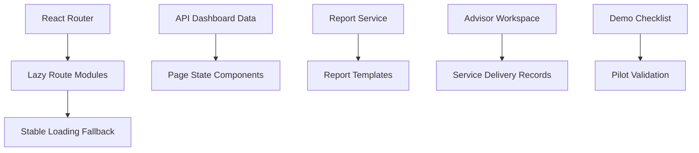

# Product Experience Performance

Feature Name: product-experience-performance
Updated: 2026-07-04

## Description

第五阶段聚焦产品化收口：补齐关键页面状态体验、降低前端首屏 bundle 风险、增强报告交付内容、完善顾问服务工作台，并建立试点客户演示验收清单。实现策略以小步迭代为主，优先解决已经暴露的 Vite 大 chunk 风险和演示可用性问题。

## Architecture

前端将主要页面模块从静态 import 改为 `React.lazy` + `Suspense`，保留现有 layout 和品牌化路由别名。页面状态采用现有 Ant Design 组件表达 loading、empty、error 和 operation feedback。报告和顾问服务沿用现有 repository port 与共享类型扩展。演示验收清单沉淀在 `.monkeycode/docs/`，用于后续试点交付。

## Components and Interfaces

- `apps/web/src/app/App.tsx`: 路由级 lazy loading 和 fallback 状态。
- `apps/web/src/layouts/navigation.ts`: 保持导航和品牌化路由别名稳定。
- `apps/web/src/features/*`: 关键页面补充空状态、错误状态、操作反馈和测试。
- `apps/api/src/modules/reports`: 增强报告 Markdown 模板和导出 metadata。
- `apps/api/src/modules/advisor`: 增强顾问诊断、服务计划、复盘和 follow-up 展示。
- `.monkeycode/docs/PILOT_DEMO_CHECKLIST.md`: 试点演示和验收清单。

## Data Models

当前阶段优先复用已有模型：`Report`、`AdvisorRecord`、`OptimizationTask`、`ContentGenerationTask`、`PublishingRecord`。如服务计划和复盘字段不足，先通过 `AdvisorRecord` 的记录类型和 `followUpItems` 承载，再按后续需求决定是否新增模型。

## Correctness Properties

- 路由拆包后，所有既有路径保持可访问。
- 品牌化路由 `/brands/:brandId/*` 继续写入品牌上下文并跳转到对应页面。
- 报告导出保持 Markdown 可读结构和现有 API 响应 envelope。
- 顾问工作台数据继续按 `brandId` 隔离。
- 演示清单记录已知限制和验证步骤，避免口头流程丢失。

## Error Handling

- lazy route 加载期间显示稳定 fallback。
- route module 加载失败时保留全局错误边界后续扩展点。
- 报告生成缺少数据时输出数据缺口章节。
- 顾问记录缺少关联报告时显示明确空状态。

## Test Strategy

- Web 路由测试覆盖主要 route config、fallback 和品牌化 alias。
- Web build 验证确认 route chunks 被拆分。
- API 报告测试覆盖单品牌、多品牌和客户交付报告章节。
- 顾问工作台测试覆盖 follow-up 和相关报告展示。
- 完整门禁使用 `npm run verify`、`git diff --check`、API 健康检查和前端入口检查。
