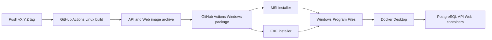

# Windows 单机发布设计

Feature Name: windows-single-machine-release
Updated: 2026-08-12

## 描述

GitHub Actions 负责构建可离线导入的 Linux 容器镜像，并在 Windows Runner 上将镜像归档、运行配置和控制脚本封装为 MSI 与 EXE。安装包不包含 Docker Desktop；Docker Desktop 提供 Windows 主机上的容器运行时。

## 架构

## 组件与接口

- `.github/workflows/windows-release.yml`：标签发布工作流，负责 Linux 构建、Windows 封装与 GitHub Release 上传。
- `deploy/windows/Start-GEO.ps1`：验证 Docker，导入离线镜像，启动 Compose 服务并打开 Web 地址。
- `deploy/windows/Stop-GEO.ps1`：停止服务，保留 Docker 命名卷。
- `deploy/windows/GEO.iss`：使用 Inno Setup 构建 EXE 安装包。
- `deploy/windows/GEO.wxs`：使用 WiX Toolset 构建 MSI 安装包。
- `deploy/compose.release.yaml`：以发布镜像标签运行服务，避免用户设备本地构建镜像。

## 数据模型

运行数据保留在 Docker 命名卷 `geo_postgres_data` 与 `geo_uploads`。安装包升级替换应用文件和镜像归档，Compose 服务继续挂载既有卷。

## 正确性属性

- 发布标签和镜像标签使用同一版本值。
- MSI 与 EXE 携带相同的发布目录内容。
- 启动脚本仅在 Docker Engine 可用后导入镜像并启动服务。
- 停止脚本不删除命名卷。

## 错误处理

- Docker Desktop 缺失或未运行时，启动脚本提供可操作的前置条件提示。
- 镜像导入或 Compose 启动失败时，PowerShell 返回非零退出码。
- GitHub 构建、封装或上传失败时，工作流任务失败，Release 不接收不完整资产。

## 测试策略

- Linux 构建任务执行 Compose 配置校验与 API/Web 镜像构建。
- Windows 封装任务校验 MSI、EXE 和安装载荷存在。
- 发布前人工在干净 Windows VM 使用 Docker Desktop 安装并验证 `http://localhost:4173` 与 API 就绪接口。
